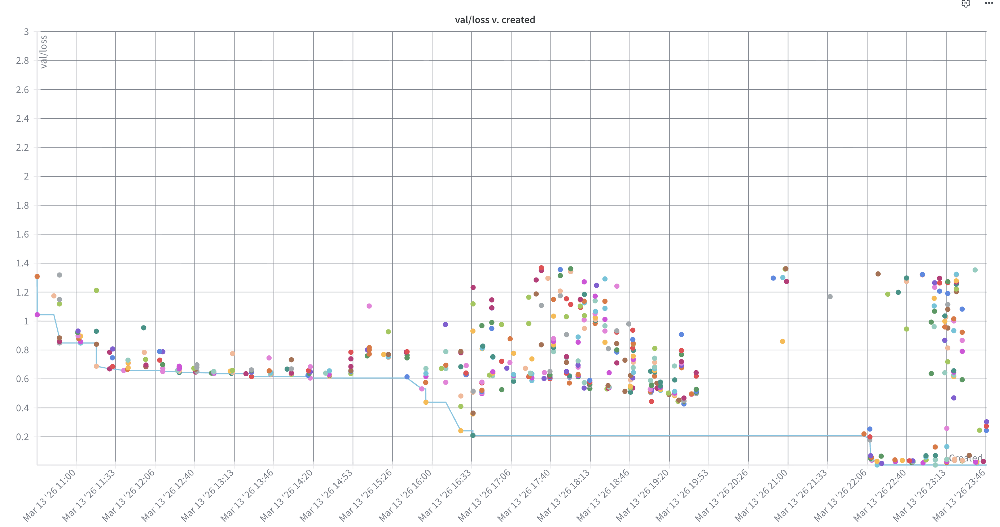
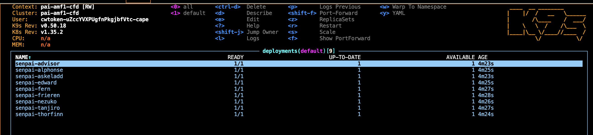
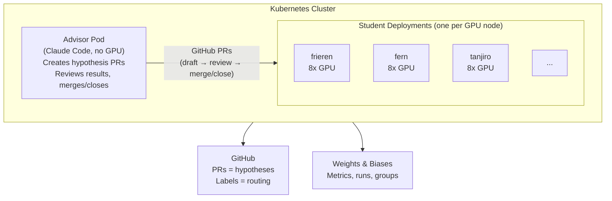
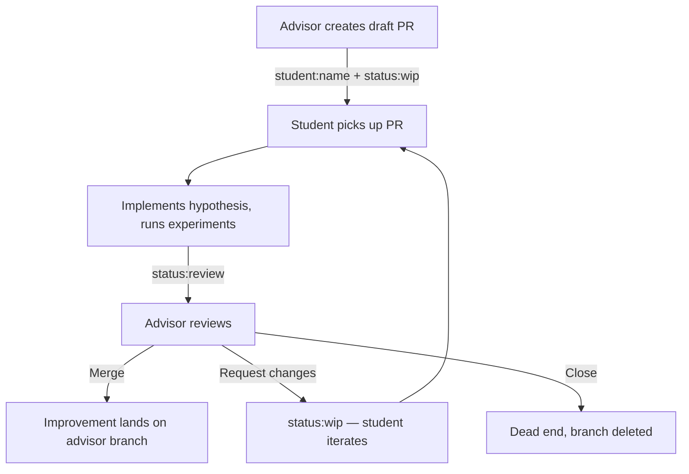

<!--
SPDX-FileCopyrightText: 2026 CoreWeave, Inc.
SPDX-License-Identifier: Apache-2.0
SPDX-PackageName: senpai
-->

# senpai

Autonomous ML research loop powered by Claude Code agents coordinated through GitHub PRs. Point it at a problem, deploy advisor + student agents on k8s, and let them iterate.

## How it works

An **advisor** agent (no GPU) creates hypothesis PRs and assigns them to **student** agents (GPU nodes). Students implement the hypothesis, run experiments, and report results. The advisor reviews: merges winners, iterates on promising ideas, closes dead ends. All coordination happens through GitHub labels and PRs. W&B tracks metrics.

The repo is **problem-agnostic** — all problem-specific code (model, training script, data pipeline, instructions) lives in a self-contained folder. `senpai.yaml` at the root points to the active problem.

### Current problem: CFD surrogates

Training a neural network surrogate for computational fluid dynamics on the [TandemFoilSet](https://openreview.net/forum?id=4Z0P4Nbosn) dataset. Given tandem-airfoil geometry and flow conditions, predict velocity (Ux, Uy) and pressure (p) at every mesh node. The model is a [Transolver](https://arxiv.org/abs/2402.02366) with physics-aware attention over irregular meshes. Key metric: surface MAE (especially pressure).



[W&B Dashboard](https://wandb.ai/wandb-applied-ai-team/senpai-v1)

## Architecture





### PR lifecycle



## Repo layout

```
senpai/
├── senpai.yaml                    # Project config: active problem + all launch defaults
├── cfd_tandemfoil/                # Problem directory (self-contained)
│   ├── train.py                   #   Training script + model (students modify this)
│   ├── program.md                 #   Research context, metrics, constraints
│   ├── data/                      #   Data pipeline and benchmark splits
│   └── instructions/              #   Role-specific Claude Code instructions
│       ├── CLAUDE-ADVISOR.md      #     Advisor workflow
│       ├── CLAUDE-STUDENT.md      #     Student workflow
│       ├── prompt-advisor.md      #     Advisor prompt template
│       └── prompt-student.md      #     Student prompt template
├── k8s/                           # Kubernetes deployment (problem-agnostic)
│   ├── launch.py                  #   Deploy advisor + student pods
│   ├── advisor-deployment.yaml    #   Advisor pod spec (CPU only)
│   ├── student-deployment.yaml    #   Student pod spec (8x GPU)
│   ├── entrypoint-advisor.sh      #   Advisor startup script
│   └── entrypoint-student.sh      #   Student startup script
├── Dockerfile                     # ML container with Claude Code + tools
└── .claude/                       # Claude Code skills and agents
    ├── skills/wandb-primary/      #   W&B + Weave queries
    ├── skills/list-experiments/   #   Experiment history
    └── agents/researcher-agent.md #   Deep literature research
```

## Configuration

All project settings live in `senpai.yaml`:

```yaml
problem: cfd_tandemfoil        # which problem folder to use
repo_url: https://github.com/wandb/senpai.git
repo_branch: main
image: ghcr.io/wandb/senpai:latest
wandb_entity: wandb-applied-ai-team
wandb_project: senpai-v1
advisor_branch: noam
timeout_minutes: 30.0
max_epochs: 50
n_students: 4
```

`launch.py` reads this via `simple_parsing` — every field can be overridden on the CLI.

## Running

```bash
# Train locally
cd cfd_tandemfoil && python train.py --agent <name> --wandb_name "<name>/<description>"

# Debug (3 epochs, tiny subset)
cd cfd_tandemfoil && python train.py --debug

# Deploy to k8s (reads defaults from senpai.yaml, only --tag is required)
python k8s/launch.py --tag <research-tag> --advisor

# Override config via CLI
python k8s/launch.py --tag <research-tag> --advisor --n_students 6 --advisor_branch "einstein"

# Pass extra instructions to the advisor
python k8s/launch.py --tag <research-tag> --advisor --extra_instructions "Only consider optimizer changes."
```

## Adding a new problem

1. Create a new folder (e.g. `weather_prediction/`) with:
   - `train.py` — training script + model
   - `program.md` — research context, metrics, constraints
   - `data/` — data pipeline
   - `instructions/` — role-specific Claude Code instructions (CLAUDE-ADVISOR.md, CLAUDE-STUDENT.md, prompts)
2. Set `problem: weather_prediction` in `senpai.yaml`
3. Deploy as usual — `python k8s/launch.py --tag <tag> --advisor`

## References

`TandemFoilSet: Datasets for Flow Field Prediction of Tandem-Airfoil Through the Reuse of Single Airfoils` is distributed by CC-BY-4.0.
```bibtex
@inproceedings{
lim2026tandemfoilset,
title={{TandemFoilSet}: Datasets for Flow Field Prediction of Tandem-Airfoil Through the Reuse of Single Airfoils},
author={Wei Xian Lim and Loh Sher En Jessica and Zenong Li and Thant Zin Oo and Wai Lee Chan and Adams Wai-Kin Kong},
booktitle={The Fourteenth International Conference on Learning Representations},
year={2026},
url={https://openreview.net/forum?id=4Z0P4Nbosn}
}
```
