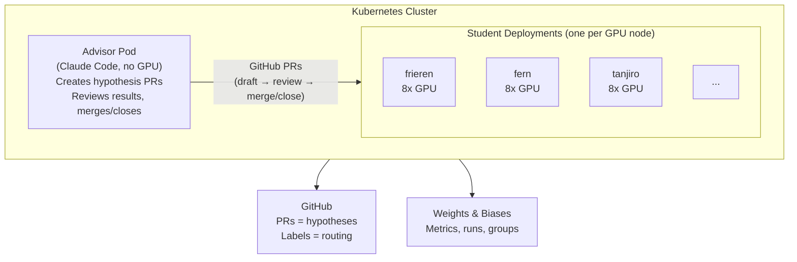
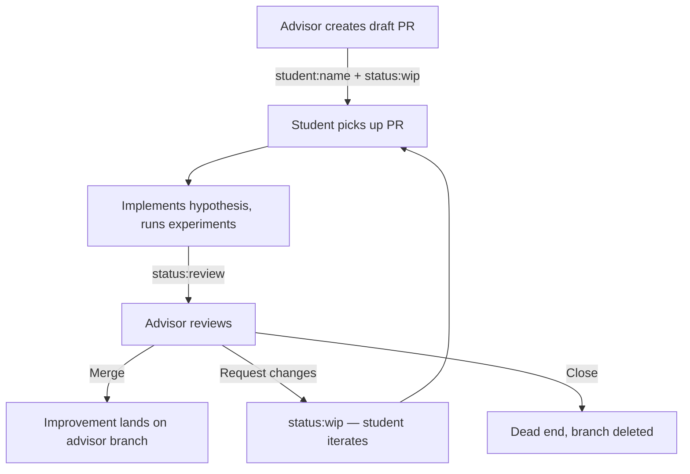

<!--
SPDX-FileCopyrightText: 2026 CoreWeave, Inc.
SPDX-License-Identifier: Apache-2.0
SPDX-PackageName: senpai
-->

# senpai

Autonomous ML research loop powered by Claude Code agents coordinated through GitHub PRs. Point it at a problem, deploy advisor + student agents on k8s, and let them iterate.

## How it works

An **advisor** agent (no GPU) creates hypothesis PRs and assigns them to **student** agents (GPU nodes). Students implement the hypothesis, run experiments, and report results. The advisor reviews: merges winners, iterates on promising ideas, closes dead ends. All coordination happens through GitHub labels and PRs. W&B tracks metrics.

The repo is **problem-agnostic** — all problem-specific code (model, training script, data pipeline, instructions) lives in a self-contained folder under `target/`. `senpai.yaml` points to the active problem via a repo-relative path.

### Current problem: ICML 2026 CFD sprint

Training neural CFD surrogates across TandemFoilSet, AirfRANS, and DrivAerML for the ICML 2026 workshop sprint. The active target is `target/icml2026`, which packages a shared trainer plus dataset-specific data pipelines under one harness problem directory.


[W&B Dashboard](https://wandb.ai/wandb-applied-ai-team/senpai-v1)

## Architecture


```mermaid
graph TD
    subgraph K8s["Kubernetes Cluster"]
        A["Advisor Pod<br/>(Claude Code, no GPU)<br/>Creates hypothesis PRs<br/>Reviews results, merges/closes"]
        subgraph Students["Student Deployments (one per GPU node)"]
            S1["frieren<br/>8x GPU"]
            S2["fern<br/>8x GPU"]
            S3["tanjiro<br/>8x GPU"]
            S4["..."]
        end
        A -->|"GitHub PRs<br/>(draft → review → merge/close)"| Students
    end
    K8s --> GH["GitHub<br/>PRs = hypotheses<br/>Labels = routing"]
    K8s --> WB["Weights & Biases<br/>Metrics, runs, groups"]
```

### PR lifecycle


```mermaid
graph TD
    A["Advisor creates draft PR"] -->|"student:name + status:wip"| B["Student picks up PR"]
    B --> C["Implements hypothesis, runs experiments"]
    C -->|"status:review"| D["Advisor reviews"]
    D -->|Merge| E["Improvement lands on advisor branch"]
    D -->|Request changes| F["status:wip — student iterates"]
    D -->|Close| G["Dead end, branch deleted"]
    F --> B
```

## Repo layout

```
senpai/
├── senpai.yaml                    # Project config: active problem + all launch defaults
├── target/
│   └── <problem>/                 # Active problem directory (self-contained)
│       ├── train.py               #   Training script + model (students modify this)
│       ├── program.md             #   Research context, metrics, constraints
│       ├── data/                  #   Data pipeline and benchmark splits
│       └── instructions/          #   Role-specific Claude Code instructions
│           ├── prompt-advisor.md  #     Task-specific Advisor prompt template
│           └── prompt-student.md  #     Task-specific Student prompt template
├── system_instructions/           # System-level Claude Code instructions
│   ├── CLAUDE-ADVISOR.md          #     System-level Advisor workflow
│   └── CLAUDE-STUDENT.md          #     System-level Student workflow
├── k8s/                           # Kubernetes deployment (problem-agnostic)
│   ├── launch.py                  #   Deploy advisor + student pods
│   ├── advisor-deployment.yaml    #   Advisor pod spec (CPU only)
│   ├── student-deployment.yaml    #   Student pod spec (8x GPU)
│   ├── entrypoint-advisor.sh      #   Advisor startup script
│   └── entrypoint-student.sh      #   Student startup script
├── Dockerfile                     # ML container with Claude Code + tools
└── .claude/                       # Claude Code skills and agents
    ├── skills/wandb-primary/      #   W&B + Weave queries skill
    ├── skills/list-experiments/   #   Experiment history skill
    └── agents/researcher-agent.md #   Deep literature research agent
```

## Configuration

All project settings live in `senpai.yaml`:

```yaml
problem: target/icml2026       # active problem directory (repo-relative)
repo_url: https://github.com/wandb/senpai.git
repo_branch: kaiming
image: ghcr.io/wandb/senpai:latest
pvc_claim_name: new-pvc
pvc_mount_path: /mnt/new-pvc
wandb_entity: wandb-applied-ai-team
wandb_project: senpai-v1
advisor_branch: kaiming
timeout_minutes: 30.0
max_epochs: 50
n_students: 4
```

`launch.py` reads this via `simple_parsing` — every field can be overridden on the CLI.

### API Key

Due to the high cost of running CC with ANTHROPIC_API_KEY, instead use CLAUDE_CODE_OAUTH_TOKEN. Create this token as follows:

```
claude setup-token
```

and push the key to the k8s secrets.

## Running

```bash
# Train locally
cd target/icml2026 && python train.py --dataset tandemfoil --agent <name> --wandb_name "<name>/<description>"

# Debug (3 epochs, tiny subset)
cd target/icml2026 && python train.py --dataset tandemfoil --debug

# Deploy to k8s (reads defaults from senpai.yaml, only --tag is required)
python k8s/launch.py --tag <research-tag> --advisor

# Override config via CLI
python k8s/launch.py --tag <research-tag> --advisor --n_students 6 --advisor_branch "einstein" --pvc_mount_path "/mnt/pai-amf1-cfd"

# Pass extra instructions to the advisor
python k8s/launch.py --tag <research-tag> --advisor --extra_instructions "Only consider optimizer changes."
```

## Adding a new problem

1. Create a new folder under `target/` (e.g. `target/weather_prediction/`) with:
   - `train.py` — training script + model
   - `program.md` — research context, metrics, constraints
   - `data/` — data pipeline
   - `instructions/` — role-specific Claude Code instructions
2. Set `problem: target/weather_prediction` in `senpai.yaml`
3. Deploy as usual — `python k8s/launch.py --tag <tag> --advisor`

## References

`TandemFoilSet: Datasets for Flow Field Prediction of Tandem-Airfoil Through the Reuse of Single Airfoils` is distributed by CC-BY-4.0.
```bibtex
@inproceedings{
lim2026tandemfoilset,
title={{TandemFoilSet}: Datasets for Flow Field Prediction of Tandem-Airfoil Through the Reuse of Single Airfoils},
author={Wei Xian Lim and Loh Sher En Jessica and Zenong Li and Thant Zin Oo and Wai Lee Chan and Adams Wai-Kin Kong},
booktitle={The Fourteenth International Conference on Learning Representations},
year={2026},
url={https://openreview.net/forum?id=4Z0P4Nbosn}
}
```
