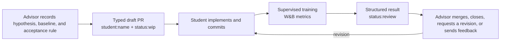
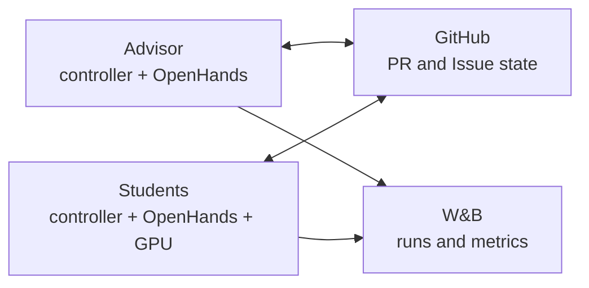

<!--
SPDX-FileCopyrightText: 2026 CoreWeave, Inc.
SPDX-License-Identifier: Apache-2.0
SPDX-PackageName: senpai
-->

# senpai

Senpai is an autonomous ML research loop built on the OpenHands Agent SDK. An advisor proposes and reviews experiments; GPU students implement one assigned experiment each, train, and return evidence through GitHub and W&B.

Senpai is problem-agnostic. It runs against a separate target repository, and every experiment branch, commit, and PR lands there—not in this runner repository.

- **ICML 2026:** [*SENPAI: Self-ExperimentatioN for Physical AI—An Observability-Based Research Harness*](https://openreview.net/forum?id=g0bJFA9gVT) was presented at the AI for Science Workshop; see the [project site](https://wandb.github.io/senpai/).
- **ICLR 2026:** Kagent, a Senpai variant, placed fourth in the [GRaM competition](https://gram-competition.github.io/).

## Quick start

Kubernetes, local Docker, AWS GPU, and AWS Mac use the same launcher, role
configuration, training limits, GitHub workflow, and W&B record. This quick
start shows Kubernetes; see [Docker](#docker), [AWS](#aws), or
[AWS Mac](#aws-mac) for a host without a cluster.

### 1. Prerequisites

- Python 3.13, [uv](https://docs.astral.sh/uv/), and Git. Kubernetes launches
  also need `kubectl`.
- A Kubernetes context and existing namespace with outbound access to GitHub,
  Exa, W&B, and each configured model provider. Your identity must be able to
  get, list, create, update, patch, and delete Deployments, ConfigMaps, and
  Secrets there.
- An existing PVC with enough space for the dataset, plus concurrent mounts from every scheduled node—normally `ReadWriteMany`, unless your storage driver explicitly supports another multi-node topology. The launcher mounts this claim but does not create it; role state stays on each pod's node-local `emptyDir` volume.
- NVIDIA GPU nodes, the Kubernetes NVIDIA device plugin, and a host driver compatible with CUDA 13 and the shipped student image.
- A target GitHub repository that Senpai can clone and modify.
- Immutable advisor and student images reachable by every cluster node.

### 2. Install Senpai

```bash
git clone https://github.com/wandb/senpai.git
cd senpai
uv sync --locked
```

For development, include the test dependencies:

```bash
uv sync --locked --extra dev
```

### 3. Add credentials

```bash
cp example.env .env
```

Fill in the required values in the gitignored `.env` file. Model-provider keys
are required when any configured model uses that provider; `HF_TOKEN` is
optional:

```dotenv
GITHUB_TOKEN=
ANTHROPIC_API_KEY=
OPENAI_API_KEY=
EXA_API_KEY=
WANDB_API_KEY=
HF_TOKEN=
```

| Credential | Required access |
|---|---|
| `GITHUB_TOKEN` | Target-repository Contents, Pull requests, and Issues read/write. A classic token with `repo` scope also works. GitHub CLI authentication is the fallback when this value is absent. |
| `ANTHROPIC_API_KEY` | Required when an `anthropic/...` model is configured. |
| `OPENAI_API_KEY` | Required when an `openai/...` model is configured. Every default profile uses GPT-5.6. |
| `EXA_API_KEY` | General-web and research-publication search. |
| `WANDB_API_KEY` | Read/write access to the configured W&B entity and project. |
| `HF_TOKEN` | Optional access to private or gated Hugging Face models and datasets. It is omitted from launch secrets when unset. |

`k8s/launch.py` reads shell environment variables first and then the
repository-root `.env`; only the GitHub token also falls back to `gh auth
token`.

Kubernetes stores runtime credentials in a per-launch Secret. Docker stores
them in private local run state; AWS sends them over SSH into the same private
run state on EC2. Termination removes that state. During role bootstrap, the
GitHub write token is removed from the process environment and handed to the
controller through a one-use channel; it is not exposed to the model or
subagents.

### 4. Prepare the target repository

The target branch normally contains:

```text
program.md
instructions/
├── prompt-advisor.md
└── prompt-student.md
```

- `program.md` defines the research objective, baseline, metrics, benchmark rules, training limits, and allowed edit surface.
- `prompt-advisor.md` adds target-specific experiment-selection and review guidance.
- `prompt-student.md` adds target-specific implementation, training, and reporting guidance.

Targets that keep their Senpai configuration in a subdirectory may use
`senpai/program.md`. Role prompt overlays are optional in that layout; without
them, both roles follow the repository instructions and their built-in Senpai
role charter.

Use the [bootstrap-target guide](plugins/senpai/skills/bootstrap-target/SKILL.md) to inspect a new target and create these files. Target `AGENTS.md`, compatible `CLAUDE.md`, and `.agents/skills/` are also loaded through OpenHands project context and progressive disclosure.

The target repository must be different from the Senpai runner repository.

### 5. Configure the launch

Copy the checked-in defaults and replace the W&B, branch, PVC, and resource values for your environment:

```bash
cp senpai.yaml senpai.local.yaml
```

The most important settings are:

```yaml
target_repo_branch: main
advisor_branch: senpai-research

wandb_entity: your-team
wandb_project: your-project

advisor_model: openai/gpt-5.6-sol
advisor_reasoning_effort: xhigh
student_model: openai/gpt-5.6-sol
student_reasoning_effort: xhigh

smart_model: openai/gpt-5.6-sol
smart_reasoning_effort: xhigh
fast_model: openai/gpt-5.6-luna
fast_reasoning_effort: high
frontier_model: openai/gpt-5.6-sol
frontier_reasoning_effort: max
local_condenser_max_events: 0
local_condenser_max_tokens: 0
local_condenser_target_events: 0

pvc_claim_name: your-existing-pvc
pvc_mount_path: /mnt/data

n_students: 4
gpus_per_student: 1
cpu_per_gpu: 8
memory_gi_per_gpu: 64

timeout_minutes: 30
max_epochs: 50
```

W&B Inference uses LiteLLM's native `wandb/` provider. For example, set every
model profile to `wandb/zai-org/GLM-5.2` with reasoning effort `max`. Senpai
uses `WANDB_API_KEY`, routes requests through the W&B chat endpoint, explicitly
enables GLM thinking, and sends
`OpenAI-Project: <wandb_entity>/<wandb_project>` on every request.
Providers without native compaction use Senpai's local summarizing condenser.
Zero selects model-specific defaults for each of its three limits. Unknown
local models retain the existing 80-event fallback with token and target limits
disabled. W&B GLM-5.2 instead uses its exact `zai-org/GLM-5.2` chat-template
tokenizer, condenses at 180,000 input tokens, targets about 40 retained events,
and keeps 600 events as an emergency fuse. The 82,144-token margin below W&B's
262,144-token context window leaves room for a large tool result and the next
model response. OpenAI Responses and Anthropic keep their native compaction and
ignore all three local limits.

Set positive values to override any dimension with
`local_condenser_max_events`, `local_condenser_max_tokens`, and
`local_condenser_target_events`; the target must leave room for the preserved
prefix and meaningful progress. The corresponding environment variables are
`SENPAI_OPENHANDS_LOCAL_CONDENSER_MAX_EVENTS`,
`SENPAI_OPENHANDS_LOCAL_CONDENSER_MAX_TOKENS`, and
`SENPAI_OPENHANDS_LOCAL_CONDENSER_TARGET_EVENTS`. AWS Mac preparation downloads
the GLM tokenizer once into `/Users/ec2-user/.senpai/huggingface`, verifies it
offline, and shares that cache with the roles' private home directories.

The defaults in `senpai.yaml` describe W&B's deployment and should not be copied unchanged into another environment. Every setting can also be overridden on the command line. `--tag` and `--target_repo_url` are required unless your chosen config file supplies them.

Deployments require one immutable image per active role, all built from the same
Senpai revision. Full `sha-<40-character-commit>` tags identify it directly;
digest-pinned role images require an explicit shared `repo_revision`.
Kubernetes and Docker fetch that commit from `repo_url`. AWS transfers the exact
clean local commit instead. PR image checks build but do not publish images.

### 6. Run preflight

```bash
revision=$(git rev-parse HEAD)
launch_args=(
  --config_path senpai.local.yaml
  --tag first-run
  --target_repo_url https://github.com/OWNER/TARGET.git
  --advisor
  --names frieren
  --advisor_image "ghcr.io/wandb/senpai-advisor:sha-$revision"
  --student_image "ghcr.io/wandb/senpai-student:sha-$revision"
)

uv run python k8s/launch.py "${launch_args[@]}" --preflight_only
```

Every preflight authenticates GitHub, Exa, W&B, and every model provider used by
an active role or shared model profile. It verifies GitHub Contents write
access, resolves the target branch, rejects active student-label collisions,
and checks immutable image references against one expected runner revision.
Backend-specific checks are described below. Preflight never changes GitHub or
starts advisor or student roles.

### 7. Launch

Inspect the preflight result, then launch with the same arguments:

```bash
uv run python k8s/launch.py "${launch_args[@]}"
```

The launcher creates routing labels, one launch Secret, role ConfigMaps, and Deployments. It does not create the namespace, PVC, Service, or general cluster RBAC.

Inspect and stop the launch:

```bash
kubectl get deployments,pods -l research-tag=first-run
kubectl logs -f deployment/senpai-first-run-frieren
kubectl delete deployments,configmaps,secrets -l research-tag=first-run
```

Use `--kube_context` and `--namespace` when the desired cluster is not your current default. Use `--dry_run` to render redacted manifests without checking credentials or writing to the cluster.

## Docker

Docker uses the same role specification and in-container `pvc_mount_path` as
Kubernetes. It requires a Linux host with Docker Engine, Git, the NVIDIA
Container Toolkit, a compatible NVIDIA driver, and enough GPUs for all
students. Docker Desktop on macOS cannot run the GPU student image.

```bash
revision=$(git rev-parse HEAD)
uv run python k8s/launch.py \
  --config_path senpai.local.yaml \
  --backend docker \
  --tag first-docker-run \
  --target_repo_url https://github.com/OWNER/TARGET.git \
  --advisor \
  --names fern \
  --data_dir /srv/ml-data \
  --advisor_image "ghcr.io/wandb/senpai-advisor:sha-$revision" \
  --student_image "ghcr.io/wandb/senpai-student:sha-$revision"
```

This first run uses one student; omit `--names fern` to use the shared default
of four. `data_dir` is mounted at `pvc_mount_path`, so target code and data paths
do not change between Kubernetes and Docker. Preflight checks the local images,
source revision, Docker, CUDA, GPU allocation, state directory, and
container-name collisions before changing GitHub. Runtime state lives under
`~/.senpai/runs/<tag>`.

```bash
uv run python k8s/docker.py status first-docker-run
uv run python k8s/docker.py logs first-docker-run --role student-fern --follow
uv run python k8s/docker.py terminate first-docker-run
```

## AWS

AWS creates one temporary, public, on-demand EC2 GPU host and runs the Docker
backend on it. All students share that host. The target repository, role
settings, data path, and agent workflow remain identical to Kubernetes.

### AWS setup

Install AWS CLI v2 and OpenSSH. The selected AWS identity needs
`sts:GetCallerIdentity`, `ssm:GetParameter`, EC2 `Describe*` access for instance
types, images, networking, instances, security groups, volumes, and volume
modifications, plus `CreateKeyPair`, `DeleteKeyPair`, `CreateSecurityGroup`,
`AuthorizeSecurityGroupIngress`, `DeleteSecurityGroup`, `RunInstances`,
`TerminateInstances`, `CreateTags`, and `ModifyVolume`. The region needs GPU
quota and a public subnet with an internet-gateway route.

For AWS SSO:

```bash
aws configure sso --profile senpai
aws sso login --profile senpai
aws sts get-caller-identity --profile senpai
```

If the session expires, run `aws sso login --profile senpai` again before a
status, logs, or termination command. AWS credentials remain on the operator
machine and are never copied to EC2. Runtime credentials still come from the
gitignored `.env` described above; Senpai sends them over SSH into private
remote Docker state. Local AWS state contains only lifecycle identifiers and
the ephemeral SSH key.

AWS currently needs anonymously pullable advisor and student images. Use
matching `:sha-<40-character-commit>` tags, or digest-pinned images with an
explicit matching `repo_revision`. Commit local changes before launching: AWS
requires a clean checkout whose `HEAD` exactly matches that revision.

### Preflight and launch

This first run uses one student to control cost. Omit `--names fern` to use the
shared default of four one-GPU students.

```bash
profile=senpai
region=us-east-2
tag=first-aws-run
revision=$(git rev-parse HEAD)

launch_args=(
  --config_path senpai.local.yaml
  --backend aws
  --tag "$tag"
  --target_repo_url https://github.com/OWNER/TARGET.git
  --advisor
  --names fern
  --aws_profile "$profile"
  --aws_region "$region"
  --aws_ttl_hours 8
  --data_dir /absolute/path/to/data-root
  --advisor_image "ghcr.io/wandb/senpai-advisor:sha-$revision"
  --student_image "ghcr.io/wandb/senpai-student:sha-$revision"
)

uv run python k8s/launch.py "${launch_args[@]}" --preflight_only
```

Verify the printed account, region, instance shape, AMI, subnet count, and
volume before creating anything. Then launch with the same arguments:

```bash
uv run python k8s/launch.py "${launch_args[@]}"
```

AWS preflight is read-only. It checks the account, local source revision,
credentials, AMI, actual GPU/vCPU/memory shape, SSH boundary, and eligible
public subnets. Image pulls and CUDA validation require the temporary host, so
EC2 billing has started, but they still happen before data upload or GitHub
mutation.

The contents of `data_dir` appear at `pvc_mount_path`. For code that reads
`/mnt/data/datasets/...` with the configuration above, pass the directory whose
child is `datasets/`. The directory must be non-empty and contain no symlinks.
Senpai streams it over SSH and verifies its file count and bytes. The initial
`aws_volume_gib` is a bootstrap floor for the AMI and image-pull peak; after
image validation, Senpai measures free space and grows the root EBS volume for
the actual dataset plus `aws_runtime_reserve_gib`.

Usually only `aws_profile`, `aws_region`, `data_dir`, and `aws_ttl_hours` need
attention. Leave the others empty unless your AWS environment has known
resources:

| Setting | When to set it |
|---|---|
| `aws_instance_type` | Pin an available x86_64 NVIDIA type. Senpai validates its real GPU, vCPU, and memory shape; otherwise it selects the first fitting type from its catalog. |
| `aws_subnet_id` | Pin a known public subnet. Otherwise Senpai searches eligible subnets across AZs and retries recognized capacity failures. |
| `aws_ami_id` | Pin the supported Ubuntu 22.04 NVIDIA Deep Learning Base AMI; otherwise Senpai resolves the current regional image. |
| `aws_ssh_cidr` | Pin the operator's IPv4 `/32`; otherwise Senpai discovers the current public IP. |
| `aws_volume_gib` | Increase the initial AMI/image-pull space when using unusually large images. |
| `aws_runtime_reserve_gib` | Change the free space retained across all roles for worktrees, checkpoints, caches, and logs. |
| `aws_ready_timeout_s`, `aws_data_timeout_s` | Increase host-start or dataset-upload deadlines on slower environments. |

### Operate and clean up

```bash
uv run python k8s/aws.py status first-aws-run
uv run python k8s/aws.py logs first-aws-run --role student-fern --tail 200
uv run python k8s/aws.py logs first-aws-run --role advisor --tail 200
uv run python k8s/aws.py terminate first-aws-run
```

Always run `terminate`. It attempts to gracefully stop the agents, terminates
EC2, and removes the ephemeral key pair, security group, local SSH key, and
lifecycle state. Launch failures attempt the same cleanup automatically.

`aws_ttl_hours` is an emergency cost backstop measured from instance startup,
not a replacement for cleanup. If it fires, run `terminate` afterward to remove
the remaining key, security group, and local state. The current AWS backend
intentionally owns one disposable public host; it does not yet support Spot,
multiple nodes, existing-host reuse, private-subnet/SSM transport, private image
registries, or IAM instance profiles.

## AWS Mac

AWS Mac reuses an already allocated fleet of `mac-m4pro.metal` Dedicated Hosts
and runs Senpai natively under per-user `launchd` services. It assigns exactly
one student to each host and co-locates the optional advisor on the first host.
The backend creates and terminates EC2 instances, but never releases the
Dedicated Hosts.

Use a clean checkout at the exact committed revision being launched. The base
macOS AMI does not contain full Xcode or the Metal toolchain. Provide either a
local Xcode app or a prepared `ditto` zip, plus a zip containing exactly one
Metal `*.exportedBundle`. Launch imports that local artifact instead of relying
on Apple's component catalog. Each selected host also needs a public subnet in
its own Availability Zone and an existing security group in the same VPC.

Package the directory produced by Xcode's component export without changing
its bundle layout:

```bash
ditto -c -k --sequesterRsrc --keepParent \
  /path/to/MetalToolchain-17F109.exportedBundle \
  /path/to/MetalToolchain.zip
```

```bash
tag=first-aws-mac-run
revision=$(git rev-parse HEAD)

launch_args=(
  --config_path senpai.local.yaml
  --backend aws-mac
  --tag "$tag"
  --target_repo_url https://github.com/OWNER/TARGET.git
  --advisor
  --n_students 2
  --gpus_per_student 1
  --repo_revision "$revision"
  --aws_region us-east-1
  --aws_instance_type mac-m4pro.metal
  --aws_mac_host_ids h-HOST1,h-HOST2
  --aws_mac_subnet_ids us-east-1a=subnet-A,us-east-1b=subnet-B
  --aws_mac_security_group_id sg-EXAMPLE
  --aws_mac_xcode_archive /absolute/path/to/Xcode.zip
  --aws_mac_metal_toolchain_archive /absolute/path/to/MetalToolchain.zip
  --aws_mac_mlxfast_bundle "$HOME/.local/share/mlxfast/mlxfast.js"
  --aws_mac_official_submit
  --aws_ttl_hours 0
)

uv run python k8s/launch.py "${launch_args[@]}" --preflight_only
uv run python k8s/launch.py "${launch_args[@]}"
```

Preflight is read-only: it validates the exact source revision, Apple Silicon
AMI, host availability and capacity, subnet placement, security group, Xcode
source, and Metal toolchain archive. Launch creates an ephemeral SSH key,
temporarily permits the operator's IPv4 `/32`, validates one native canary,
prepares the remaining Macs in parallel, and holds every role at a fleet-wide
start gate before opening it.
Host preparation installs tmux and Chromium and smoke-tests both with a fresh
role-like `HOME`, matching the private-home environment used by native roles.
Each native role also has a private, shortened tmux socket root under
`~/.senpai/t`. This keeps macOS Unix-socket paths within the platform limit
while giving co-located roles and their recursive subagents separate tmux
namespaces. All native roles still run under the configured Unix user; this is
namespace isolation, not a hostile-process security boundary.
With `--aws_mac_official_submit`, the launcher also requires
`MLXFAST_API_TOKEN` and gives every active role official dispatch capability.
Coordinate submissions so students send distinct, validated candidates rather
than duplicate jobs.

AWS Mac alone accepts `--aws_ttl_hours 0` to omit the scheduled instance
shutdown and make guest-initiated shutdowns stop rather than terminate the
instance; a positive value retains the automatic termination backstop. Zero
does not change explicit termination or release the Dedicated Hosts, so monitor
the fleet and run `terminate` manually. The GPU AWS backend continues to
require a positive TTL.

```bash
uv run python k8s/aws_mac.py status first-aws-mac-run
uv run python k8s/aws_mac.py logs first-aws-mac-run --role advisor
uv run python k8s/aws_mac.py logs first-aws-mac-run --role student-fern
uv run python k8s/aws_mac.py terminate first-aws-mac-run
```

Termination unloads the native services, removes their private state,
terminates only the instances recorded for the run, deletes the ephemeral key,
and revokes the temporary SSH rule. It preserves all pre-existing Dedicated
Hosts and networking resources.

## Experiment workflow

GitHub is both the coordination layer and the durable scientific notebook. W&B is the metric and artifact record.


```mermaid
flowchart LR
    H["Advisor records hypothesis, baseline, and acceptance rule"]
    P["Typed draft PR<br/>student:name + status:wip"]
    I["Student implements and commits"]
    T["Supervised training<br/>W&B metrics"]
    R["Structured result<br/>status:review"]
    D["Advisor merges, closes, requests a revision, or sends feedback"]

    H --> P --> I --> T --> R --> D
    D -->|revision| I
```

1. The advisor creates a falsifiable assignment with the exact required research-base SHA, baseline metrics, expected mechanism, implementation scope, and stopping rules.
2. `create_assignment` creates the student branch and draft PR, embeds a typed assignment record, and applies the routing labels.
3. The assigned student receives one OpenHands conversation for that assignment revision. New PR comments and reviews are injected into that conversation, including while a turn is active.
4. The student commits the exact implementation, launches supervised training, and records every referenced run in W&B.
5. The student calls `submit_experiment_result`; the tool validates and publishes the branch before changing the PR to `status:review`.
6. The advisor compares the evidence, then uses the corresponding operation-specific tool to merge a reproducible winner, close a useful negative result, request a new revision, or send non-revision feedback.

The structured result records its terminal status, exact result commit, W&B run IDs and URLs, bounded conclusion, and baseline/candidate metric comparison when available. Once published for an assignment revision and head, that evidence is immutable: exact duplicate publication is an idempotent replay, while changed evidence requires a new commit or revision. Non-revision feedback continues the same student conversation; a revision request intentionally creates a fresh revision identity and conversation.

`status:wip` owns a student compute slot; `status:review` does not. The advisor can therefore review one result while that student starts another experiment. Sibling assignment mutations within one worker are serialized end to end, including advisor-base publication and student preflight, push, and result publication. Across advisor and student workers, exact assignment, revision, head, and branch-lease preconditions detect stale work; if a revision wins during result publication, Senpai restores the current revision's WIP routing before returning the stale-result error.

Trusted collaborator comments, submitted reviews, and inline review comments are delivered automatically to the relevant student; feedback from untrusted authors and unrecognized bots is ignored. `get_prs` can still retrieve the complete discussion explicitly. If the configured research base changes while an experiment is running, Senpai emits `research_base_changed` with the assignment's `required_base_sha` and the live `current_base_sha` without cancelling the assignment. When reviewing its terminal result, the advisor either requests a revision on the current base or records why that exact result remains valid with `accept_result_on_current_base`; `merge_experiment` still verifies the live SHA immediately before merging.

Before each assignment or PR-feedback turn, the student controller authenticates
and hydrates the exact assignment head and recorded baseline into
`refs/senpai/assignment/` without resetting the checkout. A revision can
atomically record an explicitly accepted live baseline SHA. Divergent local
history and dirty work are preserved and reported once; an unchanged assignment
reminder does not repeatedly wake the model, while changed refs, local work, or
new feedback still do.

`get_prs` returns complete PR bodies and discussions. Up to five PRs are returned in context by default; larger selections become a Markdown artifact outside the target checkout so long histories do not pollute the main conversation.

## Long-running training and monitoring

Students do not start GPU work, stream logs, sleep, or poll through the terminal. Four typed tools make training a durable controller operation:

| Tool | Contract |
|---|---|
| `run_training` | Accepts structured `argv`, `cwd`, and a hard timeout. It requires a clean assignment worktree, starts a supervised process group without blocking, persists its identity, full log, and bounded error tail, discovers W&B run IDs, and automatically registers terminal-state monitoring for the current conversation. |
| `get_training_status` | Performs one bounded read of the latest persisted state, exit code, elapsed time, W&B run IDs, and error tail. |
| `monitor_training` | Adds a W&B metric, minimize/maximize direction, `lte`, `gte`, `improved_by`, or `regressed_by` gates, a poll interval, and stale-update detection. It cannot disable terminal wakes. |
| `cancel_training` | Stops the complete process group through the supervised TERM/KILL path, waits for a durable terminal state, and retires its monitor. |

After launch, the student can finish its turn. The deterministic controller polls process state and at most one selected W&B metric without consuming model tokens. A threshold crossing, regression, stale metric, terminal state, or monitor error creates one compact durable event and resumes the same student conversation. One broken monitor cannot block other training, GitHub feedback, or child-agent results.

`improved_by` and `regressed_by` compare with the monitor policy's first observed sample; they do not silently reuse the assignment's documented baseline.

Worker and container restarts preserve completed OpenHands events. Recovered live training is terminated safely rather than being adopted under an unverifiable process identity; the original student conversation receives the persisted terminal outcome.

Interactive browser operations are progressively disclosed. A fresh root
conversation initially sees only `load_browser`; invoking it adds the fourteen
OpenHands browser operations and records the choice in conversation state so a
resumed conversation restores them. `--no-browser` exposes neither the loader
nor the browser family.

## Subagents

`spawn_agents` launches a batch and immediately returns stable task IDs;
`await_agents` collects them with an `all`, `first`, `quorum`, or any-state
`change` join; `change` also surfaces an uncollected terminal result
immediately. A timed-out wait returns current state and suggests non-blocking
next steps; it does not cancel the children. Every child runs in a fresh
OpenHands conversation and separate process group.

| Agent | Best for | Recommended tier |
|---|---|---|
| [General Purpose](.agents/agents/general-purpose.md) | Bounded work combining terminal investigation, code editing, task tracking, tests, and one controlled level of leaf delegation. | `smart` for ordinary implementation or review; `frontier` for the hardest generalist work. |
| [Explore](.agents/agents/explore.md) | Read-only search across code, data, experiment artifacts, papers, or durable conversation history. It returns conclusions with paths and line numbers rather than dumping source. | `fast` for mechanical exploration; `smart` when relationships are subtle. |
| [Search](.agents/agents/search.md) | External research through Exa via the explicit `search_general_web` or `search_research_publications` task form, with primary-source links. | `smart`. |
| [Bash Runner](.agents/agents/bash-runner.md) | Tests, builds, linters, dependency commands, Git inspection, and noisy CLI work. It returns counts and actionable failures rather than raw logs. | `fast`. |

The model tier is independent of the agent specialization. With the default
`agent=general-purpose`, `model=frontier` launches GPT-5.6 Sol at `max`, sent
to the Responses API with `reasoning.mode: pro`
with the general-purpose terminal and code-editing toolset. Pair `frontier`
with `search_general_web` or `search_research_publications` when the hard task
is external research.

A root spawn batch and its descendants form one delegation tree, which may
create at most eight children total. A role runs at most eight active tasks
concurrently across all trees. Root tasks count toward the tree total, so leave
slots when a General Purpose child needs helpers. Recursion is limited to two
child edges: the root may spawn any agent, and a depth-one General Purpose
child may spawn leaf helpers; Explore, Search, Bash Runner, and all depth-two
children cannot delegate. The tree shares one absolute root-turn deadline, and
a nested child must await or cancel all of its helpers before returning.
Individual tasks are capped at ten minutes for `fast`, thirty for `smart`, and
one hour for `frontier`, shortened when the root deadline is nearer.

An await call is capped at five minutes and does not cancel unfinished work.
`agent_status` provides a non-blocking snapshot; with no task IDs, it returns
up to eight direct tasks that are active or have an uncollected terminal result.
`cancel_agents` records terminal cancellation. Atomic records keyed by the
required batch key and each optional task key (or stable list index) make replay
return the original task IDs instead of spawning duplicates.
The deprecated `delegate_agent` name remains visible on root advisor and
student agents only so persisted conversations can resume; it never launches
work and directs callers to `spawn_agents` and `await_agents`.
`include_context=false` sends only the system prompt and task; the child can
still search the supplied parent-history directory. `include_context=true`
also copies the model-visible parent history. The root advisor or student may
leave useful tasks running and receives their terminal results as durable
events; nested children may not detach descendants.

Children share the parent workspace, so their process and conversation are isolated but their filesystem is not. They receive only their declared tools and never receive GitHub credentials, GitHub workflow tools, or training tools.

## Task guides

OpenHands receives these as progressively disclosed skills; their bodies are loaded only when the task calls for them.

### Core research workflow

| Guide | Purpose |
|---|---|
| [Bootstrap a target](plugins/senpai/skills/bootstrap-target/SKILL.md) | Build `program.md` and the advisor/student overlays from a new ML repository. |
| [Assign an experiment](plugins/senpai/skills/assign-experiment/SKILL.md) | Turn a hypothesis into a typed student branch and draft PR. |
| [Submit experiment results](plugins/senpai/skills/submit-experiment-results/SKILL.md) | Commit the tested implementation and publish a structured, evidence-backed result. |
| [Review an experiment](plugins/senpai/skills/review-experiment/SKILL.md) | Merge a reproducible winner, close a useful negative, or request the missing evidence. |
| [Handle human Issues](plugins/senpai/skills/check-human-issues/SKILL.md) | Respond to authenticated human-to-agent messages delivered through GitHub Issues. |

### Evidence and research

| Guide | Purpose |
|---|---|
| [Senpai status check](.agents/skills/senpai-status-check/SKILL.md) | Produce a bounded, read-only GitHub, W&B, and local-controller status report. |
| [Exa search](.agents/skills/exa-search/SKILL.md) | Search the current web or scholarly publications with mode-specific defaults. |
| [AlphaXiv paper lookup](.agents/skills/alphaxiv-paper-lookup/SKILL.md) | Get a structured overview before reading a primary paper deeply. |
| [W&B and Weave](.agents/skills/wandb-primary/SKILL.md) | Inspect runs, metrics, artifacts, evaluations, and agent traces. |
| [Experiment report](.agents/skills/experiment-report/SKILL.md) | Create the project-standard `nn_cfd` W&B comparison report; this guide is target-specific rather than part of the generic runtime. |
| [Training code style](literature_and_guidance/TRAINING-CODE-STYLE.md) | Structure expensive ML entrypoints so configuration, artifacts, validation, and failure boundaries stay explicit. |

The repository also contains two reusable optimization case studies:

- [LLM inference optimization](LLM-INFERENCE-OPTIMIZATION-SENPAI-GUIDE.md)
- [LLM training optimization](LLM-TRAINING-OPTIMIZATION-GUIDE.md)

## Architecture and durability


```mermaid
flowchart LR
    GH["GitHub<br/>PR and Issue state"]
    WB["W&B<br/>runs and metrics"]
    A["Advisor<br/>controller + OpenHands"]
    S["Students<br/>controller + OpenHands + GPU"]

    A <--> GH
    S <--> GH
    A --> WB
    S --> WB
```

There is no Senpai RPC service or cross-node database. GitHub PR labels, typed comments, reviews, and human-tagged Issues are the only advisor/student communication protocol; W&B is the shared experiment store. Role-local SQLite stores local event queues and deduplication plus training-monitor policies; it is never shared across nodes.

Each role runs a small Python supervisor around the deterministic controller:

```text
entrypoint
  clone and configure
  exec supervisor

supervisor
  restart crashed workers with bounded backoff
  terminate and restart an overdue phase

controller
  poll -> reconcile -> bounded OpenHands turn -> verify -> acknowledge -> sleep
```

The controller owns cadence, durable events, conversation selection, verified GitHub operations, process supervision, and monitoring. OpenHands owns research judgment, code changes, and evidence interpretation.

- The advisor keeps one conversation UUID under the pod-local `/var/lib/senpai/<tag>/advisor/openhands_state`; it survives controller and container restarts within that pod.
- A student uses one UUID per assignment revision; feedback, monitor events, and child-task results resume that exact conversation.
- Still-actionable GitHub state is re-delivered on the configured reminder cadence, which defaults to at least ten minutes even when GitHub is polled more frequently. Immediate post-turn polls deliver changed state but not timed reminders, so a successful research-only turn cannot enter a no-sleep reminder loop. `research_base_changed` is keyed by assignment, revision, PR head, and the exact required/current base pair; each identity or base movement requires a new decision. Merge repeats the live-base check immediately before its mutation, while external base writers still require strict up-to-date branch protection or a merge queue for an atomic guarantee.
- Each model request gets one bounded 15-minute attempt. Foreground terminal calls return control within ten minutes for explicit continuation, the whole turn retains its one-hour hard lease, and two consecutive failed turns exit to the supervisor for a clean worker restart. Restart backoff grows across failed workers to a five-minute ceiling; only a successfully acknowledged turn resets that streak, not process uptime or idle sleep.
- Events injected into an active conversation are acknowledged only after that turn exits cleanly. A typed context-window or malformed-history failure gets one fresh model-visible branch under the same conversation UUID and original turn deadline; the raw trace and workspace remain intact. If that clean recovery also fails, the work stays unacknowledged and is retried after at least ten minutes rather than entering a restart loop.
- On restart, an incomplete persisted tool action is rejected rather than replayed implicitly. A checked-out assignment branch that was deliberately rebased or extended locally is preserved and surfaced to its existing student conversation for explicit reconciliation.
- The complete OpenHands event log remains locally searchable. Senpai does not prune conversation directories; operators own retention.
- Student state may be ephemeral because the branch, PR, typed result, W&B runs, and Weave trace are the durable handoff.
- Project `AGENTS.md`, compatible `CLAUDE.md`, and skills are loaded progressively instead of being inlined into every prompt.

The command policy blocks raw GitHub mutations, direct training, `git push`, polling loops, and log streams. Operation-specific typed tools enforce repository, branch, assignment, revision, head-SHA, label, and replay preconditions. This policy keeps routine operations deterministic while leaving high-entropy research work to the agent.

When `WANDB_ENTITY` and `WANDB_PROJECT` are configured, [`weave-openhands`](https://github.com/morganmcg1/weave-openhands) traces advisor, student, and child conversations. Each `OPENHANDS_RUN` record includes a direct Weave Agent Observability URL.

## Operations

Useful launch controls:

- `--names frieren,fern` selects stable students; otherwise use `--n_students` and `--student_prefix`.
- `--gpus_per_student`, `--cpu_per_gpu`, and `--memory_gi_per_gpu` size each student.
- `--timeout_minutes` and `--max_epochs` are hard per-training limits.
- `--poll_interval_s` and `--poll_jitter_s` control idle GitHub cadence without teaching the model to poll.
- `--gh_history_scope branch` keeps normal advisor-branch memory, `fresh` creates a shallow ablation checkout, and `repo` exposes full repository history.
- `--extra_instructions` accepts a Markdown file or literal operator guidance.
- `human_issues: false` disables GitHub Issue polling for isolated launches.

Advisor and student images are built from the same source revision. The advisor image excludes CUDA and PyTorch; the student image contains the CUDA/PyTorch runtime; the cutoff image contains only the minimal job runtime and pinned `kubectl`. Advisor and student builds install Chromium and execute an OpenHands browser smoke test.

For multi-day fleets, [`arm_senpai_cluster_cutoff.sh`](scripts/arm_senpai_cluster_cutoff.sh) creates a cluster-side hard cutoff that does not depend on an operator laptop remaining online. It can also hold a shared start gate until the expected fleet is ready or its readiness deadline expires.

On Kubernetes, pod startup and liveness probes read the supervisor lease.
Restarting a Deployment resumes the durable advisor or student conversation
when its state directory survives. For any backend, stop a live role before
copying or snapshotting its advisor state directory.

## Development and reference

```bash
uv sync --locked --extra dev
uv run pytest -q
bash -n k8s/*.sh scripts/*.sh plugins/senpai/scripts/*.sh
```

Deep references:

- [SPEC.md](SPEC.md): canonical runtime, persistence, safety, and acceptance contract.
- [OpenHands plugin](plugins/senpai/README.md): skills and lifecycle hooks.
- [Harness instructions](system_instructions/SENPAI-HARNESS.md): shared agent/tool contract.
- [Advisor instructions](system_instructions/ADVISOR.md) and [student instructions](system_instructions/STUDENT.md): role workflows.
- [OpenHands fork modifications](https://github.com/morganmcg1/software-agent-sdk/blob/main/FORK_MODS.md): provider continuation, compaction, reasoning, and cache changes.
- [Contributing](CONTRIBUTING.md): development and CLA requirements.
- [W&B dashboard](https://wandb.ai/wandb-applied-ai-team/senpai-v1): the default project's experiment record.
