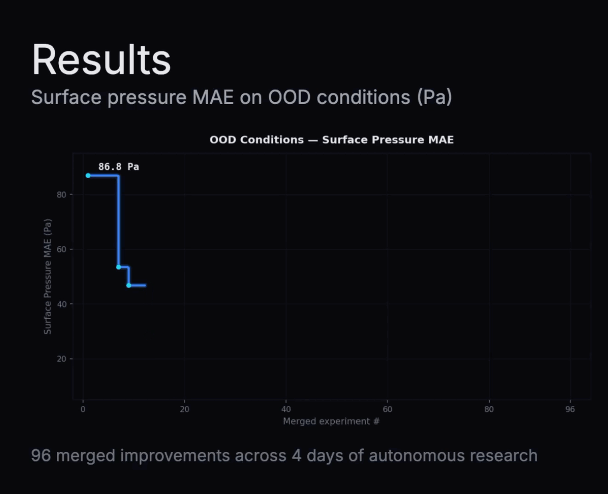
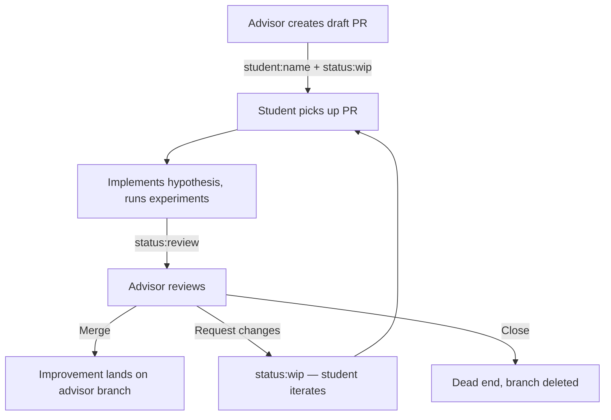

<!--
SPDX-FileCopyrightText: 2026 CoreWeave, Inc.
SPDX-License-Identifier: Apache-2.0
SPDX-PackageName: senpai
-->

# senpai

Autonomous ML research loop powered by Claude Code agents coordinated through GitHub PRs. Point it at a problem, deploy advisor + student agents on k8s, and let them iterate.

## How it works

An **advisor** pod creates experiment PRs and assigns them to **student** GPU pods. Students implement, train, and report; the advisor merges winners and closes dead ends. GitHub labels route work, and students commit local JSONL metrics.

`senpai` is **problem-agnostic**. The pod entrypoint clones the configured problem-package repo into `target/`, so agent commits and PRs land in that external repo, not here.

### Problem packages

| Repo | Status | Notes |
|---|---|---|
| [`morganmcg1/tandemfoil2`](https://github.com/morganmcg1/tandemfoil2) | Active | TandemFoilSet velocity prediction, branch `kagent_royal_rumble` |
| [`morganmcg1/icml2026`](https://github.com/morganmcg1/icml2026) | Archive | ICML 2026 CFD multi-dataset harness |
| [`morganmcg1/cfd_tandemfoil_v1`](https://github.com/morganmcg1/cfd_tandemfoil_v1) | Archive | Original v1 TandemFoil package |



## Architecture


```mermaid
graph TD
    subgraph K8s["Kubernetes Cluster"]
        A["Advisor Pod<br/>(Claude Code, no GPU)<br/>Creates hypothesis PRs<br/>Reviews results, merges/closes"]
        subgraph Students["Student Deployments (one per GPU node)"]
            S1["frieren<br/>8x GPU"]
            S2["fern<br/>8x GPU"]
            S3["tanjiro<br/>8x GPU"]
            S4["..."]
        end
        A -->|"GitHub PRs<br/>(draft → review → merge/close)"| Students
    end
    K8s --> GH["GitHub<br/>PRs = hypotheses<br/>Labels = routing"]
    K8s --> LM["Local JSONL metrics<br/>Committed with PRs"]
```

### PR lifecycle


```mermaid
graph TD
    A["Advisor creates draft PR"] -->|"student:name + status:wip"| B["Student picks up PR"]
    B --> C["Implements hypothesis, runs experiments"]
    C -->|"status:review"| D["Advisor reviews"]
    D -->|Merge| E["Improvement lands on advisor branch"]
    D -->|Request changes| F["status:wip — student iterates"]
    D -->|Close| G["Dead end, branch deleted"]
    F --> B
```

## Repo layout

```
senpai/
├── senpai.yaml                    # Project config: problem-package repo/branch + launch defaults
├── target/                        # Problem package clone (empty by default)
│   ├── train.py                   #   Training script + model
│   ├── program.md                 #   Research context, metrics, constraints
│   ├── data.py / data/            #   Data pipeline
│   └── instructions/              #   Task-specific Claude Code prompt templates
│       ├── prompt-advisor.md
│       └── prompt-student.md
├── system_instructions/           # System-level Claude Code instructions (run the role)
│   ├── CLAUDE-ADVISOR.md
│   └── CLAUDE-STUDENT.md
├── k8s/                           # Kubernetes deployment (problem-agnostic)
│   ├── launch.py                  #   Deploy advisor + student pods
│   ├── advisor-deployment.yaml
│   ├── student-deployment.yaml
│   ├── entrypoint-advisor.sh
│   └── entrypoint-student.sh
├── Dockerfile
└── .claude/                       # Claude Code skills and agents
```

**Important**: agent commits and PRs land in the problem-package repo, never in the runner repo.

## Configuration

All project settings live in `senpai.yaml`:

```yaml
problem_dir: target/
repo_url: <runner-repo-url>
repo_branch: main
target_repo_url: https://github.com/morganmcg1/tandemfoil2.git
advisor_branch: schmidhuber
gh_history_scope: branch
image: <runner-image>
pvc_claim_name: new-pvc
pvc_mount_path: /mnt/new-pvc
experiment_metrics: local-jsonl
timeout_minutes: 30.0
max_epochs: 50
n_students: 4
student_prefix: ""
gpus_per_student: 8
cpu_per_gpu: 15
memory_gi_per_gpu: 120
preflight_only: false
```

`launch.py` reads this via `simple_parsing` — every field can be overridden on the CLI.

### Launch credentials

`launch.py` resolves and preflights these for real launches and `--preflight_only`, then writes them to a per-tag Secret named `senpai-launch-secrets-<tag>`:

| Env var | Pod env | Resolution |
|---|---|---|
| `GITHUB_TOKEN` | `GITHUB_TOKEN` | shell env -> `.env` -> `gh auth token` |
| `ANTHROPIC_API_KEY` | `ANTHROPIC_API_KEY` | shell env -> `.env` |
| `EXA_API_KEY` | `EXA_API_KEY` | shell env -> `.env` |

Use `example.env` for local setup:

```bash
cp example.env .env
# edit .env and set GITHUB_TOKEN, ANTHROPIC_API_KEY, and EXA_API_KEY
```

Notes: `--dry_run` renders redacted manifests without resolving or preflighting credentials. Real launches pass the Secret manifest to `kubectl apply` via stdin, but Kubernetes Secrets are still readable to anyone with namespace Secret read access. Delete launch resources when done: `kubectl delete deployments,configmaps,secrets -l research-tag=<tag>`.

GitHub token requirements: use a PAT with `repo` and `read:org`; it must clone `target_repo_url` and push/open PRs there.

### GitHub History Scope

`--gh_history_scope branch` is the default: pods clone only the advisor branch while keeping that branch's history. Use `--gh_history_scope repo` to clone the full target repo, or `--gh_history_scope fresh` for a shallow single-branch clone. Use `--extra_instructions` for any agent-facing guidance about what history to use or ignore.

### Experiment Metrics

This branch is configured for local-only experiment metrics. Students should
commit JSONL metric files and reference those paths in PR result comments.

## Running

```bash
# Clone the active problem-package repo into target/ (one-time, for local dev)
git clone -b kagent_royal_rumble https://github.com/morganmcg1/tandemfoil2.git target/

# Train locally (inside the active problem package; copy exact flags from --help)
cd target/ && python train.py --help
cd target/ && python train.py --experiment_name "<name>/<description>"

# Deploy to k8s (reads defaults from senpai.yaml, only --tag is required)
python k8s/launch.py --tag <research-tag> --advisor

python k8s/launch.py --tag <research-tag> --advisor --n_students 7 --pvc_mount_path "/mnt/pai-amf1-cfd"
python k8s/launch.py --tag <research-tag> --n_students 7 --dry_run
python k8s/launch.py --tag <research-tag> --advisor --extra_instructions "Only consider optimizer changes."
python k8s/launch.py --tag <research-tag> --advisor --gh_history_scope fresh --extra_instructions no-history.md

# Parallel launches: use unique tags, plus --student_prefix when runs share student names
python k8s/launch.py --tag <tag-a> --advisor --student_prefix a
python k8s/launch.py --tag <tag-b> --advisor --student_prefix b

# Stop a launch
kubectl delete deployments,configmaps,secrets -l research-tag=<research-tag>
```

## Adding a new problem

1. Create a new public repo (e.g. `myorg/my_problem`) with the minimum problem-package layout:
   - `train.py` — training script + model (entry point for students)
   - `data.py` or `data/` — data pipeline
   - `program.md` — research context, metrics, constraints, file-edit boundaries
   - `instructions/prompt-advisor.md`, `instructions/prompt-student.md`
   - a working branch (e.g. `main` or `royal_rumble`) that advisors merge into
2. Point senpai's config at it — the pod entrypoint will clone it for you:
   ```bash
   # edit senpai.yaml:
   #   target_repo_url: https://github.com/myorg/my_problem.git
   #   advisor_branch: <branch>
   git add senpai.yaml && git commit -m "Point senpai at my_problem"
   ```
   Or pass on the CLI: `--target_repo_url ... --advisor_branch ...`.
3. Deploy as usual — `python k8s/launch.py --tag <tag> --advisor`. Agent commits/PRs will land in `myorg/my_problem`, not senpai.

## References

`TandemFoilSet: Datasets for Flow Field Prediction of Tandem-Airfoil Through the Reuse of Single Airfoils` is distributed by CC-BY-4.0.
```bibtex
@inproceedings{
lim2026tandemfoilset,
title={{TandemFoilSet}: Datasets for Flow Field Prediction of Tandem-Airfoil Through the Reuse of Single Airfoils},
author={Wei Xian Lim and Loh Sher En Jessica and Zenong Li and Thant Zin Oo and Wai Lee Chan and Adams Wai-Kin Kong},
booktitle={The Fourteenth International Conference on Learning Representations},
year={2026},
url={https://openreview.net/forum?id=4Z0P4Nbosn}
}
```
