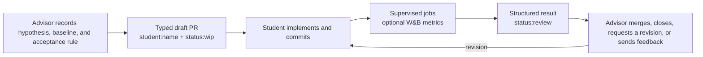
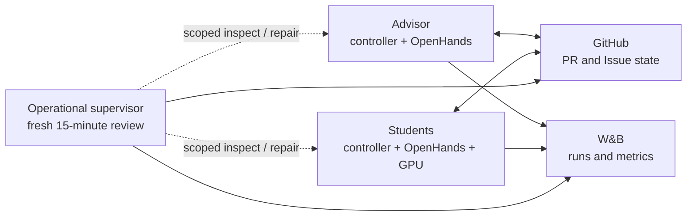

<!--
SPDX-FileCopyrightText: 2026 CoreWeave, Inc.
SPDX-License-Identifier: Apache-2.0
SPDX-PackageName: senpai
-->

# senpai

Senpai is an autonomous ML research loop built on the OpenHands Agent SDK. An advisor proposes and reviews experiments; GPU students implement one assigned experiment each, train, and return evidence through GitHub and W&B.

Senpai is problem-agnostic. It runs against a separate target repository, and every experiment branch, commit, and PR lands there—not in this runner repository.

- **ICML 2026:** [*SENPAI: Self-ExperimentatioN for Physical AI—An Observability-Based Research Harness*](https://openreview.net/forum?id=g0bJFA9gVT) was presented at the AI for Science Workshop; see the [project site](https://wandb.github.io/senpai/).
- **ICLR 2026:** Kagent, a Senpai variant, placed fourth in the [GRaM competition](https://gram-competition.github.io/).

## Quick start

Kubernetes, local Docker, AWS GPU, and AWS Mac use the same launcher, role
configuration, training limits, GitHub workflow, and W&B record. This quick
start shows Kubernetes; see [Docker](#docker), [AWS](#aws), or
[AWS Mac](#aws-mac) for a host without a cluster.

### 1. Prerequisites

- Python 3.13, [uv](https://docs.astral.sh/uv/), and Git. Kubernetes launches
  also need `kubectl`.
- A Kubernetes context and existing namespace with outbound access to GitHub,
  Exa, W&B, and each configured model provider. Your identity must be able to
  get, list, create, update, patch, and delete Deployments, ConfigMaps, and
  Secrets there.
- An existing PVC with enough space for the dataset, plus concurrent mounts from every scheduled node—normally `ReadWriteMany`, unless your storage driver explicitly supports another multi-node topology. The launcher mounts this claim but does not create it; role state stays on each pod's node-local `emptyDir` volume.
- NVIDIA GPU nodes, the Kubernetes NVIDIA device plugin, and a host driver compatible with CUDA 13 and the shipped student image.
- A target GitHub repository that Senpai can clone and modify.
- Immutable advisor and student images reachable by every cluster node.

### 2. Install Senpai

```bash
git clone https://github.com/wandb/senpai.git
cd senpai
uv sync --locked
```

For development, include the test dependencies:

```bash
uv sync --locked --extra dev
```

### 3. Add credentials

```bash
cp example.env .env
```

Fill in the required values in the gitignored `.env` file. Model-provider keys
are required when any configured model uses that provider; `HF_TOKEN` is
optional:

```dotenv
GITHUB_TOKEN=
ANTHROPIC_API_KEY=
OPENAI_API_KEY=
EXA_API_KEY=
WANDB_API_KEY=
HF_TOKEN=
```

| Credential | Required access |
|---|---|
| `GITHUB_TOKEN` | Target-repository Contents, Pull requests, and Issues read/write. A classic token with `repo` scope also works. GitHub CLI authentication is the fallback when this value is absent. |
| `ANTHROPIC_API_KEY` | Required when an `anthropic/...` model is configured. |
| `OPENAI_API_KEY` | Required when an `openai/...` model is configured. Every default profile uses GPT-5.6. |
| `EXA_API_KEY` | General-web and research-publication search. |
| `WANDB_API_KEY` | Read/write access to the configured W&B entity and project. |
| `HF_TOKEN` | Optional access to private or gated Hugging Face models and datasets. It is omitted from launch secrets when unset. |

`k8s/launch.py` reads shell environment variables first and then the
repository-root `.env`; only the GitHub token also falls back to `gh auth
token`.

Kubernetes stores runtime credentials in a per-launch Secret. Docker stores
them in private local run state; AWS sends them over SSH into the same private
run state on EC2. Termination removes that state. During role bootstrap, the
GitHub write token is removed from the process environment and handed to the
controller through a one-use channel; it is not exposed to the model or
subagents.

### 4. Prepare the target repository

The target branch normally contains:

```text
program.md
instructions/
├── prompt-advisor.md
└── prompt-student.md
```

- `program.md` defines the research objective, baseline, metrics, benchmark rules, training limits, and allowed edit surface.
- `prompt-advisor.md` adds target-specific experiment-selection and review guidance.
- `prompt-student.md` adds target-specific implementation, training, and reporting guidance.

Targets that keep their Senpai configuration in a subdirectory may use
`senpai/program.md`. Role prompt overlays are optional in that layout; without
them, both roles follow the repository instructions and their built-in Senpai
role charter.

Use the [bootstrap-target guide](plugins/senpai/skills/bootstrap-target/SKILL.md) to inspect a new target and create these files. Target `AGENTS.md`, compatible `CLAUDE.md`, and `.agents/skills/` are also loaded through OpenHands project context and progressive disclosure.

The target repository must be different from the Senpai runner repository.

### 5. Configure the launch

Copy the checked-in defaults and replace the W&B, branch, PVC, and resource values for your environment:

```bash
cp senpai.yaml senpai.local.yaml
```

The most important settings are:

```yaml
target_repo_branch: main
advisor_branch: senpai-research

wandb_entity: your-team
wandb_project: your-project

advisor_model: openai/gpt-5.6-sol
advisor_reasoning_effort: xhigh
student_model: openai/gpt-5.6-sol
student_reasoning_effort: xhigh

smart_model: openai/gpt-5.6-sol
smart_reasoning_effort: xhigh
fast_model: openai/gpt-5.6-luna
fast_reasoning_effort: high
frontier_model: openai/gpt-5.6-sol
frontier_reasoning_effort: max
local_condenser_max_events: 0
local_condenser_max_tokens: 0
local_condenser_target_events: 0

pvc_claim_name: your-existing-pvc
pvc_mount_path: /mnt/data

n_students: 4
gpus_per_student: 1
cpu_per_gpu: 8
memory_gi_per_gpu: 64

timeout_minutes: 30
max_epochs: 50

operational_supervisor: true
namespace: senpai-first-run
supervisor_dedicated_namespace: true
supervisor_network_policy_enforced: true
supervisor_state_pvc_claim_name: senpai-first-run-supervisor-state
supervisor_interval_s: 900
supervisor_research_interval_s: 21600
supervisor_action_cooldown_s: 1800
```

W&B Inference uses LiteLLM's native `wandb/` provider. For example, set every
model profile to `wandb/zai-org/GLM-5.2` with reasoning effort `max`. Senpai
uses `WANDB_API_KEY`, routes requests through the W&B chat endpoint, explicitly
enables GLM thinking, and sends
`OpenAI-Project: <wandb_entity>/<wandb_project>` on every request.
Providers without native compaction use Senpai's local summarizing condenser.
Zero selects model-specific defaults for each of its three limits. Unknown
local models retain the existing 80-event fallback with token and target limits
disabled. W&B GLM-5.2 instead uses its exact `zai-org/GLM-5.2` chat-template
tokenizer, condenses at 180,000 input tokens, targets about 40 retained events,
and keeps 600 events as an emergency fuse. The 82,144-token margin below W&B's
262,144-token context window leaves room for a large tool result and the next
model response. OpenAI Responses and Anthropic keep their native compaction and
ignore all three local limits.

Every advisor root turn also receives a live controller invariant in its
non-condensed system context: the campaign is active, no campaign round limit
is configured, and round labels or compaction summaries cannot declare the
research finished. `max_turns` is identified explicitly as a per-turn safety
bound, not a research-completion counter.

Set positive values to override any dimension with
`local_condenser_max_events`, `local_condenser_max_tokens`, and
`local_condenser_target_events`; the target must leave room for the preserved
prefix and meaningful progress. The corresponding environment variables are
`SENPAI_OPENHANDS_LOCAL_CONDENSER_MAX_EVENTS`,
`SENPAI_OPENHANDS_LOCAL_CONDENSER_MAX_TOKENS`, and
`SENPAI_OPENHANDS_LOCAL_CONDENSER_TARGET_EVENTS`. AWS Mac preparation downloads
the GLM tokenizer once into `/Users/ec2-user/.senpai/huggingface`, verifies it
offline, and shares that cache with the roles' private home directories.

The defaults in `senpai.yaml` describe W&B's deployment and should not be copied unchanged into another environment. Every setting can also be overridden on the command line. `--tag` and `--target_repo_url` are required unless your chosen config file supplies them.

Deployments require one immutable image per active role, all built from the same
Senpai revision. Full `sha-<40-character-commit>` tags identify it directly;
digest-pinned role images require an explicit shared `repo_revision`.
Kubernetes and Docker fetch that commit from `repo_url`. AWS transfers the exact
clean local commit instead. PR image checks build but do not publish images.

### 6. Run preflight

```bash
revision=$(git rev-parse HEAD)
launch_args=(
  --config_path senpai.local.yaml
  --tag first-run
  --target_repo_url https://github.com/OWNER/TARGET.git
  --advisor
  --names frieren
  --advisor_image "ghcr.io/wandb/senpai-advisor:sha-$revision"
  --student_image "ghcr.io/wandb/senpai-student:sha-$revision"
)

uv run python k8s/launch.py "${launch_args[@]}" --preflight_only
```

Every role-launch preflight authenticates GitHub, Exa, W&B, and every model
provider used by an active role or shared model profile. It verifies GitHub
Contents write access, resolves the target branch, rejects active student-label
collisions, and checks immutable image references against one expected runner
revision. A supervisor-only upgrade authenticates only the credentials the
supervisor actually uses (GitHub, W&B, and its model provider), verifies the
existing exact campaign inventory, advisor branch, and versioned management and
repair protocols. Compatible role and supervisor images may come from different
source revisions. The upgrade neither requires Exa/Hugging Face credentials nor
creates branches or labels. Backend-specific checks are described below.
Preflight never starts advisor or student roles.

### 7. Launch

Inspect the preflight result, then launch with the same arguments:

```bash
uv run python k8s/launch.py "${launch_args[@]}"
```

The launcher creates routing labels, role ConfigMaps and Deployments, and one
fixed launch Secret when it is launching an advisor or students. The
operational supervisor owns a separate least-privilege Secret and ConfigMap.
Both supervisor objects are immutable and content-addressed, so a supervisor-
only upgrade never rewrites credentials used by the research roles and retains
the previous bundle. Such an upgrade applies the campaign NetworkPolicy,
creates the new bundle, and reapplies the supervisor ServiceAccount, RBAC, and
Deployment. Its `Recreate` strategy prevents two supervisor pods from writing
the state claim concurrently, with a short supervisor-only outage during
replacement. The launcher waits up to `--supervisor_ready_timeout_s` for the
Deployment to become ready.

Before the first mutable supervisor resource is changed, the launcher resolves
and pins the Kubernetes context plus the cluster and campaign-namespace UIDs,
acquires a campaign-scoped Lease, and writes a mode-`0600` rollback bundle under
`$XDG_STATE_HOME/senpai/rollback` (or `~/.local/state/senpai/rollback`). The
private, bounded, atomically fsynced bundle records the exact prior
NetworkPolicy, ServiceAccount, Role, RoleBinding, and Deployment, including
which resources did not exist and the Lease UID/transition epoch. Any apply,
readiness, interruption, or unexpected process failure attempts rollback. It
first removes the failed Deployment in foreground, restores and verifies the
security resources, and only then recreates and verifies the old Deployment.
Lease lineage prevents an old bundle from overwriting a newer release. A
healthy rollout marks the cluster Lease committed before finalizing and
removing the local journal; a finalized Lease reconciles a crash-stale local
journal on the next launch. A failed launch prints and retains its path and a
derived manual recovery command. If a healthy rollout cannot finish that
bookkeeping, the launcher prints a separate `finalize-commit` command—never use
the restore command for that case. Immutable release artifacts may remain after
rollback. The supervisor's persistent SQLite state is never rolled back.

The supervisor also receives a dedicated Kubernetes ServiceAccount and
namespace-scoped Role/RoleBinding. This is a Kubernetes workload identity, not
a Linux user, human account, or cloud identity. Senpai creates no cloud-role
binding; on a managed cluster, verify that admission and workload-identity
policy do not attach one. Only the credentialed control container receives its
projected token while the Pod is running; a narrow startup init container also
mounts it only to create the control container's token-file kubeconfig. The
typed operation tool and repair broker enforce the campaign inventory; the
separate model-visible terminal container has no Kubernetes token or
credentials. Kubernetes cannot label-scope the control container's pod
list/log/exec verbs, so every supervised campaign requires its own namespace.
`--supervisor_dedicated_namespace` is the operator's attestation of that fact,
not an automated proof. The launcher does not create the namespace, PVC,
Service, or general cluster RBAC.

Inspect and stop the launch:

```bash
kubectl get deployments,pods -l research-tag=first-run
kubectl logs -f deployment/senpai-first-run-frieren
kubectl delete deployment/senpai-supervisor-first-run
kubectl delete deployments,configmaps,secrets,serviceaccounts,roles,rolebindings,networkpolicies \
  -l research-tag=first-run
```

The first delete is the supervisor-only kill switch. It leaves advisor and
student pods, their repair sidecars, persistent state, and host capacity in
place. The second command stops the whole campaign; these are intentionally
different operations.

Use `--kube_context` and `--namespace` when the desired cluster is not your current default. Use `--dry_run` to render redacted manifests without checking credentials or writing to the cluster.

## Docker

Docker uses the same role specification and in-container `pvc_mount_path` as
Kubernetes. It requires a Linux host with Docker Engine, Git, the NVIDIA
Container Toolkit, a compatible NVIDIA driver, and enough GPUs for all
students. Docker Desktop on macOS cannot run the GPU student image.

```bash
revision=$(git rev-parse HEAD)
uv run python k8s/launch.py \
  --config_path senpai.local.yaml \
  --backend docker \
  --tag first-docker-run \
  --target_repo_url https://github.com/OWNER/TARGET.git \
  --advisor \
  --names fern \
  --data_dir /srv/ml-data \
  --advisor_image "ghcr.io/wandb/senpai-advisor:sha-$revision" \
  --student_image "ghcr.io/wandb/senpai-student:sha-$revision"
```

This first run uses one student; omit `--names fern` to use the shared default
of four. `data_dir` is mounted at `pvc_mount_path`, so target code and data paths
do not change between Kubernetes and Docker. Preflight checks the local images,
source revision, Docker, CUDA, GPU allocation, state directory, and
container-name collisions before changing GitHub. Runtime state lives under
`~/.senpai/runs/<tag>`.

```bash
uv run python k8s/docker.py status first-docker-run
uv run python k8s/docker.py logs first-docker-run --role student-fern --follow
uv run python k8s/docker.py terminate first-docker-run
```

## AWS

AWS creates one temporary, public, on-demand EC2 GPU host and runs the Docker
backend on it. All students share that host. The target repository, role
settings, data path, and agent workflow remain identical to Kubernetes.

### AWS setup

Install AWS CLI v2 and OpenSSH. The selected AWS identity needs
`sts:GetCallerIdentity`, `ssm:GetParameter`, EC2 `Describe*` access for instance
types, images, networking, instances, security groups, volumes, and volume
modifications, plus `CreateKeyPair`, `DeleteKeyPair`, `CreateSecurityGroup`,
`AuthorizeSecurityGroupIngress`, `DeleteSecurityGroup`, `RunInstances`,
`TerminateInstances`, `CreateTags`, `ModifyVolume`, and
`ec2:GetConsoleOutput`. The region needs GPU quota and a public subnet with an
internet-gateway route.

For AWS SSO:

```bash
aws configure sso --profile senpai
aws sso login --profile senpai
aws sts get-caller-identity --profile senpai
```

If the session expires, run `aws sso login --profile senpai` again before a
status, logs, or termination command. AWS credentials remain on the operator
machine and are never copied to EC2. Runtime credentials still come from the
gitignored `.env` described above; Senpai sends them over SSH into private
remote Docker state. Local AWS state contains only lifecycle identifiers and
the ephemeral SSH key.

The launcher authenticates each new host before its first SSH connection. The
guest publishes its OpenSSH public host keys to the EC2 serial console during
boot; Senpai retrieves them through the authenticated AWS control plane,
validates their encoding and embedded key type, and pins them in the run's
private `known_hosts` file. SSH uses strict host-key checking. If AWS console
output does not provide a valid key before the readiness deadline, launch
fails before Senpai uploads runtime credentials or data.

AWS currently needs anonymously pullable advisor and student images. Use
matching `:sha-<40-character-commit>` tags, or digest-pinned images with an
explicit matching `repo_revision`. Commit local changes before launching: AWS
requires a clean checkout whose `HEAD` exactly matches that revision.

### Preflight and launch

This first run uses one student to control cost. Omit `--names fern` to use the
shared default of four one-GPU students.

```bash
profile=senpai
region=us-east-2
tag=first-aws-run
revision=$(git rev-parse HEAD)

launch_args=(
  --config_path senpai.local.yaml
  --backend aws
  --tag "$tag"
  --target_repo_url https://github.com/OWNER/TARGET.git
  --advisor
  --names fern
  --aws_profile "$profile"
  --aws_region "$region"
  --aws_ttl_hours 8
  --data_dir /absolute/path/to/data-root
  --advisor_image "ghcr.io/wandb/senpai-advisor:sha-$revision"
  --student_image "ghcr.io/wandb/senpai-student:sha-$revision"
)

uv run python k8s/launch.py "${launch_args[@]}" --preflight_only
```

Verify the printed account, region, instance shape, AMI, subnet count, and
volume before creating anything. Then launch with the same arguments:

```bash
uv run python k8s/launch.py "${launch_args[@]}"
```

AWS preflight is read-only. It checks the account, local source revision,
credentials, AMI, actual GPU/vCPU/memory shape, SSH boundary, and eligible
public subnets. Image pulls and CUDA validation require the temporary host, so
EC2 billing has started, but they still happen before data upload or GitHub
mutation.

The contents of `data_dir` appear at `pvc_mount_path`. For code that reads
`/mnt/data/datasets/...` with the configuration above, pass the directory whose
child is `datasets/`. The directory must be non-empty and contain no symlinks.
Senpai streams it over SSH and verifies its file count and bytes. The initial
`aws_volume_gib` is a bootstrap floor for the AMI and image-pull peak; after
image validation, Senpai measures free space and grows the root EBS volume for
the actual dataset plus `aws_runtime_reserve_gib`.

Usually only `aws_profile`, `aws_region`, `data_dir`, and `aws_ttl_hours` need
attention. Leave the others empty unless your AWS environment has known
resources:

| Setting | When to set it |
|---|---|
| `aws_instance_type` | Pin an available x86_64 NVIDIA type. Senpai validates its real GPU, vCPU, and memory shape; otherwise it selects the first fitting type from its catalog. |
| `aws_subnet_id` | Pin a known public subnet. Otherwise Senpai searches eligible subnets across AZs and retries recognized capacity failures. |
| `aws_ami_id` | Pin the supported Ubuntu 22.04 NVIDIA Deep Learning Base AMI; otherwise Senpai resolves the current regional image. |
| `aws_ssh_cidr` | Pin the operator's IPv4 `/32`; otherwise Senpai discovers the current public IP. |
| `aws_volume_gib` | Increase the initial AMI/image-pull space when using unusually large images. |
| `aws_runtime_reserve_gib` | Change the free space retained across all roles for worktrees, checkpoints, caches, and logs. |
| `aws_ready_timeout_s`, `aws_data_timeout_s` | Increase host-start or dataset-upload deadlines on slower environments. |

### Operate and clean up

```bash
uv run python k8s/aws.py status first-aws-run
uv run python k8s/aws.py logs first-aws-run --role student-fern --tail 200
uv run python k8s/aws.py logs first-aws-run --role advisor --tail 200
uv run python k8s/aws.py terminate first-aws-run
```

Always run `terminate`. It attempts to gracefully stop the agents, terminates
EC2, and removes the ephemeral key pair, security group, local SSH key, and
lifecycle state. Launch failures attempt the same cleanup automatically.

`aws_ttl_hours` is an emergency cost backstop measured from instance startup,
not a replacement for cleanup. If it fires, run `terminate` afterward to remove
the remaining key, security group, and local state. The current AWS backend
intentionally owns one disposable public host; it does not yet support Spot,
multiple nodes, existing-host reuse, private-subnet/SSM transport, private image
registries, or IAM instance profiles.

## AWS Mac

AWS Mac reuses an already allocated fleet of `mac-m4pro.metal` Dedicated Hosts
and runs Senpai natively under per-user `launchd` services. It assigns exactly
one student to each host and co-locates the optional advisor on the first host.
The backend creates and terminates EC2 instances, but never releases the
Dedicated Hosts.

Use a clean checkout at the exact committed revision being launched. The base
macOS AMI does not contain full Xcode or the Metal toolchain. Provide either a
local Xcode app or a prepared `ditto` zip, plus a zip containing exactly one
Metal `*.exportedBundle`. Launch imports that local artifact instead of relying
on Apple's component catalog. Each selected host also needs a public subnet in
its own Availability Zone and an existing base security group in the same VPC.
The launcher attaches that group unchanged and creates a second,
campaign-owned security group for the operator's temporary SSH `/32`. This
keeps concurrent campaigns from revoking each other's access. Senpai removes
and verifies the new group's default IPv4/IPv6 egress before launching an
instance, so attaching it cannot broaden the base group's outbound policy.

Package the directory produced by Xcode's component export without changing
its bundle layout:

```bash
ditto -c -k --sequesterRsrc --keepParent \
  /path/to/MetalToolchain-17F109.exportedBundle \
  /path/to/MetalToolchain.zip
```

```bash
tag=first-aws-mac-run
revision=$(git rev-parse HEAD)

launch_args=(
  --config_path senpai.local.yaml
  --backend aws-mac
  --tag "$tag"
  --target_repo_url https://github.com/OWNER/TARGET.git
  --advisor
  --n_students 2
  --gpus_per_student 1
  --repo_revision "$revision"
  --aws_region us-east-1
  --aws_instance_type mac-m4pro.metal
  --aws_mac_host_ids h-HOST1,h-HOST2
  --aws_mac_subnet_ids us-east-1a=subnet-A,us-east-1b=subnet-B
  --aws_mac_security_group_id sg-EXAMPLE
  --aws_mac_xcode_archive /absolute/path/to/Xcode.zip
  --aws_mac_metal_toolchain_archive /absolute/path/to/MetalToolchain.zip
  --aws_mac_mlxfast_bundle "$HOME/.local/share/mlxfast/mlxfast.js"
  --aws_mac_official_submit
  --aws_ttl_hours 0
)

uv run python k8s/launch.py "${launch_args[@]}" --preflight_only
uv run python k8s/launch.py "${launch_args[@]}"
```

Preflight is read-only: it validates the exact source revision, Apple Silicon
AMI, host availability and capacity, subnet placement, base security group,
Xcode source, and Metal toolchain archive. Launch creates an ephemeral SSH key
and a campaign-owned SSH security group, permits the operator's IPv4 `/32`
only on that group, validates one native canary,
prepares the remaining Macs in parallel, and holds every role at a fleet-wide
start gate before opening it. Each Mac uses the same authenticated EC2-console
host-key pinning and strict, fail-closed SSH policy described above, including
when `--aws_ttl_hours 0` disables scheduled shutdown.
Host preparation installs tmux and Chromium and smoke-tests both with a fresh
role-like `HOME`, matching the private-home environment used by native roles.
Each native role also has a private, shortened tmux socket root under
`~/.senpai/t`. This keeps macOS Unix-socket paths within the platform limit
while giving co-located roles and their recursive subagents separate tmux
namespaces. All native roles still run under the configured Unix user; this is
namespace isolation, not a hostile-process security boundary.
With `--aws_mac_official_submit`, the launcher also requires
`MLXFAST_API_TOKEN` and gives every active role official dispatch capability.
Coordinate submissions so students send distinct, validated candidates rather
than duplicate jobs.

AWS Mac alone accepts `--aws_ttl_hours 0` to omit the scheduled instance
shutdown and make guest-initiated shutdowns stop rather than terminate the
instance; a positive value retains the automatic termination backstop. Zero
does not change explicit termination or release the Dedicated Hosts, so monitor
the fleet and run `terminate` manually. The GPU AWS backend continues to
require a positive TTL.

```bash
uv run python k8s/aws_mac.py status first-aws-mac-run
uv run python k8s/aws_mac.py logs first-aws-mac-run --role advisor
uv run python k8s/aws_mac.py logs first-aws-mac-run --role student-fern
uv run python k8s/aws_mac.py terminate first-aws-mac-run
```

Termination unloads the native services, removes their private state,
terminates only the instances recorded for the run, and deletes the ephemeral
key and campaign-owned SSH security group. It preserves all pre-existing
Dedicated Hosts and networking resources. Cleanup retains access credentials
until every instance is confirmed terminated or missing, and persists partial
failures for a safe retry. Runs created by the older shared-rule launcher never
revoke that shared rule automatically; cleanup preserves their state with an
explicit manual-review message while the exact rule remains. Remove it only
when safe, then rerun `terminate` so cleanup can verify its absence and finish.

## Experiment workflow

GitHub is both the coordination layer and the durable scientific notebook. W&B is the metric and artifact record.


```mermaid
flowchart LR
    H["Advisor records hypothesis, baseline, and acceptance rule"]
    P["Typed draft PR<br/>student:name + status:wip"]
    I["Student implements and commits"]
    T["Supervised jobs<br/>optional W&B metrics"]
    R["Structured result<br/>status:review"]
    D["Advisor merges, closes, requests a revision, or sends feedback"]

    H --> P --> I --> T --> R --> D
    D -->|revision| I
```

1. The advisor creates a falsifiable assignment with the exact required research-base SHA, baseline metrics, expected mechanism, implementation scope, and stopping rules.
2. `create_assignment` creates the student branch and draft PR, embeds a typed assignment record, and applies the routing labels.
3. The assigned student receives one OpenHands conversation for that assignment revision. New PR comments and reviews are queued durably even while a turn is active, then delivered in the next bounded turn.
4. The student commits the exact implementation, launches supervised training, and records every referenced run in W&B.
5. The student calls `submit_experiment_result`; the tool validates and publishes the branch before changing the PR to `status:review`.
6. The advisor compares the evidence, then uses the corresponding operation-specific tool to merge a reproducible winner, close a useful negative result, request a new revision, or send non-revision feedback.

The structured result records its terminal status, exact result commit, W&B run IDs and URLs, bounded conclusion, and baseline/candidate metric comparison when available. Once published for an assignment revision and head, that evidence is immutable: exact duplicate publication is an idempotent replay, while changed evidence requires a new commit or revision. Non-revision feedback continues the same student conversation; a revision request intentionally creates a fresh revision identity and conversation.

`status:wip` owns a student compute slot; `status:review` does not. The advisor can therefore review one result while that student starts another experiment. Sibling assignment mutations within one worker are serialized end to end, including advisor-base publication and student preflight, push, and result publication. Across advisor and student workers, exact assignment, revision, head, and branch-lease preconditions detect stale work; if a revision wins during result publication, Senpai restores the current revision's WIP routing before returning the stale-result error.

Trusted collaborator comments, submitted reviews, and inline review comments are delivered automatically to the relevant student; feedback from untrusted authors and unrecognized bots is ignored. `get_prs` can still retrieve the complete discussion explicitly. If the configured research base changes while an experiment is running, Senpai emits `research_base_changed` with the assignment's `required_base_sha` and the live `current_base_sha` without cancelling the assignment. When reviewing its terminal result, the advisor either requests a revision on the current base or records why that exact result remains valid with `accept_result_on_current_base`; `merge_experiment` still verifies the live SHA immediately before merging.

Before each assignment or PR-feedback turn, the student controller authenticates
and hydrates the exact assignment head and recorded baseline into
`refs/senpai/assignment/` without resetting the checkout. A revision can
atomically record an explicitly accepted live baseline SHA. Divergent local
history and dirty work are preserved and reported once; an unchanged assignment
reminder does not repeatedly wake the model, while changed refs, local work, or
new feedback still do.

`get_prs` returns complete PR bodies and discussions. Up to five PRs are returned in context by default; larger selections become a Markdown artifact outside the target checkout so long histories do not pollute the main conversation.

## Long-running jobs and monitoring

Advisor and student root conversations receive four typed tools for durable,
non-blocking process supervision. Students use them for GPU work; advisors can
use them for repository-side watchers or other bounded long-running commands.

| Tool | Contract |
|---|---|
| `run_job` | Accepts structured `argv`, `cwd`, a hard timeout, a `read_only` or `mutable` workspace-access declaration, and an optional W&B credential grant. It starts a supervised process group without blocking, persists its identity, full log, and bounded error tail, discovers W&B run IDs, and automatically registers terminal-state monitoring for the current conversation. Suitable work includes training, inference, evaluation, builds, and receipt watchers. |
| `get_job_status` | Performs one bounded read of the latest persisted state, exit code, elapsed time, W&B run IDs, and error tail. |
| `monitor_job` | Sets or replaces optional W&B policy for an already-running job: metric, minimize/maximize direction, `lte`, `gte`, `improved_by`, or `regressed_by` gates, poll interval, and stale-update detection. It cannot disable terminal wakes. |
| `cancel_job` | Stops the complete process group through the supervised TERM/KILL path, waits for a durable terminal state, and retires its monitor. |

After launch, the role can finish its turn. The deterministic controller polls
process state and at most one selected W&B metric without consuming model
tokens. A threshold crossing, regression, stale metric, terminal state, or
monitor error creates one compact durable event and resumes the same
conversation. Due monitors are processed in bounded batches with a time budget;
a slow or broken monitor can delay its batch only within those bounds and cannot
prevent later jobs, GitHub feedback, or child-agent results from being
processed. Monitor policy and ownership have one durable SQLite source of truth.
While any monitor is active, the controller sleeps only until its earliest due
poll rather than the ordinary advisor/student heartbeat.

`workspace_access="mutable"` is the default for builds, training, evaluation,
or any command that can write in the checkout. A student must have a clean
worktree before launching such a job, and controller-driven branch changes wait
until it finishes. `read_only` is reserved for passive watchers and does not take
that lease. A job receives no ambient credentials; request `WANDB_API_KEY` in
`secret_env` only when it actually communicates with W&B.

`improved_by` and `regressed_by` compare with the monitor policy's first observed sample; they do not silently reuse the assignment's documented baseline.

Worker and container restarts preserve completed OpenHands events. A recovered
live job is terminated safely rather than adopted under an unverifiable process
identity; its original conversation receives the persisted terminal outcome.

Interactive browser operations are progressively disclosed. A fresh root
conversation initially sees only `load_browser`; invoking it adds the fourteen
OpenHands browser operations and records the choice in conversation state so a
resumed conversation restores them. `--no-browser` exposes neither the loader
nor the browser family.

`task_tracker` is optional persisted working memory for multi-step work, parallel
workstreams, delegated agents, and long-running jobs; several items may be
`in_progress` when the work is genuinely concurrent. The legacy `think`
scratchpad tool is not exposed to any Senpai root or child—the selected models'
native reasoning remains enabled.

## Subagents

`spawn_agents` launches a batch and immediately returns stable task IDs;
`await_agents` collects them with an `all`, `first`, `quorum`, or any-state
`change` join; `change` also surfaces an uncollected terminal result
immediately. A timed-out wait returns current state and suggests non-blocking
next steps; it does not cancel the children. Every child runs in a fresh
OpenHands conversation and separate process group.

| Agent | Best for | Recommended tier |
|---|---|---|
| [General Purpose](.agents/agents/general-purpose.md) | Bounded work combining terminal investigation, code editing, task tracking, tests, and one controlled level of leaf delegation. | `smart` for ordinary implementation or review; `frontier` for the hardest generalist work. |
| [Explore](.agents/agents/explore.md) | Read-only search across code, data, experiment artifacts, papers, or durable conversation history. It returns conclusions with paths and line numbers rather than dumping source. | `fast` for mechanical exploration; `smart` when relationships are subtle. |
| [Search](.agents/agents/search.md) | External research through Exa via the explicit `search_general_web` or `search_research_publications` task form, with primary-source links. | `smart`. |
| [Bash Runner](.agents/agents/bash-runner.md) | Tests, builds, linters, dependency commands, Git inspection, and noisy CLI work. It returns counts and actionable failures rather than raw logs. | `fast`. |

The model tier is independent of the agent specialization. With the default
`agent=general-purpose`, `model=frontier` launches GPT-5.6 Sol at `max`, sent
to the Responses API with `reasoning.mode: pro`
with the general-purpose terminal and code-editing toolset. Pair `frontier`
with `search_general_web` or `search_research_publications` when the hard task
is external research.

A root spawn batch and its descendants form one delegation tree, which may
create at most eight children total. A role runs at most eight active tasks
concurrently across all trees. Root tasks count toward the tree total, so leave
slots when a General Purpose child needs helpers. Recursion is limited to two
child edges: the root may spawn any agent, and a depth-one General Purpose
child may spawn leaf helpers; Explore, Search, Bash Runner, and all depth-two
children cannot delegate. The tree shares one absolute root-turn deadline, and
a nested child must await or cancel all of its helpers before returning.
Individual tasks are capped at ten minutes for `fast`, thirty for `smart`, and
one hour for `frontier`, shortened when the root deadline is nearer.

An await call is capped at five minutes and does not cancel unfinished work.
`agent_status` provides a non-blocking snapshot; with no task IDs, it returns
up to eight direct tasks that are active or have an uncollected terminal result.
`cancel_agents` records terminal cancellation. Atomic records keyed by the
required batch key and each optional task key (or stable list index) make replay
return the original task IDs instead of spawning duplicates.
`include_context=false` sends only the system prompt and task; the child can
still search the supplied parent-history directory. `include_context=true`
also copies the model-visible parent history. The root advisor or student may
leave useful tasks running and receives their terminal results as durable
events; nested children may not detach descendants.

Children share the parent workspace, so their process and conversation are isolated but their filesystem is not. They receive only their declared tools and never receive GitHub credentials, GitHub workflow tools, or job tools.

## Task guides

OpenHands receives these as progressively disclosed skills; their bodies are loaded only when the task calls for them.

### Core research workflow

| Guide | Purpose |
|---|---|
| [Bootstrap a target](plugins/senpai/skills/bootstrap-target/SKILL.md) | Build `program.md` and the advisor/student overlays from a new ML repository. |
| [Assign an experiment](plugins/senpai/skills/assign-experiment/SKILL.md) | Turn a hypothesis into a typed student branch and draft PR. |
| [Submit experiment results](plugins/senpai/skills/submit-experiment-results/SKILL.md) | Commit the tested implementation and publish a structured, evidence-backed result. |
| [Review an experiment](plugins/senpai/skills/review-experiment/SKILL.md) | Merge a reproducible winner, close a useful negative, or request the missing evidence. |
| [Handle human Issues](plugins/senpai/skills/check-human-issues/SKILL.md) | Respond to authenticated human-to-agent messages delivered through GitHub Issues. |

### Evidence and research

| Guide | Purpose |
|---|---|
| [Senpai status check](.agents/skills/senpai-status-check/SKILL.md) | Produce a bounded, read-only GitHub, W&B, and local-controller status report. |
| [Exa search](.agents/skills/exa-search/SKILL.md) | Search the current web or scholarly publications with mode-specific defaults. |
| [AlphaXiv paper lookup](.agents/skills/alphaxiv-paper-lookup/SKILL.md) | Get a structured overview before reading a primary paper deeply. |
| [W&B and Weave](.agents/skills/wandb-primary/SKILL.md) | Inspect runs, metrics, artifacts, evaluations, and agent traces. |
| [Experiment report](.agents/skills/experiment-report/SKILL.md) | Create the project-standard `nn_cfd` W&B comparison report; this guide is target-specific rather than part of the generic runtime. |
| [Training code style](literature_and_guidance/TRAINING-CODE-STYLE.md) | Structure expensive ML entrypoints so configuration, artifacts, validation, and failure boundaries stay explicit. |

The repository also contains two reusable optimization case studies:

- [LLM inference optimization](literature_and_guidance/LLM-INFERENCE-OPTIMIZATION-SENPAI-GUIDE.md)
- [LLM training optimization](LLM-TRAINING-OPTIMIZATION-GUIDE.md)

## Architecture and durability


```mermaid
flowchart LR
    GH["GitHub<br/>PR and Issue state"]
    WB["W&B<br/>runs and metrics"]
    A["Advisor<br/>controller + OpenHands"]
    S["Students<br/>controller + OpenHands + GPU"]
    O["Operational supervisor<br/>fresh 15-minute review"]

    A <--> GH
    S <--> GH
    A --> WB
    S --> WB
    O --> GH
    O --> WB
    O -. "scoped inspect / repair" .-> A
    O -. "scoped inspect / repair" .-> S
```

There is no Senpai RPC service or cross-node database. GitHub PR labels, typed
comments, reviews, and human-tagged Issues remain the only advisor/student
research protocol; W&B is the shared experiment store. Role-local SQLite
stores the ordered delivery inbox and its receipts, training-monitor policies,
and queued context resets; it is never shared across nodes. The separate
operational supervisor uses Kubernetes pod inspection/exec as a management
transport, not as a research communication channel.

The opt-in operational supervisor starts a single-flight cycle every 15 minutes
with a timestamped snapshot and fresh model conversation. Collection and the
operational turn run sequentially; when the six-hour research review is due, it
runs as a second fresh turn after the operational turn. Cycles never overlap.
A long cycle delays the next one, which starts immediately if its interval has
already elapsed. The supervisor retains only the last three snapshots in its
explicit working context, so it can detect stagnation without growing one
long-lived history. Each fresh OpenHands conversation is in-memory.

The three snapshots, cadence timestamps, typed-mutation receipts, and
arbitrary-repair records comprise the local durable supervisor state. Full
arbitrary-repair receipts, including bounded stdout and stderr, are retained for
the newest 128 completed operations. For the life of the supervisor-state PVC,
older completions remain as metadata tombstones containing operation identity,
target, command fingerprint, working directory, timeout, status, timestamps,
exit code, controller-resume outcome, prune time, and error type. Its SQLite files must live on the
dedicated `supervisor_state_pvc_claim_name`, never the dataset PVC. That claim
must be a
Bound RWO or RWOP filesystem whose operator has verified POSIX advisory locks
and atomic file create, rename, and delete behavior, then annotated it
`senpai.wandb.com/sqlite-safe=true`; RWX/NFS/CIFS-style shared storage is not an
accepted durability contract.

Enable the supervisor while launching the advisor, or add/upgrade it
incrementally when the exact-tag advisor and every unreplaced student carry the
same versioned management and repair protocols, advisor branch, and unchanged
student inventory. Supervisor and role image revisions may differ when those
protocol versions match, so a supervisor-only upgrade does not restart research
roles. Replacing a role in an already supervised campaign requires
`--operational_supervisor`, preventing an ordinary launch from silently removing
its repair sidecar. A change to socket framing, wire fields, or operation
semantics that is not backward compatible must bump the relevant protocol and
therefore requires an explicit role relaunch. Source revisions remain recorded
for provenance, not compatibility. The aggregate repair annotation
`senpai-repair-executor/v4` covers the executor, broker outcome contract, and
the authenticated `senpai-controller-repair-pause/v2` exchange; a
supervisor-only upgrade rejects retained roles without that exact aggregate
version. Each snapshot contains:

- open PRs whose base is exactly this launch's advisor branch, including age,
  workflow labels, and issue/review/inline-comment counts;
- running W&B runs resolved from exact run IDs discovered by this launch's
  student training supervisors, independent of experiment grouping; and
- each exact role pod's controller lease, completed turns, running training
  count, bounded machine utilization, reset status, and recent structured
  error markers. Raw `kubectl logs` lines exist transiently in the credentialed
  control process and are immediately reduced to marker, timestamp, and
  fingerprint; training failures are reduced inside the role before crossing
  the control boundary. Neither raw source is persisted in snapshots or sent to
  the model.

Kubernetes supervisor-only launches are independently deployable. They apply
the campaign NetworkPolicy, create a new immutable, content-addressed supervisor
Secret and ConfigMap, and reapply the ServiceAccount, Role, RoleBinding, and
supervisor Deployment. They do not mutate advisor/student Deployments or the
fixed role Secret, and prior supervisor bundles remain available. `Recreate`
gives the state PVC one supervisor writer at the cost of replacement downtime.
The launcher waits for readiness before it returns. Before mutation it pins the
resolved cluster/namespace identity, takes a campaign transaction Lease, and
captures the five mutable release resources in a private durable rollback
bundle. Failure or interruption quiesces the failed Deployment before restoring
and canonically verifying the security resources and old Deployment. The
bundle's Lease lineage rejects stale recovery after a newer release. A failed
launch retains and prints the bundle; the Lease carries the authoritative
transaction phase across hosts and context aliases, while a private local lock
serializes journal creation on one host. A healthy rollout finalizes that Lease
before reconciling and deleting its local journal. Rollback never rewinds immutable release
artifacts or the persistent SQLite state. Both preflight and the immediate
pre-mutation recheck validate the namespace, dedicated state claim, exact
inventory, and protocol annotations.

To stop only the supervisor, delete `deployment/senpai-supervisor-<tag>` in the
campaign namespace. This leaves research-role pods and repair sidecars, the
state PVC, RBAC, NetworkPolicy, immutable bundles, and host capacity untouched.
It is a supervisor kill switch, not a full campaign stop.

Supervisor-capable pods are selected by a campaign NetworkPolicy that allows
ordinary Internet and cluster egress but denies IPv4 link-local, IPv6
link-local, and AWS IPv6 IMDS. Link-local TCP/UDP port 53 remains available for
NodeLocal DNS. A credential-free first init container also fails closed if an
IMDS endpoint accepts TCP. Set `supervisor_network_policy_enforced: true` only
after verifying that the selected CNI enforces Kubernetes NetworkPolicy; valid
YAML alone is insufficient.

Missing GitHub, W&B, pod, log, or process evidence is represented as unknown,
never as a false zero. Repeated `SENPAI_TURN_DEFERRED` markers are intentionally
visible in the three-snapshot trend. Because log windows overlap and persisted
training errors can recur unchanged, the supervisor counts only distinct
timestamp/fingerprint pairs rather than treating the same marker in two wakes
as two failures.

The supervisor has OpenHands' native `terminal` interface plus one typed
operation tool, but they execute across a deliberate two-container boundary.
The credentialed control container owns GitHub, W&B, model, campaign-state, and
projected Kubernetes credentials. The model's native terminal actions are
forwarded over a Linux abstract Unix socket to a secret-free shell container.
The control and shell containers still share their Pod network namespace and
loopback; lack of a shared PID namespace or root filesystem does not isolate
same-Pod networking. No credential-bearing control endpoint listens on TCP or
UDP, and adding one would weaken this boundary. The shell has a mutable private
home, temporary directory, and workspace and is not wrapped by Senpai's
advisor/student command policy, so Senpai does not filter shell or Git syntax.
It has no Kubernetes token, campaign state, provider secret, GitHub token, W&B
key, shared PID namespace, or view of the control container's root filesystem.
The pinned runtime and instructions are mounted read-only, and persistent user-
skill loading is disabled. Every wake receives a new terminal worker and
process tree plus fresh `HOME`, `TMPDIR`, and XDG cache, config, and data
directories. Those volatile directories and all descendants are removed before
the wake completes; only the explicit supervisor workspace is mutable across
wakes within the pod.

Kubernetes sidecars still share the Pod network namespace, so filesystem and
PID separation alone do not isolate loopback. The supervisor Pod exposes no
credential-bearing TCP or UDP control endpoint. Before a role-side repair, the
role-local client authenticates the pause owner as PID 1, which stops its
controller and inherited descendants and proves that no TCP listener remains;
an unproven pause refuses the repair. The required
enforcing CNI and NetworkPolicy protect external egress such as cloud metadata,
not container-to-container loopback.

The typed tool may inspect a configured role, send one deduplicated nudge to
its existing conversation, queue a same-UUID model-context reset, or request a
restart of a quiescent controller. Every typed mutation is campaign-scoped,
audited, idempotent, and cooldown-limited. Cooldown identity comes from the
typed anomaly category, action, and exact role target rather than the model's
free-form incident label. Inspections always execute fresh, and every fresh
supervisor turn sees a bounded audit of the 12 most recent mutation outcomes.
A `succeeded` tool result for a nudge, context reset, or restart means the
request was durably accepted or queued, not that the target completed it. Later
campaign evidence shows whether a nudge had its intended effect; later
`context_resets` and `controller_restarts` snapshot entries prove completion or
rejection of those requests.

Arbitrary role repair uses `senpai-role-shell`. The shell client accepts only a
configured advisor or student plus `workspace`, `state`, or private `scratch`;
the credentialed broker resolves that fixed inventory and executes in the
target pod's secret-free `repair` sidecar. Repair sidecars share only the exact
role workspace and state, not its credentials, ServiceAccount token, PID
namespace, dataset volume, or container root. Commands have a hard timeout,
bounded output, descendant cleanup, and an audited outcome. Each repair gets a
fresh `HOME`, temporary directory, and XDG directories. The caller must choose
a stable operation ID before execution. The broker durably binds that ID to a
fingerprint over the exact target, byte-for-byte command, symbolic working
directory, and timeout. An exact replay returns the recorded receipt while its
full payload is retained; changing any of those fields under the same operation
ID is rejected. If a response is lost, query `senpai-role-shell --status` first.
Failure before executor submission is recorded as known-not-started. Only
transport loss after submission becomes outcome-unknown, and such an operation
is never run again automatically. Replaying a completed operation after its
payload has aged out returns a typed expired-receipt outcome carrying the
durable tombstone; it never runs the command again. Receipt pruning is part of
the same SQLite transaction that completes a command, and startup recovery also
enforces the bound. SQLite can reuse the freed payload pages, while the much
smaller audit tombstones intentionally remain durable for the life of the PVC.
The broker first obtains a bounded pause acknowledgement from the role's PID 1
owner. That owner terminates the current controller generation, including
escaped descendants carrying its one-generation ownership token, and refuses
to acknowledge while any TCP or TCP6 listener remains in the shared Pod
network namespace. The command is sent only after that proof. A best-effort
resume follows every outcome. The role-local client authenticates PID 1 through
Linux `SO_PEERCRED` on an abstract Unix socket. PID 1 issues a one-use 256-bit
resume capability; only its SHA-256 is persisted or audited, and the raw value
returns to the credentialed caller and is supplied to resume through stdin. The
repair sidecar never receives that capability, so it cannot release or replace
the active pause. The pause expires after a bounded interval if the resume reply
is lost, and both the command result and controller-resume status remain in the
durable receipt and audit. Every fresh supervisor wake sees a bounded repair
audit. Authenticated repository mutations remain available through a nudge to
the existing
credentialed advisor/student conversation; an authentication failure in the
secret-free shell is not a command-policy restriction. The unrestricted shell
can run all local Git operations, including pushing to a local or otherwise
already-authenticated remote, but Senpai deliberately does not place ambient
GitHub credentials in it.

Before entering the repair sidecar, the broker acquires a time-bounded pause
from the role container's process-owning supervisor. PID 1 stops the current
controller, terminates processes carrying that worker generation's private
ownership capability, and refuses to acknowledge the pause while any TCP
listener—including Chromium CDP—remains in the Pod network namespace. The
controller stays stopped for the command and resumes from its durable
conversation afterward; a broker crash releases the pause at its fixed expiry.
This deliberately interrupts the current agent turn and any child work, so
arbitrary repair is for operational recovery, not observation. The pause
state is private to the role container, while the abstract socket itself shares
the Pod network namespace. Authenticity comes from the PID 1 peer check and the
one-use resume capability, not socket reachability. The role worker runs under
the same Unix identity as its own process supervisor and is trusted with that
role's credentials already; the security boundary here is against the
credential-free supervisor shell and repair sidecar. A completed
command whose controller-resume receipt is missing remains recorded as
completed with `controller_resumed=false`; the CLI returns a visible temporary
failure and later wakes retain the resume error type.

A controller restart is refused while an advisor or student job or delegated
agent is active, or when either activity inventory is unknown. The request is
persisted against the observed conversation and worker generation; only the
role's process-owning supervisor may terminate that exact generation and start
its replacement. Planned restarts do not accrue crash backoff, and the
replacement generation completes the durable receipt. A context reset is
likewise consumed only by the owning controller at a safe turn boundary: it
starts a clean active branch while preserving the raw OpenHands trace,
conversation UUID, workspace, and pending events. It never deletes or rewrites
event files and cannot selectively remove messages or rewind to an arbitrary
point.

Inside each managed role Pod, the repair executor's command socket is a
filesystem Unix socket on a memory-backed volume mounted only in the secret-free
repair sidecar; the advisor/student container cannot open it. Its Kubernetes
health probe uses a separate sibling filesystem socket on that same private
volume. Neither command nor health endpoint is reachable from another Pod
container.

When supervised, `/repair/workspace` is the mutable target repository root;
the pinned Senpai runner, dataset, credentials, and ServiceAccount are absent.
Ordinary unsupervised roles keep their original single-workspace topology and
receive no repair executor or supervisor policy label.

The container launcher moves its GitHub, W&B, and model credentials through a
private one-use directory, unsets them, and then execs Python. Python consumes
and deletes that directory before importing OpenHands. The native terminal
therefore inherits no credential values, and Linux cannot recover them from the
Python process's initial environment.

Every six hours, the next wake runs a second fresh research review against a
bounded, secret-redacted copy of the advisor guidance actually deployed in that
role, obtained through the versioned role-control protocol. It does not use the
supervisor image's potentially different `ADVISOR.md`. It intervenes only for
clear strategic drift, such as a sustained narrow sweep loop, by injecting a
concise reminder into the existing advisor conversation. This does not change
the advisor or student research prompts and does not continuously direct
experiments.

#### Current support and planned transports

The operational supervisor is currently Kubernetes-only; the launcher rejects
`--operational_supervisor` with Docker, AWS GPU, or AWS Mac. Future backends
should preserve the snapshot, ledger, prompt, and versioned role-control
contracts while changing only discovery and transport:

- Docker will start a separate supervisor container and a narrow host-side
  broker bound to the exact container IDs in that campaign's launch plan. The
  broker will provide inspect/log/exec/restart without mounting the Docker
  socket into the model container, which would otherwise grant host-root
  authority.
- AWS GPU will use that same Docker transport on its single provisioned EC2
  host. The supervisor will receive no AWS lifecycle credentials; instance
  termination remains an explicit launcher/operator action.
- AWS Mac will run the supervisor beside the advisor on the first Mac and use
  campaign-scoped, forced-command SSH identities to reach the exact student
  LaunchDaemons. It may repair or restart role processes, but will receive no
  EC2 Dedicated Host release, instance-stop, or termination authority. A
  supervisor upgrade must preserve the running instances and host allocation;
  the forced-command identity must not reuse a broad bootstrap SSH key.

The supervisor will retain its unrestricted native terminal locally. Access to
another campaign container or host will go through one fixed
`senpai role-control` transport client. That client may carry an arbitrary
command to an exact configured role; the broker scopes which campaign runtime
can be reached rather than filtering Git or shell syntax. It will authenticate
the campaign through a private per-launch Unix socket or forced SSH command,
load an immutable role-to-runtime map from the launch plan, reject unrecorded
containers/hosts/labels, bound output and execution time, terminate orphaned
child processes, and append every request and outcome to the supervisor audit.
Raw Docker sockets and AWS lifecycle credentials remain outside the model
container.

Each transport should expose the same typed state-bound operations and native
local terminal, preserve the same bounded snapshot and durable receipt
semantics, and be covered by scope, replay, restart-safety, credential-isolation,
and no-host-release acceptance tests before the launcher accepts
`--operational_supervisor` for that backend.

Each role runs a small Python supervisor around the deterministic controller:

```text
entrypoint
  clone and configure
  exec supervisor

supervisor
  restart crashed workers with bounded backoff
  terminate and restart an overdue phase

controller
  poll -> reconcile -> bounded OpenHands turn -> verify -> acknowledge -> sleep
```

The controller owns cadence, durable events, conversation selection, verified GitHub operations, process supervision, and monitoring. OpenHands owns research judgment, code changes, and evidence interpretation.

- The advisor keeps one conversation UUID under the pod-local `/var/lib/senpai/<tag>/advisor/openhands_state`; it survives controller and container restarts within that pod.
- A student uses one UUID per assignment revision; feedback, monitor events, and child-task results resume that exact conversation.
- Still-actionable GitHub state is re-delivered on the configured reminder cadence, which defaults to at least ten minutes even when GitHub is polled more frequently. Immediate post-turn polls deliver changed state but not timed reminders, so a successful research-only turn cannot enter a no-sleep reminder loop. `research_base_changed` is keyed by assignment, revision, PR head, and the exact required/current base pair; each identity or base movement requires a new decision. Merge repeats the live-base check immediately before its mutation, while external base writers still require strict up-to-date branch protection or a merge queue for an atomic guarantee.
- Each model request gets one bounded 15-minute attempt. Foreground terminal calls return control within ten minutes for explicit continuation, the whole turn retains its one-hour hard lease, and two consecutive failed turns exit to the supervisor for a clean worker restart. Restart backoff grows across failed workers to a five-minute ceiling; only a successfully acknowledged turn resets that streak, not process uptime or idle sleep.
- Every controller prompt, GitHub event, monitor signal, and child result follows one durable `pending -> delivered -> processed` inbox. A provider failure resumes the already-delivered turn without resending it, and a crash after inference performs mailbox acknowledgement without another model call. New events wait behind an unresolved turn in the same conversation; normal drains are FIFO and bounded to 16 events or 64 KiB, while ready conversations take fair turns.
- A newly completed tool observation renews the consecutive retry budget; timeout, error, interruption, state, and delivery events do not. A persisted final response is reconciled even if cancellation left the SDK status paused. After three no-progress attempts or three total hours, Senpai preserves the raw trace and retries one canonical copy on a fresh branch with the complete research brief. If that recovery exhausts the same budget, the turn is durably quarantined, reported as `SENPAI_TURN_QUARANTINED` on every controller start, and excluded from scheduling rather than entering a restart loop. `SENPAI_INBOX_MAX_STALLED_ATTEMPTS`, `SENPAI_INBOX_MAX_TURN_AGE_SECONDS`, and `SENPAI_INBOX_MAX_RECOVERY_GENERATIONS` configure these positive attempt/age limits and the non-negative number of fresh branches.
- A typed context-window or malformed-history failure uses the same bounded fresh-branch recovery. The reset and its canonical recovery copy are durable across crashes; transient failures remain unacknowledged and retry after at least ten minutes.
- On restart, an incomplete persisted tool action is rejected rather than replayed implicitly. A checked-out assignment branch that was deliberately rebased or extended locally is preserved and surfaced to its existing student conversation for explicit reconciliation.
- The complete OpenHands event log remains locally searchable. Senpai does not prune conversation directories; operators own retention.
- Student state may be ephemeral because the branch, PR, typed result, W&B runs, and Weave trace are the durable handoff.
- Project `AGENTS.md`, compatible `CLAUDE.md`, and skills are loaded progressively instead of being inlined into every prompt.

For advisor, student, and file-defined child conversations, the command policy
blocks raw GitHub mutations, direct training, `git push`, polling loops, and log
streams. Operation-specific typed tools enforce repository, branch, assignment,
revision, head-SHA, label, and replay preconditions. The independent operational
supervisor deliberately does not load that plugin and therefore receives an
unfiltered native terminal.

When `WANDB_ENTITY` and `WANDB_PROJECT` are configured, [`weave-openhands`](https://github.com/morganmcg1/weave-openhands) traces advisor, student, supervisor, and child conversations. Each `OPENHANDS_RUN` record includes a direct Weave Agent Observability URL.

## Operations

Useful launch controls:

- `--names frieren,fern` selects stable students; otherwise use `--n_students` and `--student_prefix`.
- `--gpus_per_student`, `--cpu_per_gpu`, and `--memory_gi_per_gpu` size each student.
- `--timeout_minutes` and `--max_epochs` are hard per-training limits.
- `--poll_interval_s` and `--poll_jitter_s` control idle GitHub cadence without teaching the model to poll.
- `--gh_history_scope branch` keeps normal advisor-branch memory, `fresh` creates a shallow ablation checkout, and `repo` exposes full repository history.
- `--extra_instructions` accepts a Markdown file or literal operator guidance.
- `human_issues: false` disables GitHub Issue polling for isolated launches.
- `--operational_supervisor` enables the independent campaign supervisor;
  it also requires a non-default campaign-only `--namespace` and the explicit
  `--supervisor_dedicated_namespace` acknowledgement because raw pod exec is
  namespace-wide. It also requires a demonstrably enforcing NetworkPolicy CNI,
  `--supervisor_network_policy_enforced`, and a separate annotated
  `--supervisor_state_pvc_claim_name` with SQLite-safe filesystem semantics;
  `--supervisor_interval_s`, `--supervisor_research_interval_s`, and
  `--supervisor_action_cooldown_s` configure its durable cadences. Supervisor
  launch is currently Kubernetes-only.

Advisor and student images are built from the same source revision. The advisor
image excludes CUDA and PyTorch and includes checksum-verified `kubectl` for
the separate supervisor deployment; advisor pods receive no supervisor RBAC.
The student image contains the CUDA/PyTorch runtime; the cutoff image contains
only the minimal job runtime and pinned `kubectl`. Advisor and student builds
install Chromium and execute an OpenHands browser smoke test.

For multi-day fleets, [`arm_senpai_cluster_cutoff.sh`](scripts/arm_senpai_cluster_cutoff.sh) creates a cluster-side hard cutoff that does not depend on an operator laptop remaining online. It can also hold a shared start gate until the expected fleet is ready or its readiness deadline expires.

On Kubernetes, pod startup and liveness probes read the supervisor lease.
Restarting a Deployment resumes the durable advisor or student conversation
when its state directory survives. For any backend, stop a live role before
copying or snapshotting its advisor state directory.

## Development and reference

```bash
uv sync --locked --extra dev
uv run pytest -q
bash -n k8s/*.sh scripts/*.sh plugins/senpai/scripts/*.sh
```

Pull requests run a real credential-free Kind production canary. Kind is pinned
by image digest; Calico v3.32.1 is fetched from its released tag, verified by
SHA-256, and its CNI/node/controller images are rewritten to released
multi-architecture digests before installation. The gate proves policy
enforcement with a live IMDS-address decoy, advisor and student repair scoping,
role quiescence before repair, permission-poisoned volatile-root recovery,
terminal wake cleanup, durable repair replay and interrupted-outcome handling,
controller-owner restarts, a failed supervisor-only rollout and rollback, role
pod continuity, and dedicated supervisor-state persistence. The actual CUDA
student image is built once and container-smoked for its immutable installed
runtime and repair-executor lifecycle. The lightweight Kind topology uses
purpose-built advisor and student role simulators with distinct image names
derived from the advisor canary base; it verifies role routing and
cross-container mechanics without claiming to exercise CUDA, live GitHub or
W&B APIs, or a model provider. Before broad production rollout, run a controlled
live staging wake in a disposable campaign namespace with the intended
credentials and model provider, and verify observation, mutation, repair,
restart, and secret-redaction behavior end to end.

Deep references:

- [SPEC.md](SPEC.md): canonical runtime, persistence, safety, and acceptance contract.
- [OpenHands plugin](plugins/senpai/README.md): skills and lifecycle hooks.
- [Harness instructions](system_instructions/SENPAI-HARNESS.md): shared agent/tool contract.
- [Operational-supervisor harness](system_instructions/OPERATIONAL_SUPERVISOR_HARNESS.md): isolated control-plane contract.
- [Advisor instructions](system_instructions/ADVISOR.md) and [student instructions](system_instructions/STUDENT.md): role workflows.
- [OpenHands fork modifications](https://github.com/morganmcg1/software-agent-sdk/blob/main/FORK_MODS.md): provider continuation, compaction, reasoning, and cache changes.
- [Contributing](CONTRIBUTING.md): development and CLA requirements.
- [W&B dashboard](https://wandb.ai/wandb-applied-ai-team/senpai-v1): the default project's experiment record.
