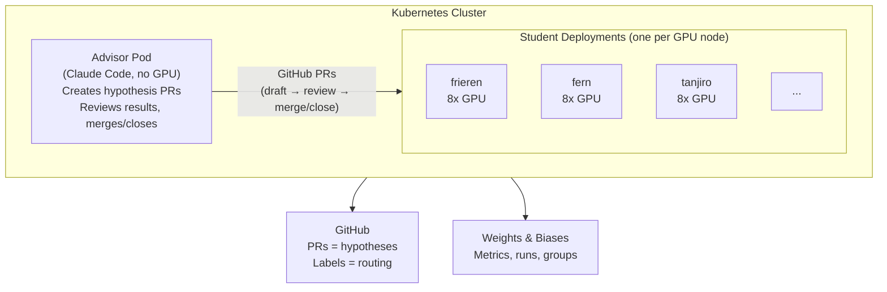
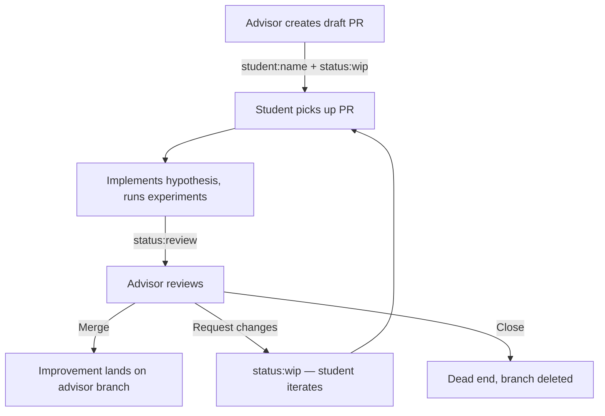

<!--
SPDX-FileCopyrightText: 2026 CoreWeave, Inc.
SPDX-License-Identifier: Apache-2.0
SPDX-PackageName: senpai
-->

# senpai

Autonomous ML research loop powered by Claude Code agents coordinated through GitHub PRs. Point it at a problem, deploy advisor + student agents on k8s, and let them iterate.

## How it works

An **advisor** agent (no GPU) creates hypothesis PRs and assigns them to **student** agents (GPU nodes). Students implement the hypothesis, run experiments, and report results. The advisor reviews: merges winners, iterates on promising ideas, closes dead ends. All coordination happens through GitHub labels and PRs. W&B tracks metrics.

The repo is **problem-agnostic** — `target/` is empty by default. You bring your own problem-package repo (model, training script, data pipeline, instructions) and the pod entrypoint clones it into `target/` at startup, so the problem-package's repo root lands at `./target/`. `senpai.yaml` sets `target_repo_url:` to the repo to clone.

### Current problem

TandemFoilSet 3D velocity-field prediction, seeded from the [`tcapelle/kagent`](https://github.com/tcapelle/kagent/tree/main/tandemfoil-competition) competition as a clean Transolver-based implementation. Lives in [`morganmcg1/tandemfoil2`](https://github.com/morganmcg1/tandemfoil2) on branch `kagent_royal_rumble`. The entrypoint clones it into `target/` at pod startup.

### Reference problem packages

Problem packages are self-contained external repos:

- [`morganmcg1/tandemfoil2`](https://github.com/morganmcg1/tandemfoil2) — **ACTIVE**. TandemFoilSet velocity prediction, kagent-seeded. Default branch `kagent_royal_rumble`.
- [`morganmcg1/icml2026`](https://github.com/morganmcg1/icml2026) — archival. Full ICML 2026 CFD multi-dataset harness (TandemFoil, AirfRANS, DrivAerML, TandemFoil paper).
- [`morganmcg1/cfd_tandemfoil_v1`](https://github.com/morganmcg1/cfd_tandemfoil_v1) — archival. Original v1 TandemFoil problem package, pre-ICML-2026 sprint.


[W&B Dashboard](https://wandb.ai/wandb-applied-ai-team/senpai-v1)

## Architecture


```mermaid
graph TD
    subgraph K8s["Kubernetes Cluster"]
        A["Advisor Pod<br/>(Claude Code, no GPU)<br/>Creates hypothesis PRs<br/>Reviews results, merges/closes"]
        subgraph Students["Student Deployments (one per GPU node)"]
            S1["frieren<br/>8x GPU"]
            S2["fern<br/>8x GPU"]
            S3["tanjiro<br/>8x GPU"]
            S4["..."]
        end
        A -->|"GitHub PRs<br/>(draft → review → merge/close)"| Students
    end
    K8s --> GH["GitHub<br/>PRs = hypotheses<br/>Labels = routing"]
    K8s --> WB["Weights & Biases<br/>Metrics, runs, groups"]
```

### PR lifecycle


```mermaid
graph TD
    A["Advisor creates draft PR"] -->|"student:name + status:wip"| B["Student picks up PR"]
    B --> C["Implements hypothesis, runs experiments"]
    C -->|"status:review"| D["Advisor reviews"]
    D -->|Merge| E["Improvement lands on advisor branch"]
    D -->|Request changes| F["status:wip — student iterates"]
    D -->|Close| G["Dead end, branch deleted"]
    F --> B
```

## Repo layout

```
senpai/
├── senpai.yaml                    # Project config: problem-package repo/branch + launch defaults
├── target/                        # Empty by default. Entrypoint clones target_repo_url here at pod startup, so the problem-package repo's root lands at ./target/.
│   ├── train.py                   #   Training script + model (students modify this)
│   ├── program.md                 #   Research context, metrics, constraints
│   ├── data.py / data/            #   Data pipeline
│   └── instructions/              #   Task-specific Claude Code prompt templates
│       ├── prompt-advisor.md
│       └── prompt-student.md
├── system_instructions/           # System-level Claude Code instructions (run the role)
│   ├── CLAUDE-ADVISOR.md
│   └── CLAUDE-STUDENT.md
├── k8s/                           # Kubernetes deployment (problem-agnostic)
│   ├── launch.py                  #   Deploy advisor + student pods
│   ├── advisor-deployment.yaml
│   ├── student-deployment.yaml
│   ├── entrypoint-advisor.sh      #   Clones target_repo_url into $PROBLEM_DIR; advisor git/PRs scoped to that repo
│   └── entrypoint-student.sh      #   Clones target_repo_url into $PROBLEM_DIR; student git/PRs scoped to that repo
├── Dockerfile
└── .claude/                       # Claude Code skills and agents
```

**Important**: the senpai parent repo is problem-agnostic. Agent commits and PRs land in the **problem-package repo** (e.g. `morganmcg1/tandemfoil2`) on its working branch, never in `wandb/senpai`.

## Configuration

All project settings live in `senpai.yaml`:

```yaml
problem_dir: target/                      # active problem directory — entrypoint clones target_repo_url here
repo_url: https://github.com/wandb/senpai.git
repo_branch: main
target_repo_url: https://github.com/morganmcg1/tandemfoil2.git   # problem-package repo: agent commits/PRs target this
advisor_branch: schmidhuber                                      # integration branch inside the problem-package repo (advisor PRs merge here; students branch off it)
image: ghcr.io/wandb/senpai:latest
pvc_claim_name: new-pvc
pvc_mount_path: /mnt/new-pvc
wandb_entity: wandb-applied-ai-team
wandb_project: senpai-v1
timeout_minutes: 30.0
max_epochs: 50
n_students: 4
```

`launch.py` reads this via `simple_parsing` — every field can be overridden on the CLI.

### GitHub token (per-launch)

`launch.py` resolves your GitHub token at launch time and materialises it as an ephemeral, per-tag k8s Secret (`senpai-github-token-<tag>`) that the pods reference for `GITHUB_TOKEN`. Resolution order:

1. `$GITHUB_TOKEN` in your shell env (shell or [`direnv`](https://direnv.net/) wins).
2. `.env` at the senpai repo root (`GITHUB_TOKEN=ghp_...`). Not committed; don't paste into a shared file.
3. `gh auth token` — works out-of-the-box if you're already logged into the `gh` CLI.

If none resolves, `launch.py` exits with instructions. The launch-scoped Secret is labelled with your research tag and is cleaned up by `kubectl delete deployments,configmaps,secrets -l research-tag=<tag>` (see [Running](#running)).

The repo ships an `example.env` template — copy it to `.env` and paste your token:

```bash
cp example.env .env
# then edit .env and set GITHUB_TOKEN=ghp_...
```

`.env` is already gitignored, so the token stays local.

> **Target-repo permissions.** The token you supply must be able to **clone** `target_repo_url` and **push branches + open/merge PRs** against it. `launch.py` preflights this against the GitHub API before spinning up pods and fails loudly if `permissions.push` is false. Same applies to the `CLAUDE_CODE_OAUTH_TOKEN` user (still in `senpai-secrets`) if you rely on `gh auth status` inside the pod.

### Shared cluster secrets (`senpai-secrets`)

Every pod also reads three keys from the shared, cluster-wide `senpai-secrets` Secret. Unlike the GitHub token these are not per-launch — set them once on the cluster and every tag reuses them:

| Key in `senpai-secrets` | Used for |
|---|---|
| `wandb-api-key` | `WANDB_API_KEY` — all W&B logging from advisor + students |
| `claude-code-oauth-token` | `CLAUDE_CODE_OAUTH_TOKEN` — Claude Code auth. Prefer this over `ANTHROPIC_API_KEY` (much cheaper) |
| `exa-api-key` | `EXA_API_KEY` — Exa web search used by the research agent |

If you don't already have a Claude Code OAuth token, generate one interactively:

```bash
claude setup-token
```

Then create the secret (the `$(claude setup-token)` inline below works too if you'd rather skip the separate step):

```bash
kubectl create secret generic senpai-secrets \
  --from-literal=wandb-api-key="$WANDB_API_KEY" \
  --from-literal=claude-code-oauth-token="$(claude setup-token)" \
  --from-literal=exa-api-key="$EXA_API_KEY"
```

Rotate a single key without recreating the whole secret:

```bash
kubectl patch secret senpai-secrets \
  --type=merge -p "{\"stringData\":{\"claude-code-oauth-token\":\"$(claude setup-token)\"}}"
```

`launch.py` does **not** preflight these — if a key is missing, pods will crash-loop on startup. `kubectl get secret senpai-secrets -o jsonpath='{.data}' | jq` confirms all three keys are present.

## Running

```bash
# Clone the active problem-package repo into target/ (one-time, for local dev)
git clone -b kagent_royal_rumble https://github.com/morganmcg1/tandemfoil2.git target/

# Train locally (inside the active problem package)
cd target/ && python train.py --wandb_name "<name>/<description>"

# Deploy to k8s (reads defaults from senpai.yaml, only --tag is required)
python k8s/launch.py --tag <research-tag> --advisor

# Override config via CLI
python k8s/launch.py --tag <research-tag> --advisor --n_students 7 --pvc_mount_path "/mnt/pai-amf1-cfd"

# Dry-run (print manifests, don't apply)
python k8s/launch.py --tag <research-tag> --n_students 7 --dry_run

# Pass extra instructions to the advisor
python k8s/launch.py --tag <research-tag> --advisor --extra_instructions "Only consider optimizer changes."

# Stop a launch (tears down deployments, configmaps, and the per-tag token Secret)
kubectl delete deployments,configmaps,secrets -l research-tag=<research-tag>
```

## Adding a new problem

1. Create a new public repo (e.g. `myorg/my_problem`) with the minimum problem-package layout:
   - `train.py` — training script + model (entry point for students)
   - `data.py` or `data/` — data pipeline
   - `program.md` — research context, metrics, constraints, file-edit boundaries
   - `instructions/prompt-advisor.md`, `instructions/prompt-student.md`
   - a working branch (e.g. `main` or `royal_rumble`) that advisors merge into
2. Point senpai's config at it — the pod entrypoint will clone it for you:
   ```bash
   # edit senpai.yaml:
   #   target_repo_url: https://github.com/myorg/my_problem.git
   #   advisor_branch: <branch>
   git add senpai.yaml && git commit -m "Point senpai at my_problem"
   ```
   Or pass on the CLI: `--target_repo_url ... --advisor_branch ...`.
3. Deploy as usual — `python k8s/launch.py --tag <tag> --advisor`. Agent commits/PRs will land in `myorg/my_problem`, not senpai.

## References

`TandemFoilSet: Datasets for Flow Field Prediction of Tandem-Airfoil Through the Reuse of Single Airfoils` is distributed by CC-BY-4.0.
```bibtex
@inproceedings{
lim2026tandemfoilset,
title={{TandemFoilSet}: Datasets for Flow Field Prediction of Tandem-Airfoil Through the Reuse of Single Airfoils},
author={Wei Xian Lim and Loh Sher En Jessica and Zenong Li and Thant Zin Oo and Wai Lee Chan and Adams Wai-Kin Kong},
booktitle={The Fourteenth International Conference on Learning Representations},
year={2026},
url={https://openreview.net/forum?id=4Z0P4Nbosn}
}
```
