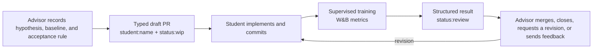
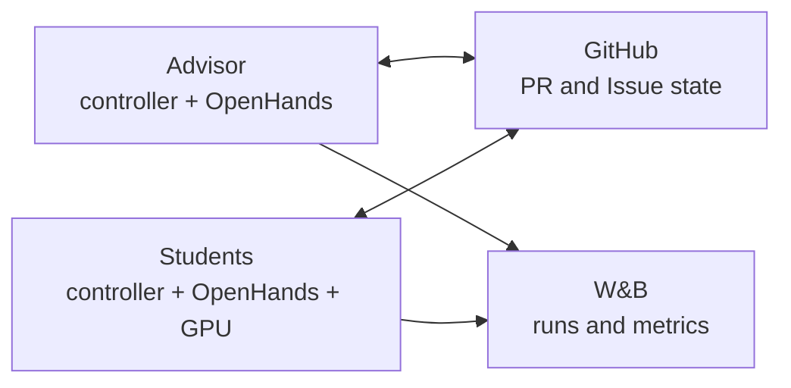

<!--
SPDX-FileCopyrightText: 2026 CoreWeave, Inc.
SPDX-License-Identifier: Apache-2.0
SPDX-PackageName: senpai
-->

# SENPAI

***[reseearch preview]*** -- Paper: [*SENPAI: Self-ExperimentatioN for Physical AI—An Observability-Based Research Harness*](https://openreview.net/forum?id=g0bJFA9gVT)

SENPAI is an semi-autonomous ML research loop - an `Advisor` proposes and reviews experiments; `Students` implement one assigned experiment each, train, and return evidence through GitHub and W&B. SENPAI works best with occasional steering from a domain-expert, steering happens by opening a Github Issue.

SENPAI is problem-agnostic. It runs against a separate target repository, and every experiment branch, commit, and PR lands there—not in this runner repository.


## News
- **[August 2026] MLX.fast challenge:** SENPAI places 7th in MLX.fast - an inference optimization speedup challenge on Mac for Poolside's Laguna 2.1 XS 30B LLM
- **[July 2026]   ICML 2026:** [*SENPAI: Self-ExperimentatioN for Physical AI—An Observability-Based Research Harness*](https://openreview.net/forum?id=g0bJFA9gVT) was presented at the AI for Science Workshop; see the [project site](https://wandb.github.io/senpai/).
- **[June 2026]   ICLR 2026:** Kagent, a SENPAI variant, placed fourth in the [GRaM competition](https://gram-competition.github.io/).

## Quick start

Kubernetes is currently the turnkey deployment path. The GitHub-based coordination protocol is infrastructure-independent, but Docker and direct-host operation still require manual bootstrap; see [Other deployment environments](#other-deployment-environments).

### 1. Prerequisites

- Python 3.13, [uv](https://docs.astral.sh/uv/), Git, and `kubectl`.
- A Kubernetes context and existing namespace with outbound access to GitHub, Anthropic, Exa, and W&B. Your identity must be able to get, list, create, update, patch, and delete Deployments, ConfigMaps, and Secrets there.
- An existing PVC with enough space for the dataset, plus concurrent mounts from every scheduled node—normally `ReadWriteMany`, unless your storage driver explicitly supports another multi-node topology. The launcher mounts this claim but does not create it; role state stays on each pod's node-local `emptyDir` volume.
- NVIDIA GPU nodes, the Kubernetes NVIDIA device plugin, and a host driver compatible with CUDA 13 and the shipped student image.
- A target GitHub repository that Senpai can clone and modify.
- Immutable advisor and student images reachable by every cluster node.

### 2. Install Senpai

```bash
git clone https://github.com/wandb/senpai.git
cd senpai
uv sync --locked
```

For development, include the test dependencies:

```bash
uv sync --locked --extra dev
```

### 3. Add credentials

```bash
cp example.env .env
```

Fill in the values in the gitignored `.env` file. Model-provider keys are
required when any configured model uses that provider:

```dotenv
GITHUB_TOKEN=
ANTHROPIC_API_KEY=
OPENAI_API_KEY=
EXA_API_KEY=
WANDB_API_KEY=
```

| Credential | Required access |
|---|---|
| `GITHUB_TOKEN` | Target-repository Contents, Pull requests, and Issues read/write. A classic token with `repo` scope also works. GitHub CLI authentication is the fallback when this value is absent. |
| `ANTHROPIC_API_KEY` | Required when an `anthropic/...` model is configured. |
| `OPENAI_API_KEY` | Required when an `openai/...` model is configured. Every default profile uses GPT-5.6. |
| `EXA_API_KEY` | General-web and research-publication search. |
| `WANDB_API_KEY` | Read/write access to the configured W&B entity and project. |

To add a credential, put its value in `.env` and list its name in the launch
configuration:

```dotenv
HF_TOKEN=abc123
```

```yaml
custom_secret_env_names: [HF_TOKEN]
```

The credential is available to every advisor, student, and delegated child;
its value is redacted from tool output and traces.

`k8s/launch.py` reads shell environment variables first and then the repository-root `.env`; only the GitHub token also falls back to `gh auth token`. Direct Docker or host execution must export or pass credentials explicitly.

The launcher places credentials in a per-launch Kubernetes Secret. During bootstrap, the GitHub write token is removed from the process environment and handed to the controller through a one-use channel; it is not exposed to the model or subagents.

### 4. Prepare the target repository

The target repository needs one concise `program.md` describing the research goal, metrics, data, constraints, allowed edits, and target-specific guidance.

A useful structure is:

- `## Mission` — Explain why the research is being run and name the primary target metric or metrics being optimized.
- `## Data` — Describe where the data lives, its type and structure, train/validation/test splits, and important nuances, exclusions, or caveats.
- `## Evaluation` — Define each evaluation metric concretely and, when using W&B, give its exact logged name, such as `val/loss` rather than "validation loss."
- `## Files` — List the key data-loading, preprocessing, training, scoring, and evaluation files, briefly describing each and whether agents may edit it.
- `## Research` — Add useful task or domain background and possible research directions without prescribing a narrow approach that limits the agents' creativity.

Put it at the repository root. If it lives elsewhere, set `program_path` in `senpai.yaml` or pass `--program_path` at launch. Senpai appends the selected file to every agent's system prompt.

The target repository must be different from the SENPAI runner repository.

### 5. Configure the launch

Copy the checked-in defaults and replace the W&B, branch, PVC, and resource values for your environment:

```bash
cp senpai.yaml senpai.local.yaml
```

The most important settings are:

```yaml
target_repo_branch: main
advisor_branch: senpai-research
program_path: ""  # auto-discover, or set e.g. senpai/program.md

wandb_entity: your-team
wandb_project: your-project

custom_secret_env_names: [HF_TOKEN]  # values come from .env

advisor_model: openai/gpt-5.6-sol
advisor_reasoning_effort: xhigh
student_model: openai/gpt-5.6-sol
student_reasoning_effort: xhigh

smart_model: openai/gpt-5.6-sol
smart_reasoning_effort: xhigh
fast_model: openai/gpt-5.6-luna
fast_reasoning_effort: high
frontier_model: openai/gpt-5.6-sol
frontier_reasoning_effort: max
compaction_trigger_tokens: 200000

pvc_claim_name: your-existing-pvc
pvc_mount_path: /mnt/data

n_students: 1
gpus_per_student: 1
cpu_per_gpu: 8
memory_gi_per_gpu: 64

timeout_minutes: 30
max_epochs: 50
```

OpenHands uses LiteLLM, so LLM provider names are required as prefixes. For
example, configure Claude Fable 5 as `anthropic/claude-fable-5`. Anthropic
`reasoning_effort: max` on Claude Fable 5, Opus 5, and Sonnet 5 stays
provider-native and is sent as `output_config.effort: max`; it does not enable
OpenAI Pro mode.

Senpai never enables Anthropic server-side model fallback. If Anthropic returns
a safety refusal or reports a `fallback_message` attempt, Senpai discards the
response and quarantines the turn immediately. It does not retry the same
refused request or continue under a substituted model. A new authenticated
human instruction can reopen the quarantined turn.

`compaction_trigger_tokens` sets the compaction limit. OpenAI and Anthropic
apply it for their models; OpenHands handles compaction for other providers.

If using W&B Inference use `wandb/` provider as the provider. For example `wandb/zai-org/GLM-5.2`, SENPAI
uses `WANDB_API_KEY` for auth.

The defaults in `senpai.yaml` describe W&B's deployment and should not be copied unchanged into another environment. Every setting can also be overridden on the command line. `--tag` and `--target_repo_url` are required unless your chosen config file supplies them.

Deployments require matching advisor and student image digests, or `sha-<40-character-commit>` tags built from the same SENPAI revision. Digest-pinned images also require the full matching `senpai_repo_revision`. The source commit must be fetchable from `senpai_repo_url`; its public default is read-only and needs no PR permission. Override it only when using images built from another SENPAI repository. `target_repo_url` is the separate, required repository where agents create commits and PRs.

### 6. Run preflight

```bash
uv run python k8s/launch.py \
  --config_path senpai.local.yaml \
  --tag first-run \
  --target_repo_url https://github.com/OWNER/TARGET.git \
  --preflight_only
```

Preflight authenticates GitHub, Exa, W&B, and every model provider referenced by
the configured model profiles. It also verifies GitHub Contents write access,
resolves the target branch, and rejects student labels already carrying active
assignments. It deliberately skips image validation and makes no cluster
changes. A real launch additionally verifies immutable image syntax and that
both role images identify the same source revision.

### 7. Launch

For a SENPAI commit whose images have been published:

```bash
revision=$(git rev-parse HEAD)

uv run python k8s/launch.py \
  --config_path senpai.local.yaml \
  --tag first-run \
  --target_repo_url https://github.com/OWNER/TARGET.git \
  --advisor \
  --names frieren \
  --advisor_image "ghcr.io/wandb/senpai-advisor:sha-$revision" \
  --student_image "ghcr.io/wandb/senpai-student:sha-$revision"
```

The launcher creates routing labels, one launch Secret, role ConfigMaps, and Deployments. It does not create the namespace, PVC, Service, or general cluster RBAC.

Inspect and stop the launch:

```bash
kubectl get deployments,pods -l research-tag=first-run
kubectl logs -f deployment/senpai-first-run-frieren
kubectl delete deployments,configmaps,secrets -l research-tag=first-run
```

Use `--kube_context` and `--namespace` when the desired cluster is not your current default. Use `--dry_run` to render redacted manifests without checking credentials or writing to the cluster.

## Experiment workflow

GitHub is both the coordination layer and the durable scientific notebook. W&B is the metric and artifact record.


```mermaid
flowchart LR
    H["Advisor records hypothesis, baseline, and acceptance rule"]
    P["Typed draft PR<br/>student:name + status:wip"]
    I["Student implements and commits"]
    T["Supervised training<br/>W&B metrics"]
    R["Structured result<br/>status:review"]
    D["Advisor merges, closes, requests a revision, or sends feedback"]

    H --> P --> I --> T --> R --> D
    D -->|revision| I
```

1. The advisor creates a falsifiable assignment with the exact required research-base SHA, baseline metrics, expected mechanism, implementation scope, and stopping rules.
2. `create_assignment` creates the student branch and draft PR, embeds a typed assignment record, and applies the routing labels.
3. The assigned student receives one OpenHands conversation for that assignment revision. New PR comments and reviews steer it after the current agent step.
4. The student commits the exact implementation, launches supervised training, records every referenced run in W&B, and uses `post_assignment_comment` for material progress, questions, blockers, or replies. Each typed comment wakes the advisor without changing the PR head, draft state, or labels.
5. The student calls `submit_experiment_result`; the tool validates and publishes the branch before changing the PR to `status:review`.
6. The advisor compares the evidence, then uses the corresponding operation-specific tool to merge a reproducible winner, close a useful negative result, request a new revision, or send non-revision feedback.

The structured result records its terminal status, exact result commit, W&B run IDs and URLs, bounded conclusion, and baseline/candidate metric comparison when available. Once published for an assignment revision and head, that evidence is immutable: exact duplicate publication is an idempotent replay, while changed evidence requires a new commit or revision. Non-revision feedback continues the same student conversation; a revision request intentionally creates a fresh revision identity and conversation.

A student cannot receive another assignment while an open assignment has `status:wip` or `status:review`. The student becomes available after the advisor merges or closes the PR. Sibling assignment mutations within one worker are serialized end to end, including advisor-base publication and student preflight, push, and result publication. Across advisor and student workers, exact assignment, revision, head, and branch-lease preconditions detect stale work; if a revision wins during result publication, SENPAI restores the current revision's WIP routing before returning the stale-result error.

PR comments from verified GitHub owners, members, and collaborators steer the advisor and reach the student. Submitted reviews and inline comments also reach the student. The system ignores untrusted authors, unrecognized bots, and advisor protocol comments. `get_prs` can still retrieve the complete discussion explicitly. If the configured research base changes while an experiment is running, SENPAI emits `research_base_changed` with the assignment's `required_base_sha` and the live `current_base_sha` without cancelling the assignment. When reviewing its terminal result, the advisor either requests a revision on the current base or records why that exact result remains valid with `accept_result_on_current_base`; `merge_experiment` still verifies the live SHA immediately before merging.

Before each assignment or PR-feedback turn, the student controller authenticates
and hydrates the exact assignment head and recorded baseline into
`refs/senpai/assignment/` without resetting the checkout. A revision can
atomically record an explicitly accepted live baseline SHA. Divergent local
history and dirty work are preserved and reported once; an unchanged assignment
reminder does not repeatedly wake the model, while changed refs, local work, or
new feedback still do.

`get_prs` returns complete PR bodies and discussions. Up to five PRs are returned in context by default; larger selections become a Markdown artifact outside the target checkout so long histories do not pollute the main conversation.

## Long-running training and monitoring

Students do not start GPU work, stream logs, sleep, or poll through the terminal. Four typed tools make training a durable controller operation:

| Tool | Contract |
|---|---|
| `run_training` | Accepts structured `argv`, `cwd`, and a hard timeout. It requires a clean assignment worktree, starts a supervised process group without blocking, persists its identity, full log, and bounded error tail, discovers W&B run IDs, and automatically registers terminal-state monitoring for the current conversation. |
| `get_training_status` | Performs one bounded read of the latest persisted state, exit code, elapsed time, W&B run IDs, and error tail. |
| `monitor_training` | Adds a W&B metric, minimize/maximize direction, `lte`, `gte`, `improved_by`, or `regressed_by` gates, a poll interval, and stale-update detection. It cannot disable terminal wakes. |
| `cancel_training` | Stops the complete process group through the supervised TERM/KILL path, waits for a durable terminal state, and retires its monitor. |

After launch, the student can finish its turn. The deterministic controller polls process state and at most one selected W&B metric without consuming model tokens. A threshold crossing, regression, stale metric, terminal state, or monitor error creates one compact durable event and resumes the same student conversation. One broken monitor cannot block other training, GitHub feedback, or child-agent results.

`improved_by` and `regressed_by` compare with the monitor policy's first observed sample; they do not silently reuse the assignment's documented baseline.

Worker and container restarts preserve completed OpenHands events. Recovered live training is terminated safely rather than being adopted under an unverifiable process identity; the original student conversation receives the persisted terminal outcome.

Interactive browser operations are progressively disclosed. A fresh root
conversation initially sees only `load_browser`; invoking it adds the fourteen
OpenHands browser operations and records the choice in conversation state so a
resumed conversation restores them. `--no-browser` exposes neither the loader
nor the browser family.

## Subagents

`spawn_agents` launches a batch and immediately returns stable task IDs;
`await_agents` collects them with an `all`, `first`, `quorum`, or any-state
`change` join; `change` also surfaces an uncollected terminal result
immediately. A timed-out wait returns current state and suggests non-blocking
next steps; it does not cancel the children. Every child runs in a fresh
OpenHands conversation and separate process group.

Every task must set `model` explicitly to `fast`, `smart`, or `frontier`; there
is no implicit model tier. Read the `delegate-subagents` skill before choosing
the tier, agent specialization, and context policy.

| Agent | Best for | Recommended tier |
|---|---|---|
| [General Purpose](.agents/agents/general-purpose.md) | Bounded work combining terminal investigation, code editing, task tracking, tests, and one controlled level of leaf delegation. | `smart` for ordinary implementation or review; `frontier` for the high-leverage research and technical judgment defined by the delegation skill. |
| [Explore](.agents/agents/explore.md) | Read-only search across code, data, experiment artifacts, papers, or durable conversation history. It returns conclusions with paths and line numbers rather than dumping source. | `fast` for mechanical exploration; `smart` when relationships are subtle. |
| [Search](.agents/agents/search.md) | External research through Exa via the explicit `search_general_web` or `search_research_publications` task form, with primary-source links. | `smart`. |
| [Bash Runner](.agents/agents/bash-runner.md) | Tests, builds, linters, dependency commands, Git inspection, and noisy CLI work. It returns counts and actionable failures rather than raw logs. | `fast`. |

The model tier is independent of the agent specialization. With the default
`agent=general-purpose`, `model=frontier` launches GPT-5.6 Sol at `max`, sent
to the Responses API with `reasoning.mode: pro`
with the general-purpose terminal and code-editing toolset. Pair `frontier`
with `search_general_web` or `search_research_publications` when the
high-leverage task is external research.

A root spawn batch and its descendants form one delegation tree, which may
create at most eight children total. A role runs at most eight active tasks
concurrently across all trees. Root tasks count toward the tree total, so leave
slots when a General Purpose child needs helpers. Recursion is limited to two
child edges: the root may spawn any agent, and a depth-one General Purpose
child may spawn leaf helpers; Explore, Search, Bash Runner, and all depth-two
children cannot delegate. Each delegated task has an absolute tier deadline,
and descendants inherit the earlier ancestor deadline. A nested child must
await or cancel all of its helpers before returning.
Individual tasks are capped at twenty minutes for `fast`, one hour for `smart`,
and two hours for `frontier`, shortened when an ancestor deadline is nearer.

An await call is capped at five minutes and does not cancel unfinished work.
`agent_status` provides a non-blocking snapshot; with no task IDs, it returns
up to eight direct tasks that are active or have an uncollected terminal result.
`cancel_agents` records terminal cancellation. Atomic records keyed by the
required batch key and each optional task key (or stable list index) make replay
return the original task IDs instead of spawning duplicates.
The deprecated `delegate_agent` name remains visible on root advisor and
student agents only so persisted conversations can resume; it never launches
work and directs callers to `spawn_agents` and `await_agents`.
`include_context=false` sends only the system prompt and task; the child can
still search the supplied parent-history directory. `include_context=true`
also copies the model-visible parent history. The root advisor or student may
leave useful tasks running and receives their terminal results as durable
events; nested children may not detach descendants.

Children share the parent workspace, so their process and conversation are isolated but their filesystem is not. They receive only their declared tools and never receive GitHub credentials, GitHub workflow tools, or training tools.

## Task guides

Live advisors and students load Senpai-owned skills only from
`plugins/senpai/skills`; target repositories may also supply project skills.
Guides under `.agents/skills` are for human users and Senpai developers and
are not installed into autoresearch pods.

### Live autoresearch

| Guide | Purpose |
|---|---|
| [Assign an experiment](plugins/senpai/skills/assign-experiment/SKILL.md) | Turn a hypothesis into a typed student branch and draft PR. |
| [Delegate subagents](plugins/senpai/skills/delegate-subagents/SKILL.md) | Launch and coordinate bounded parallel research, review, and implementation help. |
| [Maintain research state](plugins/senpai/skills/maintain-research-state/SKILL.md) | Keep advisor-owned research direction, ideas, and dataset knowledge current and publish them safely. |
| [Submit experiment results](plugins/senpai/skills/submit-experiment-results/SKILL.md) | Commit the tested implementation and publish a structured, evidence-backed result. |
| [Review an experiment](plugins/senpai/skills/review-experiment/SKILL.md) | Merge a reproducible winner, close a useful negative, or request the missing evidence. |
| [Handle human Issues](plugins/senpai/skills/check-human-issues/SKILL.md) | Respond to authenticated human-to-agent messages delivered through GitHub Issues. |
| [Senpai status check](plugins/senpai/skills/senpai-status-check/SKILL.md) | Produce a bounded, read-only GitHub, W&B, and local-controller status report. |
| [Exa search](plugins/senpai/skills/exa-search/SKILL.md) | Search the current web or scholarly publications with mode-specific defaults. |
| [AlphaXiv paper lookup](plugins/senpai/skills/alphaxiv-paper-lookup/SKILL.md) | Get a structured overview before reading a primary paper deeply. |
| [W&B and Weave](plugins/senpai/skills/wandb-primary/SKILL.md) | Inspect runs, metrics, artifacts, evaluations, and agent traces. |

### Human and developer guides

| Guide | Purpose |
|---|---|
| [Bootstrap a target](.agents/skills/bootstrap-target/SKILL.md) | Build `program.md` from a new ML repository. |
| [Experiment report](.agents/skills/experiment-report/SKILL.md) | Create the project-standard `nn_cfd` W&B comparison report; this guide is target-specific rather than part of the generic runtime. |
| [Training code style](literature_and_guidance/TRAINING-CODE-STYLE.md) | Structure expensive ML entrypoints so configuration, artifacts, validation, and failure boundaries stay explicit. |

The repository also contains two reusable optimization case studies:

- [LLM inference optimization](literature_and_guidance/LLM-INFERENCE-OPTIMIZATION-SENPAI-GUIDE.md)
- [LLM training optimization](LLM-TRAINING-OPTIMIZATION-GUIDE.md)

## Architecture and durability


```mermaid
flowchart LR
    GH["GitHub<br/>PR and Issue state"]
    WB["W&B<br/>runs and metrics"]
    A["Advisor<br/>controller + OpenHands"]
    S["Students<br/>controller + OpenHands + GPU"]

    A <--> GH
    S <--> GH
    A --> WB
    S --> WB
```

GitHub PR labels, typed comments, reviews, and human-tagged Issues are the only advisor/student communication protocol; W&B is the shared experiment store. Role-local SQLite stores the ordered delivery inbox and its receipts plus training-monitor policies; it is never shared across nodes.

Each role runs a small Python supervisor around the deterministic controller:

```text
entrypoint
  clone and configure
  exec supervisor

supervisor
  restart crashed workers with bounded backoff
  terminate and restart an overdue phase

controller
  poll -> reconcile -> bounded OpenHands turn -> verify -> acknowledge -> sleep
```

The controller owns cadence, durable events, conversation selection, verified GitHub operations, process supervision, and monitoring. OpenHands owns research judgment, code changes, and evidence interpretation.

- The advisor keeps one conversation UUID across restarts, recovery, and quarantine.
- A student uses one UUID per assignment revision; feedback, monitor events, and child-task results resume that exact conversation.
- Still-actionable GitHub state is re-delivered on the configured reminder cadence, which defaults to at least ten minutes even when GitHub is polled more frequently. Human Issue and PR comment versions are retained across failed or interrupted turns and are never delivered again after successful acknowledgement. New trusted text creates a new version; a changed Human Issue title also creates a new version. `research_base_changed` and student assignment comments are also delivered once per exact event version. Immediate post-turn polls deliver changed state but not timed reminders, so a successful research-only turn cannot enter a no-sleep reminder loop. `research_base_changed` is keyed by assignment, revision, PR head, and the exact required/current base pair; each identity or base movement requires a new decision. Merge repeats the live-base check immediately before its mutation, while external base writers still require strict up-to-date branch protection or a merge queue for an atomic guarantee.
- Each model request has a hard 90-minute ceiling. OpenHands uses five attempts with 8/16/32/64-second waits (`SENPAI_LLM_NUM_RETRIES`). Foreground terminal calls return within ten minutes, delegated children retain hard 20/60/120-minute tier limits, and root turns use a two-hour inactivity lease renewed by OpenHands events. Two consecutive failed turns exit to the supervisor for a clean worker restart. Restart backoff grows across failed workers to a five-minute ceiling; only a successfully acknowledged turn resets that streak, not process uptime or idle sleep.
- Every input follows one durable `pending -> delivered -> processed` inbox. Authenticated human Issues and PR comments are the interrupt tier: tools get up to 60 seconds to finish before the active run is interrupted and resumed, even when its inbox batch is full. Student assignments and trusted PR feedback share a FIFO queue tier; feedback waits for the next completed agent step without cancelling it. Ordinary events remain FIFO. Turn formation and non-human attachments are bounded to 16 events or 64 KiB; prioritized overflow leads the next turn.
- A completed tool observation renews the three-attempt no-progress budget; timeout, error, interruption, state, and delivery events do not. Thirty-six inference starts on one branch are a separate restart backstop and do not limit one productive run. Either exhausted budget triggers bounded canonical fresh-branch recovery; exhausting recovery quarantines the turn and reports it on every controller start. Only an authenticated human instruction reopens quarantine and resets both budgets; trusted PR feedback stays pending. A persisted final response is reconciled even if cancellation left the SDK status paused. `SENPAI_INBOX_MAX_STALLED_ATTEMPTS` and `SENPAI_INBOX_MAX_RECOVERY_GENERATIONS` configure recovery.
- Typed context/history failures use durable bounded fresh-branch recovery. Exhausted transient provider failures preserve the turn and its budgets behind durable 30/60/120/240/300-second cooldowns with jitter and `Retry-After` while mailbox polling continues; permanent provider errors fail immediately. Anthropic safety refusals and classifier-driven substitutions quarantine the turn without an automatic retry.
- On restart, an incomplete persisted tool action is rejected rather than replayed implicitly. A checked-out assignment branch that was deliberately rebased or extended locally is preserved and surfaced to its existing student conversation for explicit reconciliation.
- The complete OpenHands event log remains locally searchable. Senpai does not prune conversation directories; operators own retention.
- Student state may be ephemeral because the branch, PR, typed result, W&B runs, and Weave trace are the durable handoff.
- Explicit project skills remain available through OpenHands skill context. Repository `AGENTS.md`, `AGENT.md`, and `CLAUDE.md` instruction files are reserved for human-facing development tools and are not loaded as Senpai project context.

The command policy blocks raw GitHub mutations, direct training, `git push`, polling loops, and log streams. Operation-specific typed tools enforce repository, branch, assignment, revision, head-SHA, label, and replay preconditions. This policy keeps routine operations deterministic while leaving high-entropy research work to the agent.

When `WANDB_ENTITY` and `WANDB_PROJECT` are configured, [`weave-openhands`](https://github.com/morganmcg1/weave-openhands) traces advisor, student, and child conversations. Each `OPENHANDS_RUN` record includes a direct Weave Agent Observability URL.

## Operations

Useful launch controls:

- `--names frieren,fern` selects stable students; otherwise use `--n_students` and `--student_prefix`.
- `--gpus_per_student`, `--cpu_per_gpu`, and `--memory_gi_per_gpu` size each student.
- `--timeout_minutes` and `--max_epochs` set agent-facing launch-context limits; target training receives neither as a dedicated `SENPAI_*` variable.
- `--poll_interval_s` and `--poll_jitter_s` control idle GitHub cadence without teaching the model to poll.
- `--gh_history_scope branch` keeps normal advisor-branch memory, `fresh` creates a shallow ablation checkout, and `repo` exposes full repository history.
- `--extra_instructions` accepts optional human operator guidance as a Markdown file or literal user context.
- `human_issues: false` disables GitHub Issue polling for isolated launches.

Advisor and student images are built from the same source revision. The advisor image excludes CUDA and PyTorch; the student image contains the CUDA/PyTorch runtime; the cutoff image contains only the minimal job runtime and pinned `kubectl`. Advisor and student builds install Chromium and execute an OpenHands browser smoke test.

For multi-day fleets, [`arm_senpai_cluster_cutoff.sh`](scripts/arm_senpai_cluster_cutoff.sh) creates a cluster-side hard cutoff that does not depend on an operator laptop remaining online. It can also hold a shared start gate until the expected fleet is ready or its readiness deadline expires.

Pod startup and liveness probes read the supervisor lease. Container restarts resume the advisor or student conversation from the pod-local state volume; replacing or rescheduling the pod starts fresh state. Stop a container before copying or snapshotting a live advisor state directory.

### Other deployment environments

GitHub coordination works across Docker, cloud VMs, or local hosts without private networking. The current repository does not yet provide a Compose or direct-host launcher: the Kubernetes manifests perform the source clone, environment assembly, skill installation, token handoff, mounts, and entrypoint selection.

To build another launcher, reproduce [entrypoint-advisor.sh](k8s/entrypoint-advisor.sh) or [entrypoint-student.sh](k8s/entrypoint-student.sh), render `SENPAI-LAUNCH-CONTEXT.md` with runtime identity, limits, and isolation through `render_launch_context`, and provide it as base64 in `SENPAI_LAUNCH_CONTEXT_B64`. Pass the built-in role template and its required non-secret values to the Python supervisor, which renders and persists that role snapshot. Keep optional operator guidance in `EXTRA_INSTRUCTIONS_B64`. Persist `/var/lib/senpai/<tag>/advisor` for the advisor and use the container healthcheck with a restart policy. Student execution requires Linux, an NVIDIA runtime, and compatible CUDA hardware; Docker Desktop on macOS cannot run the GPU student image.

## Development and reference

```bash
uv sync --locked --extra dev
uv run pytest -q
bash -n k8s/*.sh scripts/*.sh plugins/senpai/scripts/*.sh
```

Deep references:

- [SPEC.md](SPEC.md): canonical runtime, persistence, safety, and acceptance contract.
- [OpenHands plugin](plugins/senpai/README.md): skills and lifecycle hooks.
- [Harness instructions](system_instructions/SENPAI-HARNESS.md): shared agent/tool contract.
- [Advisor instructions](system_instructions/ADVISOR.md) and [student instructions](system_instructions/STUDENT.md): role workflows.
- [OpenHands fork modifications](https://github.com/morganmcg1/software-agent-sdk/blob/main/FORK_MODS.md): provider continuation, compaction, reasoning, and cache changes.
- [Contributing](CONTRIBUTING.md): development and CLA requirements.
- [W&B dashboard](https://wandb.ai/wandb-applied-ai-team/senpai-v1): the default project's experiment record.
