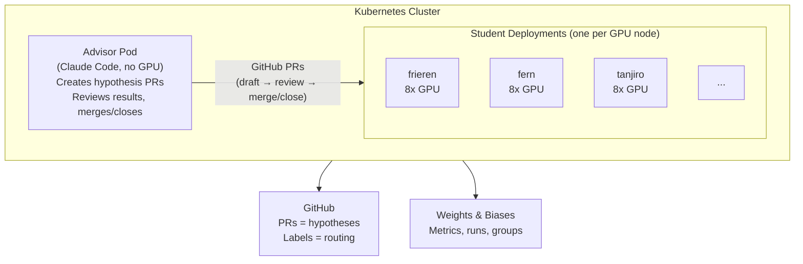
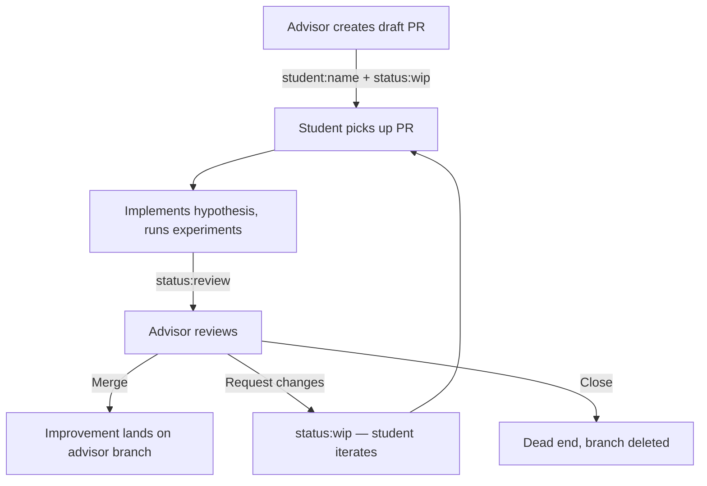

<!--
SPDX-FileCopyrightText: 2026 CoreWeave, Inc.
SPDX-License-Identifier: Apache-2.0
SPDX-PackageName: senpai
-->

# senpai

Autonomous ML research loop powered by Claude Code agents coordinated through GitHub PRs. Point it at a problem, deploy advisor + student agents on k8s, and let them iterate.

## How it works

An **advisor** agent (no GPU) creates hypothesis PRs and assigns them to **student** agents (GPU nodes). Students implement the hypothesis, run experiments, and report results. The advisor reviews: merges winners, iterates on promising ideas, closes dead ends. All coordination happens through GitHub labels and PRs. W&B tracks metrics.

The repo is **problem-agnostic** — all problem-specific code (model, training script, data pipeline, instructions) lives in a self-contained folder under `target/`. `senpai.yaml` points to the active problem via a repo-relative path.

### Current problem: `target/tandemfoil2`

TandemFoilSet 3D velocity-field prediction, seeded from the [`tcapelle/kagent`](https://github.com/tcapelle/kagent/tree/main/tandemfoil-competition) competition as a clean Transolver-based implementation. Lives in [`morganmcg1/tandemfoil2`](https://github.com/morganmcg1/tandemfoil2) on branch `kagent_royal_rumble` and is attached here as a git submodule at `target/tandemfoil2`.

### Reference problem packages

Problem packages are self-contained repos. `target/` is empty at the senpai level; packages attach as submodules (or plain clones):

- [`morganmcg1/tandemfoil2`](https://github.com/morganmcg1/tandemfoil2) — **ACTIVE**. TandemFoilSet velocity prediction, kagent-seeded. Default branch `kagent_royal_rumble`.
- [`morganmcg1/icml2026`](https://github.com/morganmcg1/icml2026) — archival. Full ICML 2026 CFD multi-dataset harness (TandemFoil, AirfRANS, DrivAerML, TandemFoil paper).
- [`morganmcg1/cfd_tandemfoil_v1`](https://github.com/morganmcg1/cfd_tandemfoil_v1) — archival. Original v1 TandemFoil problem package, pre-ICML-2026 sprint.


[W&B Dashboard](https://wandb.ai/wandb-applied-ai-team/senpai-v1)

## Architecture


```mermaid
graph TD
    subgraph K8s["Kubernetes Cluster"]
        A["Advisor Pod<br/>(Claude Code, no GPU)<br/>Creates hypothesis PRs<br/>Reviews results, merges/closes"]
        subgraph Students["Student Deployments (one per GPU node)"]
            S1["frieren<br/>8x GPU"]
            S2["fern<br/>8x GPU"]
            S3["tanjiro<br/>8x GPU"]
            S4["..."]
        end
        A -->|"GitHub PRs<br/>(draft → review → merge/close)"| Students
    end
    K8s --> GH["GitHub<br/>PRs = hypotheses<br/>Labels = routing"]
    K8s --> WB["Weights & Biases<br/>Metrics, runs, groups"]
```

### PR lifecycle


```mermaid
graph TD
    A["Advisor creates draft PR"] -->|"student:name + status:wip"| B["Student picks up PR"]
    B --> C["Implements hypothesis, runs experiments"]
    C -->|"status:review"| D["Advisor reviews"]
    D -->|Merge| E["Improvement lands on advisor branch"]
    D -->|Request changes| F["status:wip — student iterates"]
    D -->|Close| G["Dead end, branch deleted"]
    F --> B
```

## Repo layout

```
senpai/
├── senpai.yaml                    # Project config: active problem + submodule repo/branch + launch defaults
├── .gitmodules                    # Declares the target/* submodules
├── target/                        # Problem packages live here as submodules (empty by default)
│   └── <problem>/                 #   (submodule of an external problem-package repo)
│       ├── train.py               #     Training script + model (students modify this)
│       ├── program.md             #     Research context, metrics, constraints
│       ├── data.py / data/        #     Data pipeline
│       └── instructions/          #     Task-specific Claude Code prompt templates
│           ├── prompt-advisor.md
│           └── prompt-student.md
├── system_instructions/           # System-level Claude Code instructions (run the role)
│   ├── CLAUDE-ADVISOR.md
│   └── CLAUDE-STUDENT.md
├── k8s/                           # Kubernetes deployment (problem-agnostic)
│   ├── launch.py                  #   Deploy advisor + student pods
│   ├── advisor-deployment.yaml
│   ├── student-deployment.yaml
│   ├── entrypoint-advisor.sh      #   Submodule-aware startup (advisor git/PRs scoped to submodule)
│   └── entrypoint-student.sh      #   Submodule-aware startup (student git/PRs scoped to submodule)
├── Dockerfile
└── .claude/                       # Claude Code skills and agents
```

**Important**: the senpai parent repo is problem-agnostic. Agent commits and PRs land in the **submodule's origin** (e.g. `morganmcg1/tandemfoil2`) on the submodule's working branch, never in `wandb/senpai`. The submodule pointer is bumped only by humans when pinning a new baseline.

## Configuration

All project settings live in `senpai.yaml`:

```yaml
problem: target/tandemfoil2               # active problem directory (submodule path)
repo_url: https://github.com/wandb/senpai.git
repo_branch: main
target_repo_url: https://github.com/morganmcg1/tandemfoil2.git   # agent commits/PRs target this repo
target_working_branch: kagent_royal_rumble                       # integration branch inside the submodule
image: ghcr.io/wandb/senpai:latest
pvc_claim_name: new-pvc
pvc_mount_path: /mnt/new-pvc
wandb_entity: wandb-applied-ai-team
wandb_project: senpai-v1
advisor_branch: kagent_royal_rumble
timeout_minutes: 30.0
max_epochs: 50
n_students: 4
```

`launch.py` reads this via `simple_parsing` — every field can be overridden on the CLI.

### API Key

Due to the high cost of running CC with ANTHROPIC_API_KEY, instead use CLAUDE_CODE_OAUTH_TOKEN. Create this token as follows:

```
claude setup-token
```

and push the key to the k8s secrets.

## Running

```bash
# Initialize the submodule once after cloning senpai
git submodule update --init --recursive

# Train locally (inside the active problem submodule)
cd target/tandemfoil2 && python train.py --wandb_name "<name>/<description>"

# Deploy to k8s (reads defaults from senpai.yaml, only --tag is required)
python k8s/launch.py --tag <research-tag> --advisor

# Override config via CLI
python k8s/launch.py --tag <research-tag> --advisor --n_students 7 --pvc_mount_path "/mnt/pai-amf1-cfd"

# Dry-run (print manifests, don't apply)
python k8s/launch.py --tag <research-tag> --n_students 7 --dry_run

# Pass extra instructions to the advisor
python k8s/launch.py --tag <research-tag> --advisor --extra_instructions "Only consider optimizer changes."
```

## Adding a new problem

1. Create a new public repo (e.g. `myorg/my_problem`) with the minimum problem-package layout:
   - `train.py` — training script + model (entry point for students)
   - `data.py` or `data/` — data pipeline
   - `program.md` — research context, metrics, constraints, file-edit boundaries
   - `instructions/prompt-advisor.md`, `instructions/prompt-student.md`
   - a working branch (e.g. `main` or `royal_rumble`) that advisors merge into
2. Attach it to senpai as a submodule and point the config at it:
   ```bash
   git submodule add -b <branch> https://github.com/myorg/my_problem.git target/my_problem
   # edit senpai.yaml: problem=target/my_problem, target_repo_url=<url>, target_working_branch=<branch>, advisor_branch=<branch>
   git add senpai.yaml .gitmodules target/my_problem && git commit -m "Attach my_problem submodule"
   ```
3. Deploy as usual — `python k8s/launch.py --tag <tag> --advisor`. Agent commits/PRs will land in `myorg/my_problem`, not senpai.

## References

`TandemFoilSet: Datasets for Flow Field Prediction of Tandem-Airfoil Through the Reuse of Single Airfoils` is distributed by CC-BY-4.0.
```bibtex
@inproceedings{
lim2026tandemfoilset,
title={{TandemFoilSet}: Datasets for Flow Field Prediction of Tandem-Airfoil Through the Reuse of Single Airfoils},
author={Wei Xian Lim and Loh Sher En Jessica and Zenong Li and Thant Zin Oo and Wai Lee Chan and Adams Wai-Kin Kong},
booktitle={The Fourteenth International Conference on Learning Representations},
year={2026},
url={https://openreview.net/forum?id=4Z0P4Nbosn}
}
```
