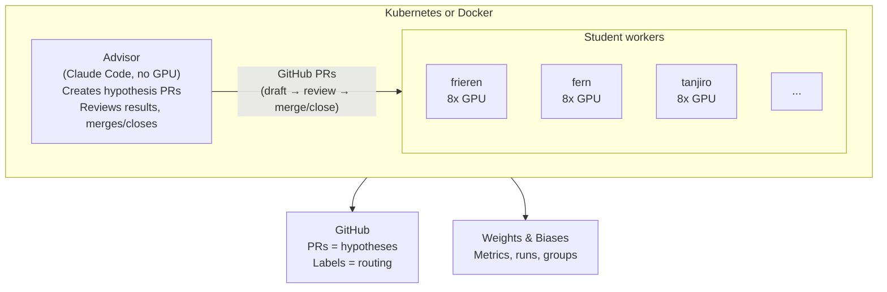
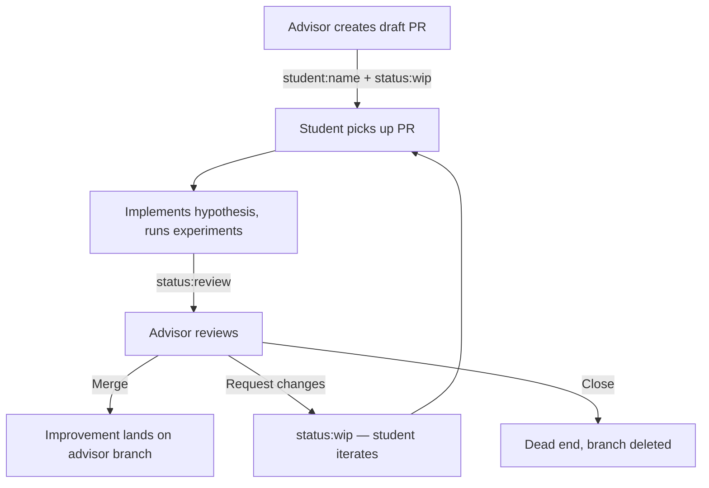

<!--
SPDX-FileCopyrightText: 2026 CoreWeave, Inc.
SPDX-License-Identifier: Apache-2.0
SPDX-PackageName: senpai
-->

# senpai

Autonomous ML research loop powered by Claude Code agents coordinated through GitHub PRs. Point it at a problem, launch advisor + student agents on Kubernetes or Docker, and let them iterate.

## How it works

An **advisor** creates experiment PRs and assigns them to **student** GPU workers. Students implement, train, and report; the advisor merges winners and closes dead ends. GitHub labels route work, and W&B tracks metrics.

`senpai` is **problem-agnostic**. Each worker clones the configured problem-package repo into `target/`, so agent commits and PRs land in that external repo, not here.

### Quick start

```bash
uv sync
cp example.env .env
# Fill in the four required credentials in .env, then:
uv run python launch.py \
  --tag first-run \
  --target_repo_url https://github.com/<org>/<problem-repo>.git \
  --advisor
```

The command uses Kubernetes by default. Add `--backend docker` for a local or
AWS Docker host. Run either form with `--dry_run` first to inspect the generated
resources without reading credentials or changing infrastructure.

### Problem packages

| Repo | Status | Notes |
|---|---|---|
| [`morganmcg1/tandemfoil2`](https://github.com/morganmcg1/tandemfoil2) | Active | TandemFoilSet velocity prediction, branch `kagent_royal_rumble` |
| [`morganmcg1/icml2026`](https://github.com/morganmcg1/icml2026) | Archive | ICML 2026 CFD multi-dataset harness |
| [`morganmcg1/cfd_tandemfoil_v1`](https://github.com/morganmcg1/cfd_tandemfoil_v1) | Archive | Original v1 TandemFoil package |

## DOMAIN SPECIFIC GUIDES

- [LLM Inference Optimization Senpai Guide](LLM-INFERENCE-OPTIMIZATION-SENPAI-GUIDE.md): Fast Gemma 4 case-study lessons for serving-time LLM optimization, including quality gates, bytes-per-token bottlenecks, kernels, quantization, and speculative decoding.
- [LLM Training Optimization Guide](LLM-TRAINING-OPTIMIZATION-GUIDE.md): Modded-NanoGPT case-study lessons for reducing training steps under a fixed benchmark contract, including optimizer mechanisms, schedules, cooldown behavior, parameter groups, statistical gates, and experiment hygiene.


[W&B Dashboard](https://wandb.ai/wandb-applied-ai-team/senpai-v1)

## Architecture


```mermaid
graph TD
    subgraph Compute["Kubernetes or Docker"]
        A["Advisor<br/>(Claude Code, no GPU)<br/>Creates hypothesis PRs<br/>Reviews results, merges/closes"]
        subgraph Students["Student workers"]
            S1["frieren<br/>8x GPU"]
            S2["fern<br/>8x GPU"]
            S3["tanjiro<br/>8x GPU"]
            S4["..."]
        end
        A -->|"GitHub PRs<br/>(draft → review → merge/close)"| Students
    end
    Compute --> GH["GitHub<br/>PRs = hypotheses<br/>Labels = routing"]
    Compute --> WB["Weights & Biases<br/>Metrics, runs, groups"]
```

### PR lifecycle


```mermaid
graph TD
    A["Advisor creates draft PR"] -->|"student:name + status:wip"| B["Student picks up PR"]
    B --> C["Implements hypothesis, runs experiments"]
    C -->|"status:review"| D["Advisor reviews"]
    D -->|Merge| E["Improvement lands on advisor branch"]
    D -->|Request changes| F["status:wip — student iterates"]
    D -->|Close| G["Dead end, branch deleted"]
    F --> B
```

## Repo layout

```
senpai/
├── launch.py                       # One launcher for Kubernetes and Docker
├── senpai.yaml                    # Project config: problem-package repo/branch + launch defaults
├── example.env                    # Credential template; copy to gitignored .env
├── senpai/launch/                 # Shared role, credential, and backend logic
├── target/                        # Problem package clone (empty by default)
│   ├── train.py                   #   Training script + model
│   ├── program.md                 #   Research context, metrics, constraints
│   ├── data.py / data/            #   Data pipeline
│   └── instructions/              #   Task-specific Claude Code prompt templates
│       ├── prompt-advisor.md
│       └── prompt-student.md
├── system_instructions/           # System-level Claude Code instructions (run the role)
│   ├── CLAUDE-ADVISOR.md
│   └── CLAUDE-STUDENT.md
├── k8s/                           # Kubernetes manifests and worker entrypoints
│   ├── launch.py                  #   Backwards-compatible launcher path
│   ├── advisor-deployment.yaml
│   ├── student-deployment.yaml
│   ├── entrypoint-advisor.sh
│   └── entrypoint-student.sh
├── Dockerfile
└── .claude/                       # Claude Code skills and agents
```

**Important**: agent commits and PRs land in the problem-package repo, never in `wandb/senpai`.

## Configuration

All project settings live in `senpai.yaml`:

```yaml
backend: kubernetes
problem_dir: target/
repo_url: https://github.com/wandb/senpai.git
repo_branch: main
target_repo_url: https://github.com/morganmcg1/tandemfoil2.git
target_repo_branch: main
advisor_branch: schmidhuber
gh_history_scope: branch
human_issues: true
image: ghcr.io/wandb/senpai:latest
docker_run_root: ~/.senpai/runs
docker_dataset_path: ""
docker_gpu_ids: ""
pvc_claim_name: new-pvc
pvc_mount_path: /mnt/new-pvc
wandb_entity: wandb-applied-ai-team
wandb_project: senpai-v1
timeout_minutes: 30.0
max_epochs: 50
poll_interval_s: 600
poll_jitter_s: 120
stale_wip_seconds: 7200
advisor_claude_watchdog_interval_s: 60
advisor_claude_min_runtime_s: 600
advisor_claude_stale_log_s: 1200
student_claude_watchdog_interval_s: 300
student_claude_watchdog_jitter_s: 60
student_claude_min_runtime_s: 600
student_claude_stale_log_s: 1200
student_assignment_drift_grace_s: 1800
n_students: 4
student_prefix: ""
gpus_per_student: 8
cpu_per_gpu: 15
memory_gi_per_gpu: 120
preflight_only: false
```

`launch.py` reads this via `simple_parsing` — every field can be overridden on the CLI.

### Responsiveness knobs

Advisor and student entrypoints poll GitHub before invoking Claude Code. By
default they sleep for 10 minutes plus jitter between idle checks, which is
appropriate for long training loops but too slow for short-budget targets. Use
the polling and watchdog launch fields to make the loop more responsive without
editing manifests by hand.

`poll_interval_s` and `poll_jitter_s` are shared by both advisor and student
outer loops. The watchdog fields tune role-specific checks while Claude is
already running.

For short, interactive experiments, lower `poll_interval_s` and
`poll_jitter_s` so idle students and review-ready PRs are picked up quickly.
For long training runs, keep those defaults or use larger values to reduce
GitHub/API churn. Lower `*_claude_watchdog_interval_s` and
`student_assignment_drift_grace_s` only when you want the outer loop to reclaim
stale or reassigned work aggressively.

```bash
uv run python launch.py \
  --tag inferencebench-a-r1 \
  --advisor \
  --poll_interval_s 30 \
  --poll_jitter_s 5 \
  --stale_wip_seconds 600 \
  --student_claude_watchdog_interval_s 30 \
  --student_claude_watchdog_jitter_s 5 \
  --student_assignment_drift_grace_s 120
```

### Image rebuilds

The published runner image is `ghcr.io/wandb/senpai:latest`. It is built by `.github/workflows/build.yaml` on pushes to `main` or `docker` when `Dockerfile`, `pyproject.toml`, or the workflow changes. It can also be rebuilt manually from the GitHub Actions `workflow_dispatch` button.

### Launch credentials

All workload credentials live in one gitignored file at the repository root:

```bash
cp example.env .env
# edit .env, then launch normally
```

Four keys are required and preflighted before any resources start:

| Key | Used for |
|---|---|
| `GITHUB_TOKEN` | Clone, push, and open PRs in the target repository |
| `ANTHROPIC_API_KEY` | Claude Code |
| `EXA_API_KEY` | Research search tools |
| `WANDB_API_KEY` | W&B experiment tracking and Weave traces |

Add any other provider credential to `.env`; every non-empty workload key is
passed to advisor and student workers without a launcher code change. Known
scout-only keys (`SLACK_WEBHOOK_URL`, `KUBECONFIG_B64`, and
`SEMANTIC_SCHOLAR_API_KEY`) are routed only to that workflow. Keep ordinary
settings in `senpai.yaml`, not `.env`, so workers receive only credentials they
need.

The launcher reads credentials only from `.env`, automatically restricts the
file to mode `0600`, and never writes a generated plaintext credential file:

| Backend | What the launcher does |
|---|---|
| Kubernetes | Applies one launch-scoped `Secret` over stdin and injects its keys with `envFrom` |
| Docker | Passes values only to the Compose client, which mounts them as files under `/run/secrets` |

`--dry_run` never prints secret values. Kubernetes Secrets still require
cluster-side encryption at rest and least-privilege namespace RBAC. Docker
workers convert mounted secret files to process environment variables only
inside the container because the underlying tools expect those names; the
values do not appear in the saved Compose file or `docker inspect` environment.

The optional CoreWeave scout workflow uses the same source: add its commented
keys from `example.env`, then run
`uv run python scripts/apply_scout_workflow.py`.

GitHub token requirements: use a PAT with `repo` and `read:org`; it must clone `target_repo_url` and push/open PRs there.

### GitHub History Scope

`--target_repo_branch` is the branch in the problem-package repo used as the base when `--advisor_branch` does not already exist. Leave it empty to use the target repo's default branch.

`--gh_history_scope branch` is the default: pods clone only the advisor branch while keeping that branch's history. Use `--gh_history_scope repo` to clone the full target repo, or `--gh_history_scope fresh` for a shallow single-branch clone. Use `--extra_instructions` for any agent-facing guidance about what history to use or ignore.

### Research Modes

- **Isolated ablation:** use a unique `--tag`, unique `--advisor_branch`, `--gh_history_scope fresh`, `--student_prefix`, and `--nohuman_issues`. Agents see only the routed branch/PR stream unless explicitly told otherwise.
- **Normal branch memory:** use `--gh_history_scope branch` with human issues enabled. Agents keep continuity on the active advisor branch while routine PR/issue polling stays scoped to the target repo.
- **Deliberate exploration:** use `--gh_history_scope repo` or targeted `--extra_instructions` that ask the advisor/researcher-agent to inspect other branches, PRs, issues, W&B runs, or repos. Senpai helpers stay scoped to `GH_REPO`, but explicit `gh --repo owner/repo ...` reads are available when credentials allow.

### Ablations

The ICML appendix Charlie/Willow logging ablation uses long-lived runner
branches in `wandb/senpai` plus matching mirror branches in the
[`morganmcg1/TandemFoilSet-Balanced`](https://github.com/morganmcg1/TandemFoilSet-Balanced)
problem-package repo. Keep these pairs matched; do not launch a Charlie runner
against a Willow target branch, or vice versa.

| Arm | Runner branch (`wandb/senpai`) | Target mirror branch (`TandemFoilSet-Balanced`) | Meaning |
|---|---|---|---|
| Willow | `icml-appendix-willow` | `icml-appendix-willow` | Control arm: normal Senpai with W&B experiment logging available to advisor/student workflows. The target mirror should stay functionally aligned with the target repo's `main`. |
| Charlie | `icml-appendix-charlie` | `icml-appendix-charlie` | Treatment arm: removes W&B experiment logging from advisor/student workflows and from the target trainer. The target trainer writes committed local metrics such as `models/<experiment>/metrics.jsonl` and `metrics.yaml` instead. Developer telemetry such as Weave/Hivemind may still run from the runner, but it is not an experiment-metrics source and should not be used as a research signal. |

Before rerunning this ablation, sync current operational fixes into both runner
branches. Then verify the target mirrors: Willow should match target `main`;
Charlie should keep the same model, data, optimizer, scheduler, validation,
test, and timeout behavior as Willow, changing only the experiment-metrics
logging surface and the prompts/docs that describe it.

## Running

```bash
# Clone the active problem-package repo into target/ (one-time, for local dev)
git clone -b kagent_royal_rumble https://github.com/morganmcg1/tandemfoil2.git target/

# Train locally (inside the active problem package; copy exact flags from --help)
cd target/ && python train.py --help
cd target/ && python train.py --wandb_name "<name>/<description>"

# Deploy to Kubernetes (reads defaults from senpai.yaml)
uv run python launch.py --tag <research-tag> --target_repo_url https://github.com/<org>/<problem-repo>.git --advisor

uv run python launch.py --tag <research-tag> --advisor --n_students 7 --pvc_mount_path "/mnt/pai-amf1-cfd"
uv run python launch.py --tag <research-tag> --n_students 7 --dry_run
uv run python launch.py --tag <research-tag> --advisor --extra_instructions "Only consider optimizer changes."
uv run python launch.py --tag <research-tag> --advisor --target_repo_branch icml-appendix-charlie --advisor_branch icml-appendix-charlie-rerun-r1 --gh_history_scope fresh --extra_instructions no-history.md

# Parallel launches: use unique tags, plus --student_prefix when runs share student names
uv run python launch.py --tag <tag-a> --advisor --student_prefix a
uv run python launch.py --tag <tag-b> --advisor --student_prefix b

# Stop a launch
kubectl delete deployments,configmaps,secrets -l research-tag=<research-tag>
```

### Docker on a single host

Use the same command and `.env` file on any host with Docker Compose, including
an AWS GPU instance. Each advisor or student runs as a Compose service using
the same image and entrypoint as Kubernetes. GPU workers require the NVIDIA
Container Toolkit; CPU-only launches need only Docker Engine with Compose v2.

```bash
# One student on GPU 0 plus the advisor
uv run python launch.py \
  --backend docker \
  --tag <research-tag> \
  --target_repo_url https://github.com/<org>/<problem-repo>.git \
  --advisor \
  --names fern \
  --gpus_per_student 1 \
  --docker_gpu_ids 0 \
  --docker_dataset_path /path/to/dataset
```

Omit `--docker_gpu_ids` to assign GPU IDs sequentially across students. Use
`--gpus_per_student 0` for CPU-only orchestration. The launcher saves only the
non-secret Compose definition under `~/.senpai/runs/<tag>/compose.yaml` and
prints the exact `logs` and `down` commands after launch. Re-run the same
command after rotating `.env`; `--force-recreate` gives every container the new
secret values.

## Adding a new problem

Use the `senpai:bootstrap-target <target-repo-path-or-url>` skill to onboard any ML or research target repository.
It inspects the repo, interviews for missing metric/benchmark/guardrail decisions, and drafts the `program.md`
plus `instructions/` files that make the target work well with Senpai.

1. Create a new public repo (e.g. `myorg/my_problem`) with the minimum problem-package layout:
   - `train.py` — training script + model (entry point for students)
   - `data.py` or `data/` — data pipeline
   - `program.md` — research context, metrics, constraints, file-edit boundaries
   - `instructions/prompt-advisor.md`, `instructions/prompt-student.md`
   - a working branch (e.g. `main` or `royal_rumble`) that advisors merge into
2. Point senpai's config at it — the pod entrypoint will clone it for you:
   ```bash
   # edit senpai.yaml:
   #   target_repo_url: https://github.com/myorg/my_problem.git
   #   target_repo_branch: <base-branch>
   #   advisor_branch: <advisor-branch>
   git add senpai.yaml && git commit -m "Point senpai at my_problem"
   ```
   Or pass on the CLI: `--target_repo_url ... --target_repo_branch ... --advisor_branch ...`.
3. Deploy as usual — `uv run python launch.py --tag <tag> --advisor`. Agent commits/PRs will land in `myorg/my_problem`, not senpai.

## References

`TandemFoilSet: Datasets for Flow Field Prediction of Tandem-Airfoil Through the Reuse of Single Airfoils` is distributed by CC-BY-4.0.
```bibtex
@inproceedings{
lim2026tandemfoilset,
title={{TandemFoilSet}: Datasets for Flow Field Prediction of Tandem-Airfoil Through the Reuse of Single Airfoils},
author={Wei Xian Lim and Loh Sher En Jessica and Zenong Li and Thant Zin Oo and Wai Lee Chan and Adams Wai-Kin Kong},
booktitle={The Fourteenth International Conference on Learning Representations},
year={2026},
url={https://openreview.net/forum?id=4Z0P4Nbosn}
}
```
