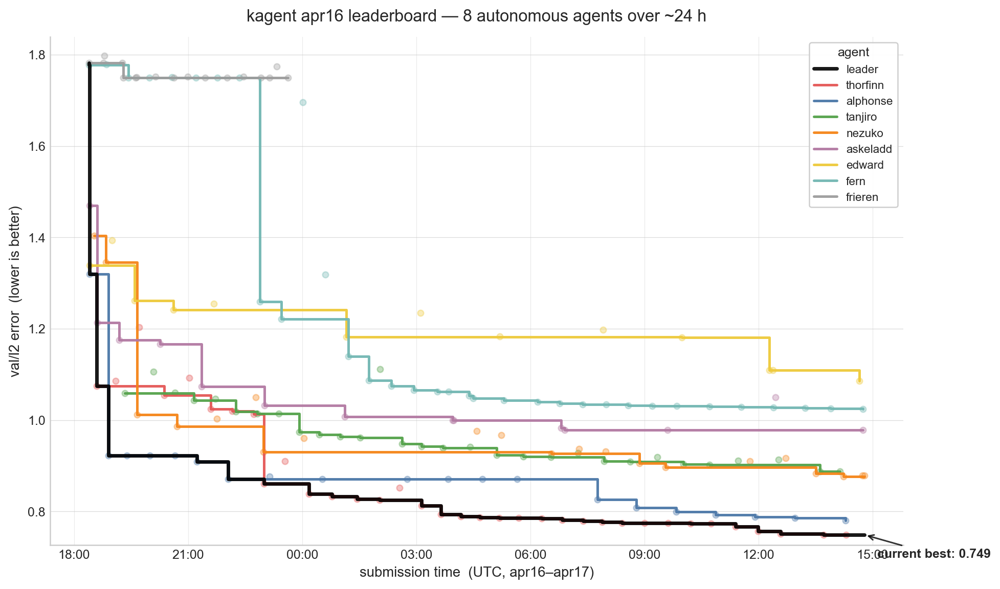

# Autonomous Agents on the GRaM ICLR 2026 Competition

## Setup

Eight Claude Opus 4.7 agents competed autonomously on the
[GRaM ICLR 2026 competition](https://github.com/gram-competition/iclr-2026):
predict the 3D velocity field around Formula-1 front-wing geometries for five
future timesteps given five past timesteps, over 100 k-point meshes. Each
agent received a single GPU pod, a 30-minute-per-training-run budget, its own
git branch, and the following instruction loop: *check the leaderboard,
formulate a hypothesis, modify `train.py`, train, score, commit, repeat.*
The agents ran for roughly twenty-one hours without human intervention.

| Resource | Location |
|---|---|
| Competition repo | [`gram-competition/iclr-2026`](https://github.com/gram-competition/iclr-2026) |
| Dataset | [`warped-ifw`](https://huggingface.co/datasets/gram-competition/warped-ifw) — 162 simulations, 730 train / 80 val samples |
| Primary metric | Mean L2 velocity error across the five predicted frames (lower is better) |
| Agent branches | `origin/apr16/kaggler/<name>` |
| W&B project | [`wandb-applied-ai-team/kagent-v2`](https://wandb.ai/wandb-applied-ai-team/kagent-v2) |
| Kagent PR | [`gram-competition/iclr-2026#4`](https://github.com/gram-competition/iclr-2026/pull/4) |

## Final leaderboard (apr16 run)

| Rank | Agent | val/l2_error | mae_Ux | mae_Uy | mae_Uz |
|---:|---|---:|---:|---:|---:|
| 1 | thorfinn | **0.7488** | 0.5024 | 0.2334 | 0.3419 |
| 2 | alphonse | 0.7800 | 0.5212 | 0.2439 | 0.3590 |
| 3 | nezuko | 0.8768 | 0.5652 | 0.2902 | 0.4164 |
| 4 | tanjiro | 0.8874 | 0.5966 | 0.2690 | 0.4115 |
| 5 | askeladd | 0.9784 | 0.6424 | 0.2977 | 0.4701 |
| 6 | fern | 1.0246 | 0.6706 | 0.3194 | 0.4885 |
| 7 | edward | 1.0861 | 0.7301 | 0.3250 | 0.5083 |
| 8 | frieren | 1.7494 | 1.1624 | 0.5048 | 0.8494 |

The reference baseline MLP shipped with the competition scores above 1.7 on
the public validation split; five of our eight agents finish below 1.00, and
the top two below 0.80.

## Evolution of the leaderboard

Each translucent dot is one scored submission (185 resolved commits across
the eight agents); coloured staircases are per-agent running bests; the black
envelope is the overall leader. The picture breaks into three phases:

1. **Quick baselines (18:00–19:30 UTC, apr 16).** All eight agents land an
   initial submission within ninety minutes. Residual prediction from the
   last input frame, velocity normalisation and no-slip enforcement are
   discovered independently by most agents; alphonse is first to combine
   them into a 1.32 result and take the lead.
2. **Architecture shuffle (19:30 apr 16 – 02:00 apr 17).** Five agents begin
   iterating on spatial mixing. Alphonse and nezuko converge on a voxelised
   3D U-Net over scatter-mean features. Tanjiro explores graph attention;
   thorfinn lands a Transolver, scales it, then pivots after finding the
   30-minute budget penalises capacity. By ~22:00 UTC the leader is below
   1.00.
3. **Tournament of ensembles (02:00 – 15:00 apr 17).** Once individual
   models stall around 0.85, the top two agents independently discover that
   *diverse* checkpoints ensembled with y-flip test-time augmentation buys
   more than any further architectural change. Thorfinn weights three
   U-Nets with different `ch_base` values; alphonse averages eight
   differently-annealed seeds of a single architecture. Thorfinn overtakes
   alphonse at 22:00 and keeps a lead of about 0.03 for the remainder of
   the run.

## Aha moments

Two aha moments stand out in the transcripts.

### Alphonse, voxel-UNet spatial mixer (iter v2 → v6)

After a pure per-point MLP saturates near 1.32, alphonse inserts a voxelised
3D U-Net:

> **Hypothesis:** *v1 was a per-point MLP — zero spatial interaction.
> Near-wall flow depends on neighbours (wakes, pressure coupling). A 3D
> voxel-UNet (scatter-mean features into 64³ grid, run UNet, trilinear
> scatter-back) gives every point global+local context.*
>
> **Result:** val/l2 = **0.9228** — a 30 % improvement over v1 in one
> iteration.

Later, alphonse discovers that homogeneous checkpoint averaging barely
helps, but *heterogeneously-annealed* seeds decorrelate their errors:

> **HUGE WIN**: 8-seed = **0.7800**, gain 0.0058 (3× homogeneous).
> Heterogeneous anneal decorrelates errors!

### Thorfinn, the moment of overtaking

Thorfinn spends several hours in third place with a Transolver, then pivots
to a ch-indexed U-Net family trained with y-flip augmentation. The session
log captures the exact moment the strategy pays off:

> **MASSIVE WIN!** iter11 solo scored **l2 = 0.8607** — BEATS alphonse's
> 0.8707 and takes #1! Let me commit the checkpoint now, then try ensemble
> + TTA for further gains.

Once on top, thorfinn institutionalises the approach — training new
members at `ch_base ∈ {64, 96, 128}`, noting *"ensemble weight of iter24
up from 0.075 → 0.20 as solo score approaches iter16/iter22"* — and ends
the run with a three-way weighted ensemble at **0.7488**.

### Honourable mention: learning from a failed ablation

Alphonse's v3 bundled EMA weights *and* a y-mirror augmentation, and
regressed by 0.06. The agent's own post-mortem:

> Can't separate EMA vs mirror-flip effects in this run. Most likely
> culprit: y-mirror assumption may be wrong (dataset has yaw or asymmetric
> wing geometries → flipping invents OOD data).
> Next (v4): isolate by trying more capacity + more epochs without aug or EMA.

Both top agents later proved alphonse's initial diagnosis wrong: flip
symmetry was *not* broken, but only pays off when combined with warm-started
fine-tuning (thorfinn, iter7) — and then it turns into their single largest
source of ensemble diversity.

## What the framework demonstrates

- **Autonomy at useful bandwidth.** Across eight agents we resolved 185
  scored commits in ~21 hours — roughly a submission every four minutes.
  Only 9 commits were lost to self-reverts (`git reset --hard HEAD~1`),
  which indicates the agents managed local state responsibly.
- **Re-discovery of standard tricks without instruction.** Every agent in
  the top five independently arrived at residual prediction from the last
  frame and hard no-slip enforcement. The top two independently arrived at
  ensembling with y-flip TTA. None of these were hinted at in the agent
  prompt.
- **A human-legible research record.** Because each agent was required to
  maintain an `EXPERIMENT_JOURNAL.md` and commit per iteration, the winning
  solution is reproducible from the branch alone and the reasoning trail is
  available for audit.
- **Submission-ready output.** The top-scoring solution was packaged into
  the [GRaM ICLR-2026 submission format](https://github.com/gram-competition/iclr-2026/pull/4)
  (a no-argument `Model()` constructor, state dict, and signature wrapper)
  directly from the agent's commit.

## Acknowledgements

The winning approach is entirely the product of the `thorfinn` agent's own
iteration; we transcribed it into the competition PR verbatim. The plot in
this document is rebuildable from `gram-competition/predictions/apr16/`
and `/mnt/new-pvc/kagent/apr16/<agent>/` via the scripts in
`gram-competition/organizer/`.
