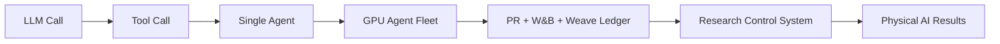
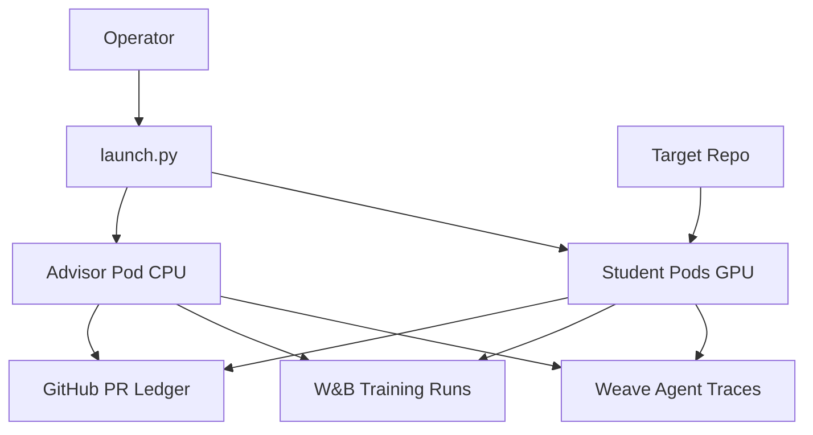
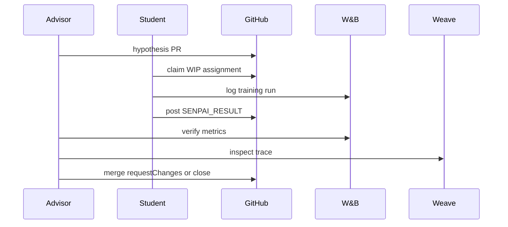

# PRs as Hypotheses, W&B as Memory

Building observable autoresearch for physical AI

**SENPAI workshop**

<!--
Open by saying this is not an agents 101 talk. The goal is to learn how to let
agents spend real GPU time without losing the research record.
-->

---

# Workshop Promise

By the end, you can:

- Draw the stack from one LLM call to a GPU-fleet autoresearch loop
- Explain where W&B, Weave, GitHub, and Kubernetes sit
- Critique whether an autoresearch design is operationally credible
- Avoid expensive failure modes before they hit real GPUs

<!--
Set the bar: this is for people asked to design, sell, or operate agentic ML
research systems, not for people trying a toy chatbot.
-->

---

# The Staff-Engineer Thesis

Autoresearch is a distributed ML control system, not a long prompt.



<!--
This is the mental model to return to after each section.
-->

---

# Why Physical AI Is The Hard Case

- Runs are expensive
- Data is large and often PVC-backed
- Metrics are easy to mix incorrectly
- Completed jobs can still be physically meaningless
- Claims need split, target, normalization, and aggregation contracts

**Repo anchors:** `analysis/*_BENCHMARK.md`

<!--
Use DrivAerML/TandemFoilSet metric-contract examples here. Runnable is not the
same as scientifically defensible.
-->

---

# SENPAI In One Diagram



**Key split:** runner repo orchestrates; target repo receives experiment code and PRs.

<!--
Point to README and the runner-vs-target split. This distinction prevents a lot
of bad mental models.
-->

---

# DevRel Framing

| W&B | CoreWeave |
| --- | --- |
| Metric/config/provenance ledger | GPU pods and PVC-backed data |
| Training curves and system metrics | K8s control and restartability |
| Weave traces for agent behavior | Resource economics for autonomous work |

<!--
Customers already understand experiment tracking and GPU capacity. This
workshop connects those familiar pieces to agent autonomy.
-->

---

# Layer Map

| Layer | Capability | Failure Mode |
| --- | --- | --- |
| LLM call | reasoning | plausible text without evidence |
| Tool call | observation/action | brittle interfaces |
| Single agent | bounded loop | weak handoff |
| Multiagent | parallel work | routing drift |
| Ledger | durable memory | inconsistent truth |
| Physical AI | scientific result | invalid claim |

<!--
Each section should teach one capability and the new failure mode it introduces.
-->

---
layout: section
---

# 1. LLM Calls

Useful for hypotheses, not evidence

---

# A Plain LLM Call Is Still Useful

Use it for:

- Explaining a problem
- Proposing candidate mechanisms
- Summarizing literature
- Naming possible bottlenecks

Do **not** use it as:

- Baseline truth
- W&B run truth
- File-boundary truth
- Benchmark-comparison truth

<!--
Tie to notebook 01. The goal is not to diminish LLMs, but to put their output
in the correct stage of the research loop.
-->

---

# Notebook 01

`workshop/notebooks/01_llm_calls_to_hypotheses.py`

```python {all|1-3|5-9}
ideas = anthropic_message(config, problem_statement, max_tokens=700)

assignment_prompt = f"""
Take one idea and rewrite it as a SENPAI-style assignment.
Include hypothesis, mechanism, primary metric, split,
allowed files, W&B logging, and falsifying result.
"""
assignment = anthropic_message(config, assignment_prompt, max_tokens=900)
```

**Teaching point:** ideation becomes actionable only after adding contracts.

<!--
Run or show the notebook output if credentials are configured. Otherwise read
the code and explain the cell boundary.
-->

---

# Physical-AI Claim Trap

Bad:

> We beat TandemFoilSet.

Better:

> On the internal parity contract, test surface-pressure MAE improved from 33.88 to 24.58.

Different:

> The paper contract uses normalized full-field MSE and must be reported separately.

<!--
This is the first place research leads lean in. It makes the physical-AI
dimension concrete.
-->

---

# Takeaway

A hypothesis is cheap.

A research assignment needs:

- metric
- split
- allowed files
- command
- W&B logging
- falsifier

<!--
Transition: once we know what facts are missing, tools are how the model gets
them.
-->

---
layout: section
---

# 2. Tool Calls

Observation and action through contracts

---

# Tool Contracts Matter

SENPAI wraps fragile operations:

- `swap_gh_pr_label`
- `mark_ready_for_review`
- `senpai_merge_winner_preflight`
- `create_assignment_pr_from_file`

**Repo anchor:** `plugins/senpai/scripts/senpai-gh.sh`

<!--
These wrappers came from real operational failures. Treat them as product
surface, not helper scripts.
-->

---

# Notebook 02

`workshop/notebooks/02_tool_calls_and_contracts.py`

```python {all|1-5|7-9}
tools = [
    Tool("github_repo", "Read target repo metadata.", lambda _: get_repo(config)),
    Tool("github_branch", "Read target branch metadata.", lambda _: get_branch(config)),
    Tool("wandb_recent_runs", "Read compact W&B summaries.", lambda args: recent_runs(config, limit=3)),
]

choice = choose_tool(config, task, tools)
tool_result = run_chosen_tool(choice, tools)
```

**Teaching point:** tools should return structured state, not prose blobs.

---

# The `SENPAI-RESULT` Boundary

```markdown
SENPAI-RESULT: {"terminal":true,"status":"complete","pending_arms":false,
"wandb_run_ids":["<run-id>"],
"primary_metric":{"name":"<metric>","value":0.0},
"test_metric":{"name":"<metric>","value":0.0}}
```

Guarded by the same idea as `plugins/senpai/scripts/senpai-pr-guard.py`.

<!--
Explain that this marker is workflow state, not formatting. It controls whether
review and merge are safe.
-->

---

# Tool Design Rule

Bad tool:

```bash
gh pr edit 1842 --remove-label status:wip --add-label status:review
```

Better tool:

```bash
mark_ready_for_review 1842
```

The better tool checks result state and performs the safe label transition.

<!--
Explain the label footgun and how raw CLI examples can poison fresh subagents.
-->

---

# Takeaway

Tooling should hide brittle mechanics and expose safe state transitions.

If a step is important enough to repeat, it is important enough to wrap.

---
layout: section
---

# 3. Single Agents

Role, loop, stop condition, handoff

---

# What Makes An Agent

An agent has:

- role
- tools
- loop
- state boundary
- stop condition
- handoff protocol

An agent is not just an LLM with a longer prompt.

<!--
Transition from tools to control loops. Use the student role as the clean
example.
-->

---

# The Student Role

Student responsibilities:

- Poll for exactly one assigned PR
- Read PR instructions
- Edit allowed files only
- Run training
- Log to W&B
- Post structured results
- Submit for advisor review

**Repo anchor:** `system_instructions/CLAUDE-STUDENT.md`

---

# Notebook 03

`workshop/notebooks/03_single_agent_student_loop.py`

```python {all|1-7|9-13}
assignment = Assignment(
    number=2417,
    title="DrivAerML EMA warmup",
    student="ws-fern",
    metric_name="test_primary/surface_pressure_rel_l2_pct",
    baseline_value=6.24,
)

decision = merge_decision(observed["primary_value"], assignment.baseline_value)
result_line = senpai_result_line(result)
```

**Teaching point:** students execute and report; advisors decide.

---

# Idle Work Is Runtime Policy

In SENPAI, if a student has no work:

- the shell loop sleeps
- Claude is not invoked
- no invented polling loop appears inside model context

**Repo anchor:** `k8s/entrypoint-student.sh`

<!--
This is the CoreWeave cost story: idle GPU and idle model sessions are both
cost surfaces.
-->

---

# Takeaway

Autonomy increases when role boundaries become stricter.

Loose agents waste compute and corrupt attribution.

---
layout: section
---

# 4. Multiagent Flow

Labels are infrastructure

---

# Advisor, Student, Researcher

- Advisor: portfolio, hypothesis, review, baseline
- Student: implementation, training, reporting
- Researcher-agent: literature and experiment lineage

The agents coordinate through artifacts, not free-form chat.

---

# GitHub Labels Are The Queue

Required routing state:

- advisor branch label
- `student:<name>`
- `status:wip`
- `status:review`

**Repo anchors:** `k8s/launch_helpers.py`, `plugins/senpai/skills/survey-prs/SKILL.md`

---

# Notebook 04

`workshop/notebooks/04_multiagent_advisor_student_flow.py`

```python {all|1-6|8-13}
wip_by_student = {name: [] for name in students}
review_ready = []
malformed = []

for pr in pr_board:
    labels = set(pr["labels"])
    if "status:review" in labels:
        review_ready.append(pr["number"])
    for student in students:
        if f"student:{student}" in labels and "status:wip" in labels:
            wip_by_student[student].append(pr["number"])
```

**Teaching point:** multiagent correctness is queue correctness.

---

# Advisor Decision Order

1. Review terminal `status:review` PRs
2. Merge winners best-first after preflight
3. Request changes for promising non-winners
4. Close dead ends
5. Assign idle students
6. Reconcile malformed labels

<!--
This slide helps DevRel presenters explain SENPAI without reading long prompts.
-->

---

# Takeaway

Multiagent systems fail through ownership, routing, and stale state before they fail through “bad ideas.”

---
layout: section
---

# 5. W&B And Weave As Memory

Observability is the ledger

---

# Joined Research Ledger

| Artifact | Truth it carries |
| --- | --- |
| PR body | hypothesis |
| Git diff | implementation |
| W&B config/history/summary | measured result |
| PR comments | handoff and review |
| Git history | provenance |
| Weave trace | agent/tool path |

---

# Notebook 05

`workshop/notebooks/05_wandb_and_weave_as_memory.py`

```python {all|1-3|5-10}
runs = recent_runs(config, limit=5)

try:
    import weave
    client = weave.init(config.wandb_path)
    calls = list(client.get_calls(limit=3))
except Exception:
    trace_result = local_trace_shape()
```

**Teaching point:** W&B tells what happened in training; Weave helps explain how the agent got there.

---

# Monitor Cost Failure

From the 24-hour trace:

- 53,022 real Claude requests
- 5.24B cache-inclusive tokens
- 28,246 direct monitor-event responses
- 3.25B cache-inclusive tokens from direct monitor events

**Repo anchor:** `papers/icml/AGENT_FAILURE_MODES1.2.md`

<!--
The lesson is not “never monitor.” The lesson is “reduce before context.”
-->

---

# Reducer Pattern

Emit:

- new best
- error
- OOM/NaN
- completion
- timeout
- sparse status

Suppress:

- every epoch
- raw `tail -f`
- unchanged status
- full logs

---

# Takeaway

Dashboards help humans.

Ledgers keep autonomous systems sane.

---
layout: section
---

# 6. K8s Autoresearch Runtime

CoreWeave as the research substrate

---

# Launch Control Plane

`k8s/launch.py` handles:

- config and CLI overrides
- credential preflight
- advisor branch setup
- label setup
- ConfigMaps and Secrets
- student/advisor deployments

---

# Notebook 06

`workshop/notebooks/06_k8s_autoresearch_dry_run.py`

```python {all|1-8|10-15}
command = [
    sys.executable, "k8s/launch.py",
    "--tag", "workshop",
    "--target_repo_url", config.target_repo_url,
    "--advisor_branch", config.advisor_branch,
    "--advisor",
    "--dry_run",
]

result = subprocess.run(
    command,
    cwd=REPO_ROOT,
    capture_output=True,
    text=True,
)
```

**Teaching point:** dry-run validates the launch contract without spending GPUs.

---

# Runtime Split

Advisor:

- CPU control loop
- GitHub/W&B/LLM credentials
- reviews and assigns

Student:

- GPU worker
- PVC data
- training execution
- structured result handoff

---

# Takeaway

The right unit of abstraction is not “agent.”

It is **research workload with control, evidence, and recovery**.

---
layout: section
---

# 7. Physical-AI Claim Review

Runnability is not scientific validity

---

# Notebook 07

`workshop/notebooks/07_physical_ai_claim_review.py`

```python {all|1-5|7-11}
contract_paths = [
    REPO_ROOT / "analysis" / "AIRFRANS_BENCHMARK.md",
    REPO_ROOT / "analysis" / "DRIVAERML_BENCHMARK.md",
    REPO_ROOT / "analysis" / "TANDEMFOILSET_BENCHMARK.md",
]

claims = [
    "Our DrivAerML validation score improved, so we beat AB-UPT.",
    "TandemFoilSet surface MAE is comparable to paper full-field MSE.",
]
```

**Teaching point:** metric contracts are part of system correctness.

---

# Defensible vs Misleading

Defensible:

> On DrivAerML public 400/34/50, held-out test surface-pressure relative-L2 is 6.24%, behind AB-UPT 3.82%.

Misleading:

> Validation improved, so we beat AB-UPT.

Proxy-only:

> Validation improved; run a held-out test confirmation.

---

# Takeaway

Physical-AI autoresearch needs claim governance.

Completed training does not automatically produce a defensible result.

---
layout: section
---

# 8. Full Autoresearch Trace

The capstone loop

---

# Notebook 08

`workshop/notebooks/08_full_autoresearch_trace.py`

```python {all|1-5|7-13}
hypothesis = anthropic_message(config, hypothesis_prompt)

assignment = Assignment(
    number=9001,
    student="ws-fern",
    metric_name="test_primary/surface_pressure_rel_l2_pct",
    baseline_value=6.24,
)

result_line = senpai_result_line(student_result)
advisor_decision = anthropic_message(config, review_prompt)
```

**Teaching point:** every autonomous action leaves a durable artifact.

---

# End-To-End Artifact Trail



---

# Design Review Checklist

Ask before launching:

- What is authoritative state?
- Who can spend GPU time?
- Who can merge?
- What proves a run is terminal?
- Which metric is paper-facing?
- What wakes the model?
- What gets reduced before context?
- How does recovery happen?

Resource: `workshop/resources/architecture-checklist.md`

---

# Audience-Specific Close

| Audience | Close |
| --- | --- |
| W&B | Instrument training and agent traces together. |
| CoreWeave | Treat runtime as research policy. |
| DevRel | Teach failure modes honestly. |
| Research leads | Define metric contracts first. |

---
layout: end
---

# Final Rule

Autoresearch becomes credible when every autonomous action leaves behind a human-auditable artifact.

Run next:

```bash
uv run python workshop/setup_credentials.py
npm --prefix workshop run dev
```

<!--
End by pointing to the runnable notebooks. The next step is not launching 50
agents. The next step is making one safe autonomous experiment observable.
-->
